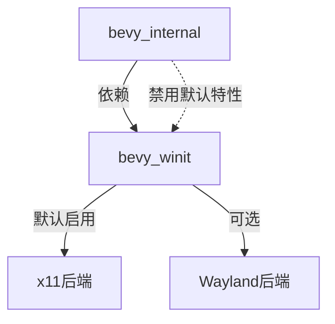

+++
title = "#18475 enable x11 by default in bevy_winit"
date = "2025-03-24T00:00:00"
draft = false
template = "pull_request_page.html"
in_search_index = false

[extra]
current_language = "zh-cn"
available_languages = {"zh-cn" = { name = "中文", url = "/pull_request/bevy/2025-03/pr-18475-zh-cn-20250324" }, "en" = { name = "English", url = "/pull_request/bevy/2025-03/pr-18475-en-20250324" }}
labels = ["`A-Windowing`", "`O-Linux`", "`S-Ready-For-Final-Review`"]
+++

# #18475 enable x11 by default in bevy_winit

## Basic Information
- **Title**: enable x11 by default in bevy_winit
- **PR Link**: https://github.com/bevyengine/bevy/pull/18475
- **Author**: mockersf
- **Status**: MERGED
- **Labels**: `A-Windowing`, `O-Linux`, `S-Ready-For-Final-Review`
- **Created**: 2025-03-22T08:57:06Z
- **Merged**: Not merged
- **Merged By**: N/A

## Description Translation

# Objective

- 在 Linux 上构建 bevy_winit 失败，错误信息如下：
```
error: The platform you're compiling for is not supported by winit
  --> /home/runner/.cargo/registry/src/index.crates.io-1949cf8c6b5b557f/winit-0.30.9/src/platform_impl/mod.rs:78:1
   |
78 | compile_error!("The platform you're compiling for is not supported by winit");
   | ^^^^^^^^^^^^^^^^^^^^^^^^^^^^^^^^^^^^^^^^^^^^^^^^^^^^^^^^^^^^^^^^^^^^^^^^^^^^^
```
- 这个问题阻碍了在 Linux 上发布 Bevy 时的验证流程

## Solution

- 在构建 bevy_winit 时默认启用 `x11`，并在 bevy_internal 中禁用 bevy_winit 的默认特性
- 这不会对依赖 Bevy 的用户产生任何影响

## The Story of This Pull Request

### 问题根源与上下文
在 Linux 构建环境中，当开发者尝试编译 bevy_winit 时遇到了平台不支持的错误。问题源于 winit 的 platform_impl 模块在检测到未启用任何平台后端（如 x11 或 Wayland）时会抛出编译错误。该问题直接影响 Bevy 的发布流程，因为 CI 验证步骤在 Linux 环境下无法通过。

### 解决方案设计
核心思路是通过以下两步解决：
1. 在 bevy_winit 的默认特性中强制包含 x11 后端支持
2. 在 bevy_internal 的依赖声明中显式禁用 bevy_winit 的默认特性

这种设计保证了：
- 直接依赖 bevy_winit 的用户默认获得 x11 支持
- Bevy 主仓库通过特性控制保持原有行为不变
- 避免特性冲突和隐式依赖

### 具体实现分析
在 `bevy_winit/Cargo.toml` 中明确设置默认特性：
```toml
[features]
default = ["x11"]  # 新增默认特性配置
```

在 `bevy_internal/Cargo.toml` 中调整依赖声明：
```toml
bevy_winit = { 
    path = "../bevy_winit", 
    version = "0.16.0-dev", 
    default-features = false,  # 禁用默认特性
    features = ["trace"] 
}
```

这种配置方式实现了：
- 分层特性控制：库使用者（bevy_internal）与应用开发者（直接使用 bevy_winit）的默认行为解耦
- 向后兼容：现有依赖关系不受影响
- 平台适配：确保 Linux 环境下有默认可用的窗口后端

### 技术洞察
1. **Cargo 特性传播机制**：通过 default-features = false 中断默认特性的继承链，防止特性设置被意外覆盖
2. **平台适配策略**：选择 x11 作为默认 Linux 后端，因其在传统 X Window 系统中的广泛支持
3. **构建系统可靠性**：解决发布流程中的硬性阻断问题，提升 CI 系统的可靠性

### 影响评估
该修改：
- 修复了 Linux 下的关键构建失败问题
- 使 Bevy 的发布流程恢复可用
- 保持跨平台特性配置的一致性
- 为后续窗口后端选择策略奠定基础

## Visual Representation



## Key Files Changed

### `crates/bevy_winit/Cargo.toml`
**修改说明**：设置默认特性包含 x11
```toml
# 修改前
[features]
default = []

# 修改后 
[features]
default = ["x11"]
```

### `crates/bevy_internal/Cargo.toml`
**修改说明**：禁用 bevy_winit 的默认特性
```toml
# 修改前
bevy_winit = { path = "../bevy_winit", version = "0.16.0-dev" }

# 修改后
bevy_winit = { 
    path = "../bevy_winit", 
    version = "0.16.0-dev", 
    default-features = false,
    features = ["trace"] 
}
```

## Further Reading
1. [Cargo Features 官方文档](https://doc.rust-lang.org/cargo/reference/features.html)
2. [Winit 多平台支持策略](https://github.com/rust-windowing/winit/wiki/Platform-APIs)
3. [Bevy 窗口系统架构](https://bevyengine.org/learn/book/getting-started/window/)