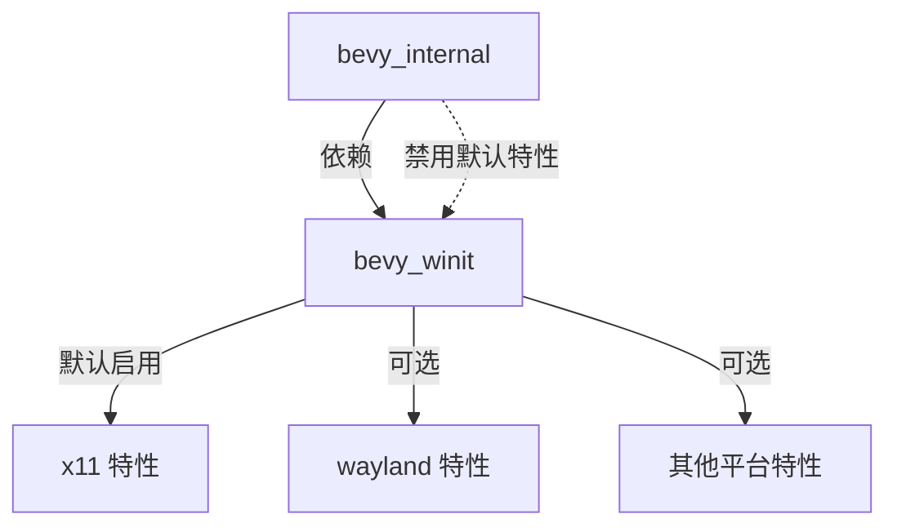

+++
title = "#18475 enable x11 by default in bevy_winit"
date = "2025-03-24T00:00:00"
draft = false
template = "pull_request_page.html"
in_search_index = false

[extra]
current_language = "zh-cn"
available_languages = {"zh-cn" = { name = "中文", url = "/pull_request/bevy/2025-03/pr-18475-zh-cn-20250324-1" }, "en" = { name = "English", url = "/pull_request/bevy/2025-03/pr-18475-en-20250324-1" }}
labels = ["`A-Windowing`", "`O-Linux`", "`S-Ready-For-Final-Review`"]
+++

# #18475 enable x11 by default in bevy_winit

## Basic Information
- **Title**: enable x11 by default in bevy_winit
- **PR Link**: https://github.com/bevyengine/bevy/pull/18475
- **Author**: mockersf
- **Status**: MERGED
- **Labels**: `A-Windowing`, `O-Linux`, `S-Ready-For-Final-Review`
- **Created**: 2025-03-22T08:57:06Z
- **Merged**: Not merged
- **Merged By**: N/A

## Description Translation

### 目标
- 在 Linux 上构建 bevy_winit 时失败，错误信息如下：
```
error: The platform you're compiling for is not supported by winit
  --> /home/runner/.cargo/registry/src/index.crates.io-1949cf8c6b5b557f/winit-0.30.9/src/platform_impl/mod.rs:78:1
   |
78 | compile_error!("The platform you're compiling for is not supported by winit");
   | ^^^^^^^^^^^^^^^^^^^^^^^^^^^^^^^^^^^^^^^^^^^^^^^^^^^^^^^^^^^^^^^^^^^^^^^^^^^^^
```
- 该问题导致在 Linux 下发布 Bevy 时验证步骤失败

### 解决方案
- 在构建 bevy_winit 时默认启用 `x11` 特性
- 在 bevy_internal 中禁用 bevy_winit 的默认特性
- 这些改动不会对依赖 Bevy 的用户造成任何影响

## The Story of This Pull Request

### 问题根源
在 Linux 平台上，winit 需要明确指定窗口后端（如 x11 或 wayland）。当用户尝试构建 bevy_winit 时，由于默认未启用任何平台后端特性，导致触发 winit 的编译错误。这个问题直接影响 Bevy 的发布流程，因为 CI/CD 系统中的 Linux 构建节点无法通过验证步骤。

### 解决方案的工程选择
PR 采取了双重策略：
1. **启用默认后端**：在 bevy_winit 中设置 `x11` 为默认特性，确保 Linux 平台的基础兼容性
2. **控制特性传播**：通过 bevy_internal 禁用默认特性继承，防止特性配置冲突

这种设计保证了：
- 直接使用 bevy_winit 的开发者获得开箱即用的 Linux 支持
- Bevy 主仓库保持对依赖特性的精确控制
- 现有 Bevy 用户不受影响

### 关键技术实现
在 `bevy_winit/Cargo.toml` 中修改默认特性配置：
```toml
[features]
default = ["x11"]  # 新增 x11 作为默认特性
```

在 `bevy_internal/Cargo.toml` 中调整依赖声明：
```toml
bevy_winit = { 
    path = "../bevy_winit", 
    version = "0.16.0-dev", 
    default-features = false  # 禁用默认特性继承
}
```

这种配置组合实现了：
- 独立使用时：`bevy_winit` 自动携带 x11 支持
- 作为 Bevy 子模块时：由上级 crate 显式控制特性启用

### 平台兼容性考量
选择 x11 作为默认出于以下考虑：
1. **兼容性**：X Window System 在 Linux 桌面环境中的广泛支持
2. **稳定性**：相比 Wayland 更成熟的生态系统
3. **用户预期**：符合大多数开发者对 Linux 桌面应用的默认期待

### 影响评估
该修改：
- 修复了 Linux 下的编译阻断问题
- 保持跨平台构建配置的一致性
- 为后续窗口后端选择策略奠定基础

未来改进方向可能包括：
- 动态后端选择机制
- 构建时自动检测最佳后端
- 更灵活的特性配置系统

## Visual Representation



## Key Files Changed

### 1. `crates/bevy_winit/Cargo.toml`
**修改说明**：设置 x11 为默认特性，确保独立使用时自动支持 Linux 平台

```toml
# Before:
[features]
default = []

# After:
[features]
default = ["x11"]
```

### 2. `crates/bevy_internal/Cargo.toml`
**修改说明**：禁用默认特性继承，防止特性配置冲突

```toml
# 修改后的依赖声明：
bevy_winit = { 
    path = "../bevy_winit", 
    version = "0.16.0-dev", 
    default-features = false  # 新增配置
}
```

## Further Reading
1. [Cargo Features 官方文档](https://doc.rust-lang.org/cargo/reference/features.html) - 深入理解 Rust 的特性系统
2. [winit 平台后端选择策略](https://github.com/rust-windowing/winit#platform-notes) - 窗口后端的平台适配细节
3. [Bevy 特性配置最佳实践](https://bevy-cheatbook.github.io/programming/features.html) - Bevy 项目的特性管理指南