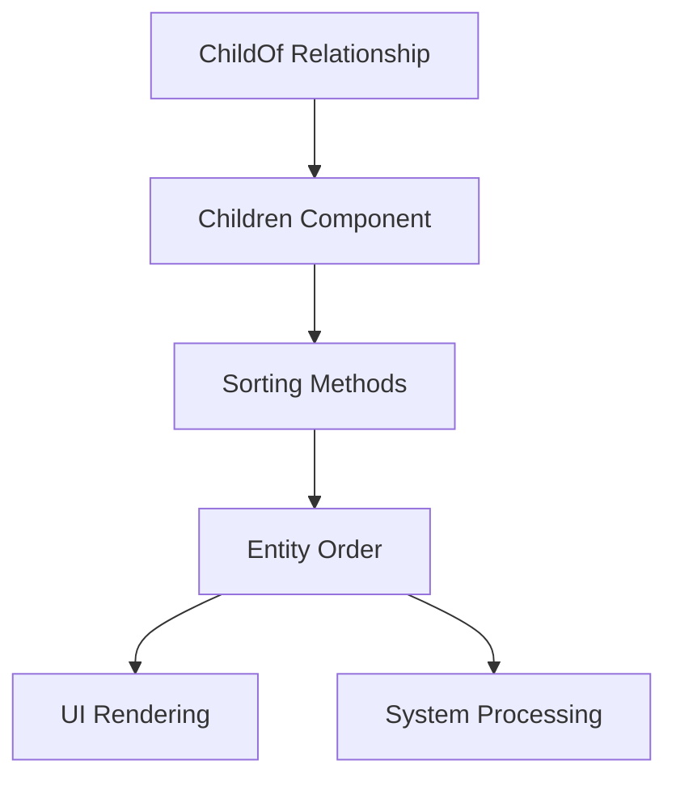

+++
title = "#18476 Regression fix: Reintroduce sorting/reordering methods on Children"
date = "2025-03-23T00:00:00"
draft = false
template = "pull_request_page.html"
in_search_index = true

[taxonomies]
list_display = ["show"]

[extra]
current_language = "en"
available_languages = {"en" = { name = "English", url = "/pull_request/bevy/2025-03/pr-18476-en-20250323" }, "zh-cn" = { name = "中文", url = "/pull_request/bevy/2025-03/pr-18476-zh-cn-20250323" }}
labels = ["`D-Trivial`", "`A-ECS`", "`S-Ready-For-Final-Review`", "`P-Regression`", "`X-Uncontroversial`"]
+++

# #18476 Regression fix: Reintroduce sorting/reordering methods on Children

## Basic Information
- **Title**: Regression fix: Reintroduce sorting/reordering methods on Children
- **PR Link**: https://github.com/bevyengine/bevy/pull/18476
- **Author**: inodentry
- **Status**: MERGED
- **Labels**: `D-Trivial`, `A-ECS`, `S-Ready-For-Final-Review`, `P-Regression`, `X-Uncontroversial`
- **Created**: 2025-03-22T09:35:19Z
- **Merged**: 2025-03-22T14:22:35Z
- **Merged By**: cart

## Description Translation
# Objective

Bevy 0.15 used to have methods on `Children` for sorting and reordering them. This is very important, because in certain situations, the order of children matters. For example, in the context of UI nodes.

These methods are missing/omitted/forgotten in the current version, after the Relationships rework.

Without them, it is impossible for me to upgrade `iyes_perf_ui` to Bevy 0.16.

## Solution

Reintroduce the methods. This PR simply copy-pastes them from Bevy 0.15.

## The Story of This Pull Request

The regression stemmed from Bevy's recent Relationships system rework, which introduced new hierarchy management components like `ChildOf` and `Children`. During this architectural shift, several sorting methods were accidentally omitted from the `Children` component - a Vec-backed collection of child entities. This broke essential functionality for users relying on child ordering, particularly in UI systems where rendering order and event propagation depend on child sequence.

The author identified the missing APIs as critical for upgrading the `iyes_perf_ui` crate. The solution involved directly porting the sorting implementations from Bevy 0.15's stable version. This straightforward approach was chosen because:

1. The original implementations were already well-tested
2. It provided immediate compatibility for existing users
3. It maintained API consistency across versions

The restored methods include:

```rust
impl Children {
    pub fn sort(&mut self) { /*...*/ }
    pub fn sort_by<F>(&mut self, compare: F) { /*...*/ }
    pub fn sort_by_key<K, F>(&mut self, compare: F) { /*...*/ }
    pub fn sort_by_cached_key<K, F>(&mut self, compare: F) { /*...*/ }
    pub fn reverse(&mut self) { /*...*/ }
}
```

These methods directly wrap standard Vec operations, preserving the existing performance characteristics. For example, `sort_by` uses `Vec::sort_by` internally:

```rust
pub fn sort_by<F>(&mut self, compare: F)
where
    F: FnMut(&Entity, &Entity) -> Ordering,
{
    self.0.sort_by(compare);
}
```

The changes maintain the system's integrity because:
- The `Children` component already contained a Vec<Entity>
- Sorting operations don't interfere with the ECS relationships
- Hierarchy updates are handled automatically through existing hooks

This fix demonstrates the importance of maintaining API stability during architectural changes. While the Relationships rework improved Bevy's hierarchy management, subtle API breaks like this required immediate attention to prevent ecosystem fragmentation.

## Visual Representation



## Key Files Changed

### `crates/bevy_ecs/src/hierarchy.rs` (+90/-0)
Added sorting methods to the `Children` implementation block:

```rust
impl Children {
    /// Sorts the [`Children`] in place using the default comparator.
    pub fn sort(&mut self) {
        self.0.sort();
    }

    /// Sorts the [`Children`] in place with a comparator function.
    pub fn sort_by<F>(&mut self, compare: F)
    where
        F: FnMut(&Entity, &Entity) -> Ordering,
    {
        self.0.sort_by(compare);
    }

    // Additional sorting methods follow...
}
```

These changes restore critical manipulation capabilities to the hierarchy system while maintaining compatibility with existing user code that depended on child ordering semantics.

## Further Reading
- [Bevy ECS Relationships Documentation](https://bevyengine.org/learn/book/ecs-relationships/)
- [Original Child Ordering Discussion](https://github.com/bevyengine/bevy/discussions/18475)
- [Vec Sorting Methods in Rust Std](https://doc.rust-lang.org/std/vec/struct.Vec.html#method.sort)