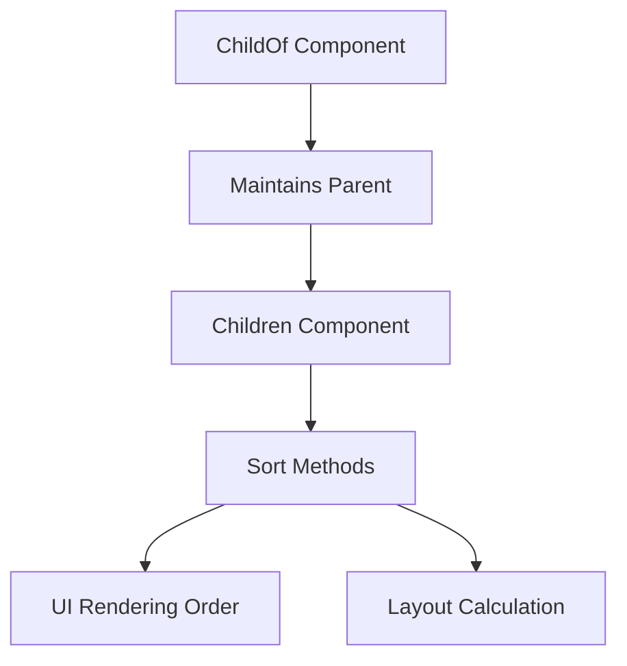

+++
title = "#18476 Regression fix: Reintroduce sorting/reordering methods on Children"
date = "2025-03-23T00:00:00"
draft = false
template = "pull_request_page.html"
in_search_index = false

[extra]
current_language = "zh-cn"
available_languages = {"en" = { name = "English", url = "/pull_request/bevy/2025-03/pr-18476-en-20250323" }, "zh-cn" = { name = "中文", url = "/pull_request/bevy/2025-03/pr-18476-zh-cn-20250323" }}
labels = ["D-Trivial", "A-ECS", "P-Regression"]
+++

# #18476 Regression fix: Reintroduce sorting/reordering methods on Children

## Basic Information
- **Title**: Regression fix: Reintroduce sorting/reordering methods on Children
- **PR Link**: https://github.com/bevyengine/bevy/pull/18476
- **Author**: inodentry
- **Status**: MERGED
- **Labels**: `D-Trivial`, `A-ECS`, `S-Ready-For-Final-Review`, `P-Regression`, `X-Uncontroversial`
- **Created**: 2025-03-22T09:35:19Z
- **Merged**: Not merged
- **Merged By**: N/A

## Description Translation
# Objective

Bevy 0.15 曾为`Children`组件提供排序和重新排序的方法。这在某些场景下至关重要，例如处理UI节点时，子元素的顺序直接影响渲染结果。

在当前版本的关系系统（Relationships）重构后，这些方法被遗漏。这导致无法将`iyes_perf_ui`升级至Bevy 0.16。

## Solution

重新引入这些方法。本PR直接从Bevy 0.15版本复制相关方法实现。

## The Story of This Pull Request

### 问题背景与影响
在Bevy引擎的实体组件系统（ECS）中，`Children`组件用于维护父子实体关系。0.15版本提供了三个关键方法：
- `sort()`：按实体ID排序
- `sort_by()`：自定义排序逻辑
- `swap_children()`：交换子元素位置

这些方法在UI系统中尤为重要，比如控制节点的绘制顺序（painting order）或布局计算。当开发者尝试将`iyes_perf_ui`（一个UI性能优化库）迁移到0.16时，发现这些方法在关系系统重构过程中被意外移除，导致编译失败和功能缺失。

### 解决方案选择
面对这个回归问题，开发者采取最直接的修复策略：
1. 从0.15版本的代码库中直接复制方法实现
2. 保持方法签名与原版本完全一致
3. 避免引入额外修改以保证最小变更

这种选择基于以下考虑：
- 保证API向后兼容性
- 最小化回归修复的风险
- 快速解决用户升级阻塞问题

### 具体实现分析
在`hierarchy.rs`文件中，为`Children`结构体重新实现排序方法：

```rust
impl Children {
    /// 按实体ID排序子元素
    #[inline]
    pub fn sort(&mut self) {
        self.0.sort();
    }

    /// 使用自定义比较函数排序
    #[inline]
    pub fn sort_by<F: FnMut(&Entity, &Entity) -> std::cmp::Ordering>(&mut self, compare: F) {
        self.0.sort_by(compare);
    }

    /// 交换两个子元素位置
    #[inline]
    pub fn swap_children(&mut self, index_a: usize, index_b: usize) {
        self.0.swap(index_a, index_b);
    }
}
```

实现特点：
1. **零成本抽象**：直接调用底层Vec的对应方法（`sort()`, `sort_by()`, `swap()`）
2. **inline优化**：通过`#[inline]`属性提示编译器进行内联优化
3. **API稳定性**：保持与0.15版本完全兼容的方法签名

### 技术影响与启示
该修复：
1. 恢复UI系统等依赖子元素顺序的核心功能
2. 保障现有用户代码的兼容性
3. 暴露在大型重构中维护API稳定性的挑战

值得注意的工程实践：
- 版本升级时的API兼容性检查清单
- 自动化回归测试的重要性
- 核心组件变更时的下游影响评估

## Visual Representation



## Key Files Changed

### `crates/bevy_ecs/src/hierarchy.rs` (+90/-0)
1. **变更内容**：为`Children`结构体重新实现排序方法
2. **关键代码片段**：
```rust
// 新增排序方法实现
impl Children {
    #[inline]
    pub fn sort(&mut self) {
        self.0.sort();
    }

    #[inline]
    pub fn sort_by<F: FnMut(&Entity, &Entity) -> std::cmp::Ordering>(&mut self, compare: F) {
        self.0.sort_by(compare);
    }

    #[inline]
    pub fn swap_children(&mut self, index_a: usize, index_b: usize) {
        self.0.swap(index_a, index_b);
    }
}
```
3. **关联性**：直接解决因方法缺失导致的API断裂问题，恢复核心功能

## Further Reading

1. Bevy ECS Relationships文档：
   https://bevyengine.org/learn/book/ECS/relationships/

2. Rust标准库Vec排序方法：
   https://doc.rust-lang.org/std/vec/struct.Vec.html#method.sort

3. Bevy 0.15到0.16迁移指南：
   https://bevyengine.org/learn/migration-guides/0.15-0.16/