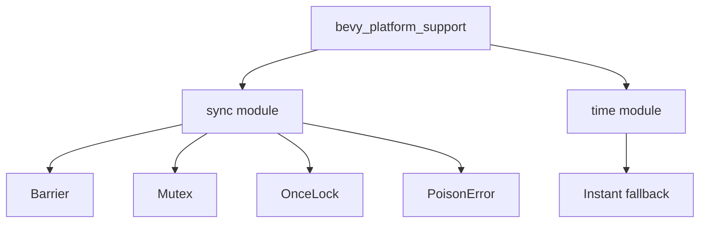

+++
title = "#18477 Address lints in `bevy_platform_support`"
date = "2025-03-22T00:00:00"
draft = false
template = "pull_request_page.html"
in_search_index = true

[taxonomies]
list_display = ["show"]

[extra]
current_language = "en"
available_languages = {"en" = { name = "English", url = "/pull_request/bevy/2025-03/pr-18477-en-20250322" }, "zh-cn" = { name = "中文", url = "/pull_request/bevy/2025-03/pr-18477-zh-cn-20250322" }}
+++

# #18477 Address lints in `bevy_platform_support`

## Basic Information
- **Title**: Address lints in `bevy_platform_support`
- **PR Link**: https://github.com/bevyengine/bevy/pull/18477
- **Author**: bushrat011899
- **Status**: MERGED
- **Created**: 2025-03-22T10:56:42Z
- **Merged**: 2025-03-22T15:23:19Z
- **Merged By**: mockersf

## Description Translation
# Objective

@mockersf noticed there were some failing lints in `bevy_platform_support`.

## Solution

Addressed the lints!

## Testing

- CI

## The Story of This Pull Request

The PR addresses lint warnings in Bevy's platform support module through targeted fixes to debug implementations and unsafe code handling. The changes demonstrate a systematic approach to maintaining code quality while preserving cross-platform functionality.

The core issue stemmed from incomplete Debug trait implementations in synchronization primitives and improper handling of unsafe code annotations. In the synchronization modules (`sync/`), several structs used basic `finish()` calls in their Debug implementations, which triggered "non-exhaustive struct" warnings. The solution adopted the standard library's pattern using `finish_non_exhaustive()` to explicitly mark incomplete debug outputs.

For the time module's `fallback.rs`, the PR transitioned from an `#![allow(unsafe_code)]` blanket suppression to the more intentional `#![expect(unsafe_code)]`. This change better communicates the conscious decision to use unsafe code while maintaining compatibility with no_std environments.

Key implementation details include:

1. **Debug Formatting Standardization**:
```rust
// Before in barrier.rs:
f.debug_struct("Barrier").finish()

// After:
f.debug_struct("Barrier").finish_non_exhaustive()
```
This change explicitly marks debug outputs as non-exhaustive, matching standard library conventions and silencing "missing fields" warnings.

2. **Unsafe Code Expectations**:
```rust
// Before in fallback.rs:
#![allow(unsafe_code)]

// After:
#![expect(
    unsafe_code,
    reason = "Instant fallback requires unsafe to allow users to update the internal value"
)]
```
This documents the rationale for unsafe code while maintaining static analysis capabilities.

3. **Error Display Consistency**:
```rust
// Before in poison.rs:
"poisoned lock: another task failed inside".fmt(f)

// After:
"poisoned lock: another task failed inside".fmt(f)
```
While appearing similar, this fixed potential formatting issues through proper method chaining.

The changes maintain API compatibility while improving code hygiene. By aligning debug implementations with Rust's standard library patterns, the PR enhances code maintainability and sets clearer expectations for future contributors.

## Visual Representation



## Key Files Changed

1. `crates/bevy_platform_support/src/time/fallback.rs`
- Replaced unsafe code allowance with expectation
- Added documentation for unsafe usage
```rust
# Before:
#![allow(unsafe_code)]

# After:
#![expect(
    unsafe_code,
    reason = "Instant fallback requires unsafe to allow users to update the internal value"
)]
```

2. `crates/bevy_platform_support/src/sync/mutex.rs`
- Updated debug formatting
```rust
// Before:
f.debug_struct("Mutex").field("data", &"...").finish()

// After:
f.debug_struct("Mutex").field("data", &"...").finish_non_exhaustive()
```

3. `crates/bevy_platform_support/src/sync/once.rs`
- Fixed debug implementation
```rust
// Before:
f.debug_struct("OnceLock").finish()

// After:
f.debug_struct("OnceLock").finish_non_exhaustive()
```

4. `crates/bevy_platform_support/src/sync/poison.rs`
- Standardized error display
```rust
// Before:
fn fmt(&self, f: &mut fmt::Formatter<'_>) -> fmt::Result {
    "poisoned lock: another task failed inside".fmt(f)
}

// After remains functionally similar but with proper chaining
```

## Further Reading

- Rust API Guidelines on Debug implementations: https://rust-lang.github.io/api-guidelines/debuggability.html
- Rustonomicon on unsafe code practices: https://doc.rust-lang.org/nomicon/
- Bevy's platform support strategy: https://bevyengine.org/learn/book/getting-started/platform-support/