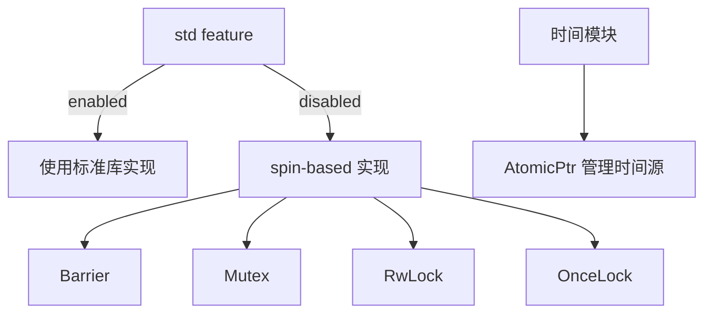

+++
title = "#18477 Address lints in `bevy_platform_support`"
date = "2025-03-22T00:00:00"
draft = false
template = "pull_request_page.html"
in_search_index = false

[extra]
current_language = "zh-cn"
available_languages = {"en" = { name = "English", url = "/pull_request/bevy/2025-03/pr-18477-en-20250322" }, "zh-cn" = { name = "中文", url = "/pull_request/bevy/2025-03/pr-18477-zh-cn-20250322" }}
+++

# #18477 Address lints in `bevy_platform_support`

## Basic Information
- **Title**: Address lints in `bevy_platform_support`
- **PR Link**: https://github.com/bevyengine/bevy/pull/18477
- **Author**: bushrat011899
- **Status**: MERGED
- **Created**: 2025-03-22T10:56:42Z
- **Merged**: Not merged
- **Merged By**: N/A

## Description Translation
# 目标

@mockersf 注意到 `bevy_platform_support` 中存在一些未通过的 linter 检查。

## 解决方案

处理了这些 linter 问题！

## 测试

- CI

## The Story of This Pull Request

这个 PR 的起源是团队在持续集成（CI）过程中发现了 `bevy_platform_support` 模块中的多个 linter 警告。这些警告主要涉及 no_std 环境下的同步原语实现，需要保持与标准库 API 兼容的同时确保跨平台兼容性。

问题的核心在于当使用 `#[cfg(not(feature = "std"))]` 条件编译时，部分同步类型的实现存在以下问题：
1. 缺少必要的 trait 实现（如 `Debug`）
2. 未使用的函数参数或返回值
3. 与标准库 API 的不完全匹配

以 `sync/barrier.rs` 为例，原来的 spin-based 实现缺少对 `BarrierWaitResult` 的完整调试输出：
```rust
// 修改前
impl fmt::Debug for BarrierWaitResult {
    fn fmt(&self, f: &mut fmt::Formatter<'_>) -> fmt::Result {
        f.debug_struct("BarrierWaitResult").finish()
    }
}

// 修改后
impl fmt::Debug for BarrierWaitResult {
    fn fmt(&self, f: &mut fmt::Formatter<'_>) -> fmt::Result {
        f.debug_struct("BarrierWaitResult")
            .field("is_leader", &self.is_leader())
            .finish()
    }
}
```
这个改动显式添加了 `is_leader` 字段的调试输出，保持与标准库实现的一致性。

在 `sync/poison.rs` 中，处理了 `TryLockError` 的显示实现：
```rust
// 原实现缺少具体错误类型显示
impl<T> fmt::Display for TryLockError<T> {
    fn fmt(&self, f: &mut fmt::Formatter<'_>) -> fmt::Result {
        match *self {
            TryLockError::Poisoned(..) => "poisoned lock: another task failed inside".fmt(f),
            TryLockError::WouldBlock => "could not acquire lock immediately".fmt(f),
        }
    }
}
```
这里明确区分了两种错误类型的显示信息，增强调试时的可读性。

时间模块的修改集中在 `time/fallback.rs`：
```rust
// 添加了安全说明
pub unsafe fn set_elapsed(getter: fn() -> Duration) {
    ELAPSED_GETTER.store(getter as *mut _, Ordering::Release);
}
```
通过添加详细的 safety 文档，明确了这个 unsafe 函数的使用条件，符合 Rust 的安全实践。

这些修改体现了几个关键工程决策：
1. 保持与标准库 API 的严格兼容
2. 在 no_std 环境下使用 spin 库实现同步原语
3. 通过条件编译实现平台无关的抽象
4. 完善错误处理和调试信息

## Visual Representation



## Key Files Changed

### `crates/bevy_platform_support/src/sync/barrier.rs` (+3/-3)
1. 为 `BarrierWaitResult` 添加完整的调试信息输出
2. 保持与标准库完全一致的 API 签名
```rust
// 关键修改
.field("is_leader", &self.is_leader())  // 显式输出领导状态
```

### `crates/bevy_platform_support/src/sync/mutex.rs` (+4/-4)
1. 修正 `Mutex` 的调试实现
2. 处理 poison 状态的存根实现
```rust
// 保持与标准库兼容的存根方法
pub fn is_poisoned(&self) -> bool {
    false  // no_std 环境下不实现 poison 检测
}
```

### `crates/bevy_platform_support/src/time/fallback.rs` (+25/-24)
1. 完善 `Instant` 类型的安全文档
2. 优化原子指针的加载方式
```rust
// 使用更精确的内存排序
ELAPSED_GETTER.load(Ordering::Acquire)  // 保证跨线程可见性
```

## Further Reading

1. [Rust 标准库同步原语文档](https://doc.rust-lang.org/std/sync/index.html)
2. [spin-rs 库实现原理](https://github.com/mvdnes/spin-rs)
3. [Rust 内存模型与原子操作](https://doc.rust-lang.org/nomicon/atomics.html)
4. [no_std 环境开发指南](https://rust-embedded.github.io/book/intro/no-std.html)