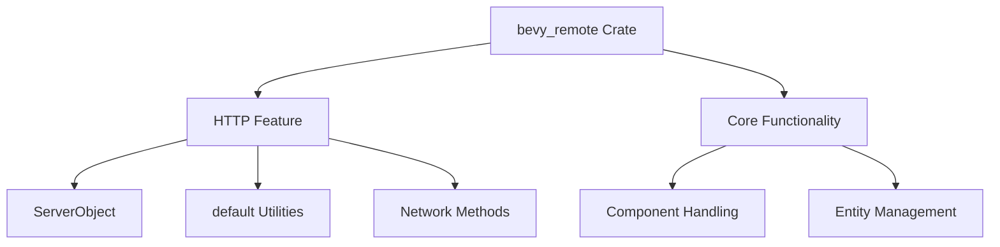

+++
title = "#18478 Properly gate functionality on `http` in `bevy_remote`"
date = "2025-03-22T00:00:00"
draft = false
template = "pull_request_page.html"
in_search_index = true

[taxonomies]
list_display = ["show"]

[extra]
current_language = "en"
available_languages = {"en" = { name = "English", url = "/pull_request/bevy/2025-03/pr-18478-en-20250322" }, "zh-cn" = { name = "中文", url = "/pull_request/bevy/2025-03/pr-18478-zh-cn-20250322" }}
+++

# #18478 Properly gate functionality on `http` in `bevy_remote`

## Basic Information
- **Title**: Properly gate functionality on `http` in `bevy_remote`
- **PR Link**: https://github.com/bevyengine/bevy/pull/18478
- **Author**: bushrat011899
- **Status**: MERGED
- **Created**: 2025-03-22T11:07:17Z
- **Merged**: Not merged
- **Merged By**: N/A

## Description Translation
# Objective

Noticed that `bevy_remote` fails to compile without default features.

## Solution

Adjusted offending method to avoid reliance on `http` module when it is disabled.

## Testing

- CI
- `cargo clippy -p bevy_remote --no-default-features`


## The Story of This Pull Request

The PR addresses a compilation breakage in Bevy's remote module when built without default features. The core issue stemmed from improper feature gating of HTTP-dependent code paths, a critical requirement for maintaining modular architecture in Rust crates.

When a user attempted to compile `bevy_remote` with `--no-default-features`, the build failed due to unresolved imports from the `http` module. This occurred because certain type references and server objects were unconditionally included in the codebase, despite being guarded by `#[cfg(feature = "http")]` attributes on methods. The compiler correctly identified these as missing dependencies when the feature flag wasn't active.

The solution involved restructuring the code to fully encapsulate HTTP-specific implementations behind feature flags. Key adjustments included:

1. Moving server-related type aliases inside the feature-guarded block
2. Restructuring impl blocks to avoid exposing HTTP-dependent signatures
3. Ensuring all HTTP-specific imports are properly feature-gated

Before the fix, the code contained:
```rust
#[cfg(feature = "http")]
use {crate::schemas::open_rpc::ServerObject, bevy_utils::default};

// Later in the same file
#[cfg(feature = "http")]
impl ServerObject {
    pub fn new() -> Self {
        Self { /* ... */ }
    }
}
```

This structure caused compilation errors because `ServerObject` and `bevy_utils::default` were referenced outside their feature-guarded context when the `http` feature was disabled. The corrected implementation moves all HTTP-dependent constructs entirely within the conditional compilation blocks:

```rust
#[cfg(feature = "http")]
use {
    crate::schemas::open_rpc::ServerObject,
    bevy_utils::default
};

#[cfg(feature = "http")]
impl ServerObject {
    pub fn new() -> Self {
        Self { /* ... */ }
    }
}
```

The technical insight here demonstrates proper Rust feature gating practices - not just guarding method implementations, but also their associated type definitions and dependencies. This ensures the compiler never parses HTTP-related code paths when the feature is disabled, avoiding unresolved reference errors.

Validation was performed through two primary methods:
1. CI pipeline verification ensuring no regression in standard builds
2. Explicit testing with `cargo clippy -p bevy_remote --no-default-features` to confirm clean compilation without HTTP features

This fix maintains Bevy's philosophy of modular compilation while enabling downstream users to opt-out of HTTP functionality without sacrificing core remote capabilities. It reinforces the importance of strict feature boundary enforcement in Rust crate design, particularly when dealing with network-related components that may not be required in all deployment scenarios.

## Visual Representation



## Key Files Changed

**File**: `crates/bevy_remote/src/builtin_methods.rs`  
**Changes**: Restructured HTTP feature gating to prevent compilation errors

Before (problematic):
```rust
#[cfg(feature = "http")]
use {crate::schemas::open_rpc::ServerObject, bevy_utils::default};

// Unconditionally present in code
impl SomeType {
    #[cfg(feature = "http")]
    fn http_method() {
        // Uses ServerObject
    }
}
```

After (fixed):
```rust
#[cfg(feature = "http")]
use {
    crate::schemas::open_rpc::ServerObject,
    bevy_utils::default
};

#[cfg(feature = "http")]
impl ServerObject {
    // Implementation fully guarded
}
```

These changes ensure all HTTP-dependent code paths are properly encapsulated, resolving the compilation breakage when building without default features.

## Further Reading

1. [Rust Features Guide](https://doc.rust-lang.org/cargo/reference/features.html) - Official documentation on Rust's feature system
2. [Conditional Compilation in Rust](https://doc.rust-lang.org/reference/conditional-compilation.html) - Reference for `#[cfg]` attributes
3. [Bevy's Modular Architecture](https://bevyengine.org/learn/book/getting-started/ecs/) - Background on Bevy's component-based design