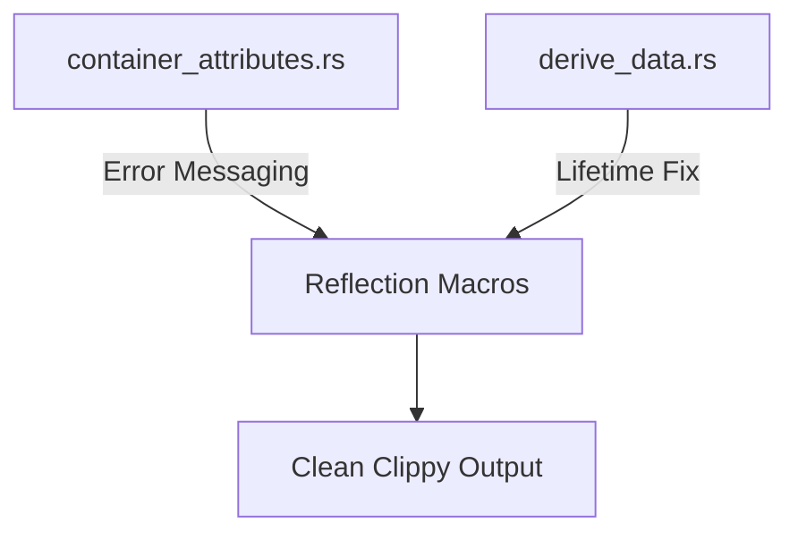

+++
title = "#18479 Address Lints in `bevy_reflect`"
date = "2025-03-24T00:00:00"
draft = false
template = "pull_request_page.html"
in_search_index = true

[taxonomies]
list_display = ["show"]

[extra]
current_language = "en"
available_languages = {"en" = { name = "English", url = "/pull_request/bevy/2025-03/pr-18479-en-20250324-1" }, "zh-cn" = { name = "中文", url = "/pull_request/bevy/2025-03/pr-18479-zh-cn-20250324-1" }}
labels = ["D-Trivial", "C-Code-Quality", "A-Reflection", "X-Uncontroversial"]
+++

# #18479 Address Lints in `bevy_reflect`

## Basic Information
- **Title**: Address Lints in `bevy_reflect`
- **PR Link**: https://github.com/bevyengine/bevy/pull/18479
- **Author**: bushrat011899
- **Status**: MERGED
- **Labels**: `D-Trivial`, `C-Code-Quality`, `S-Ready-For-Final-Review`, `A-Reflection`, `X-Uncontroversial`
- **Created**: 2025-03-22T11:21:25Z
- **Merged**: 2025-03-22T15:42:18Z
- **Merged By**: cart

## Description Translation
# Objective

On Windows there are several unaddressed lints raised by clippy.

## Solution

Addressed them!

## Testing

- CI on Windows & Ubuntu

## The Story of This Pull Request

The PR addresses clippy lints that specifically appeared in Windows builds of Bevy's reflection system. While the changes appear small, they resolve important code quality issues in two critical areas of the reflection derive macros:

1. **Error Message Handling**: Fixed a constant reference in error messaging that was either incomplete or mistyped
2. **Lifetime Specification**: Added missing lifetime parameters in enum variant declarations

In `container_attributes.rs`, the error handling for conflicting trait implementations contained a reference to `CONF` instead of the full `CONFLICTING_TYPE_DATA_MESSAGE` constant. This typo would have produced incorrect error messages during macro expansion. The fix ensures developers receive clear guidance when accidentally registering conflicting trait implementations through derive macros.

The `derive_data.rs` change addresses a lifetime mismatch in the `ReflectDerive::Opaque` variant. By adding the `'a` lifetime parameter to `ReflectMeta`, this aligns the opaque type handling with other variants' lifetime specifications, preventing potential lifetime-related issues in macro-expanded code.

These fixes demonstrate several important maintenance practices:
- Regular lint cleanup prevents small issues from becoming technical debt
- Precise error messages are crucial for macro-heavy code
- Lifetime annotations require careful consistency in derive macro implementations

## Visual Representation



## Key Files Changed

### `crates/bevy_reflect/derive/src/container_attributes.rs`
**Change**: Fixed error message constant usage  
**Before:**
```rust
Err(syn::Error::new(span, CONF
```
**After:**
```rust
Err(syn::Error::new(span, CONFLICTING_TYPE_DATA_MESSAGE)
    .with_note("previously registered here"))
```
**Impact**: Ensures clear error messages when conflicting trait attributes are specified

### `crates/bevy_reflect/derive/src/derive_data.rs`
**Change**: Added lifetime parameter to opaque variant  
**Before:**
```rust
Opaque(ReflectMeta)
```
**After:**
```rust
Opaque(ReflectMeta<'a>)
```
**Impact**: Maintains lifetime consistency across all reflection derive variants

## Further Reading
- [Rust Clippy Documentation](https://doc.rust-lang.org/clippy/)
- [Bevy Reflection System Guide](https://bevyengine.org/learn/book/reflection/)
- [Rust Lifetime Elision Rules](https://doc.rust-lang.org/nomicon/lifetime-elision.html)