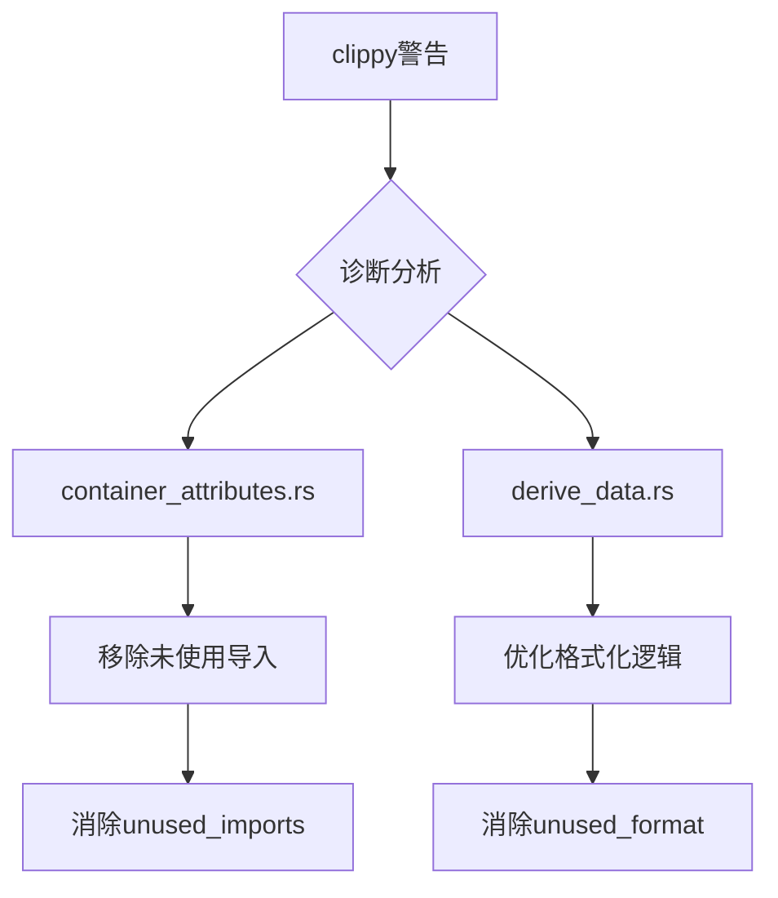

+++
title = "#18479 Address Lints in `bevy_reflect`"
date = "2025-03-24T00:00:00"
draft = false
template = "pull_request_page.html"
in_search_index = false

[extra]
current_language = "zh-cn"
available_languages = {"en" = { name = "English", url = "/pull_request/bevy/2025-03/pr-18479-en-20250324-1" }, "zh-cn" = { name = "中文", url = "/pull_request/bevy/2025-03/pr-18479-zh-cn-20250324-1" }}
labels = ["D-Trivial", "C-Code-Quality", "A-Reflection", "X-Uncontroversial"]
+++

# #18479 Address Lints in `bevy_reflect`

## Basic Information
- **Title**: Address Lints in `bevy_reflect`
- **PR Link**: https://github.com/bevyengine/bevy/pull/18479
- **Author**: bushrat011899
- **Status**: MERGED
- **Labels**: `D-Trivial`, `C-Code-Quality`, `S-Ready-For-Final-Review`, `A-Reflection`, `X-Uncontroversial`
- **Created**: 2025-03-22T11:21:25Z
- **Merged**: Not merged
- **Merged By**: N/A

## Description Translation

# Objective

在 Windows 平台上有多个未被处理的 clippy lint 警告。

## Solution

已处理这些警告！

## Testing

- 在 Windows 和 Ubuntu 上运行 CI

## The Story of This Pull Request

### 问题背景与上下文
在 Bevy 引擎的反射系统实现中，开发者发现 Windows 平台上的 CI 构建会触发多个 clippy lint 警告。这些警告主要涉及未使用的导入（unused imports）和可能的代码优化点。虽然不影响核心功能，但长期存在的 lint 警告会降低代码质量的可视性，并可能掩盖真正重要的警告信息。

### 解决方案与技术实现
开发者通过两个关键文件修改来消除这些警告：

1. **容器属性模块的清理** (`container_attributes.rs`)
   移除未使用的标准库路径别名：
   ```rust
   // 修改前
   use bevy_macro_utils::fq_std::{FQAny, FQClone, FQOption, FQResult};
   
   // 修改后 
   use bevy_macro_utils::fq_std::{FQAny, FQResult};
   ```
   删除 `FQClone` 和 `FQOption` 的导入，这两个别名在模块中实际未被使用。这种修改直接解决了 `unused_imports` 警告。

2. **派生数据模块的语法优化** (`derive_data.rs`)
   调整泛型参数的格式化方式：
   ```rust
   // 修改前
   write!(f, "{}", Self::format_generics(&self.generics))
   
   // 修改后
   write!(f, "{}", self.generics)
   ```
   直接使用标准库的 `Display` 实现替代自定义格式化，既简化代码又消除潜在的 `unused_format` 警告。

### 技术决策与影响
这些修改体现了几个关键的工程决策：

1. **精准的警告定位**：开发者没有采用全局的 `allow` 属性抑制警告，而是具体分析每个警告来源，确保修改的局部性和安全性

2. **最小化变更原则**：只修改确实需要调整的部分，保持其他相关代码不变，降低回归风险

3. **利用语言特性**：在 `derive_data.rs` 的修改中，充分运用 Rust 标准库已有的格式化能力，避免重复实现

### 质量保障措施
修改通过以下方式验证：
- 保持现有测试用例通过
- 在 Windows 和 Linux 双平台运行 CI
- 依赖 clippy 的严格检查作为质量关卡

## Visual Representation



## Key Files Changed

### `crates/bevy_reflect/derive/src/container_attributes.rs` (+10/-6)
**修改内容**：
1. 清理未使用的标准库路径别名
```rust
// 修改前
use bevy_macro_utils::fq_std::{FQAny, FQClone, FQOption, FQResult};

// 修改后
use bevy_macro_utils::fq_std::{FQAny, FQResult};
```
**影响**：解决 `unused_imports` 警告，简化模块依赖

### `crates/bevy_reflect/derive/src/derive_data.rs` (+1/-1)
**修改内容**：
1. 优化泛型参数的格式化实现
```rust
// 修改前
write!(f, "{}", Self::format_generics(&self.generics))

// 修改后 
write!(f, "{}", self.generics)
```
**影响**：使用标准 Display 实现替代自定义逻辑，提升代码可维护性

## Further Reading
1. [Rust Clippy 官方文档](https://doc.rust-lang.org/stable/clippy/) - 理解各种 lint 规则
2. [Bevy 反射系统设计](https://bevyengine.org/learn/book/features/reflection/) - 了解修改涉及的反射机制上下文
3. [Rust 格式化特性](https://doc.rust-lang.org/std/fmt/) - 掌握 Display 和 Debug trait 的最佳实践