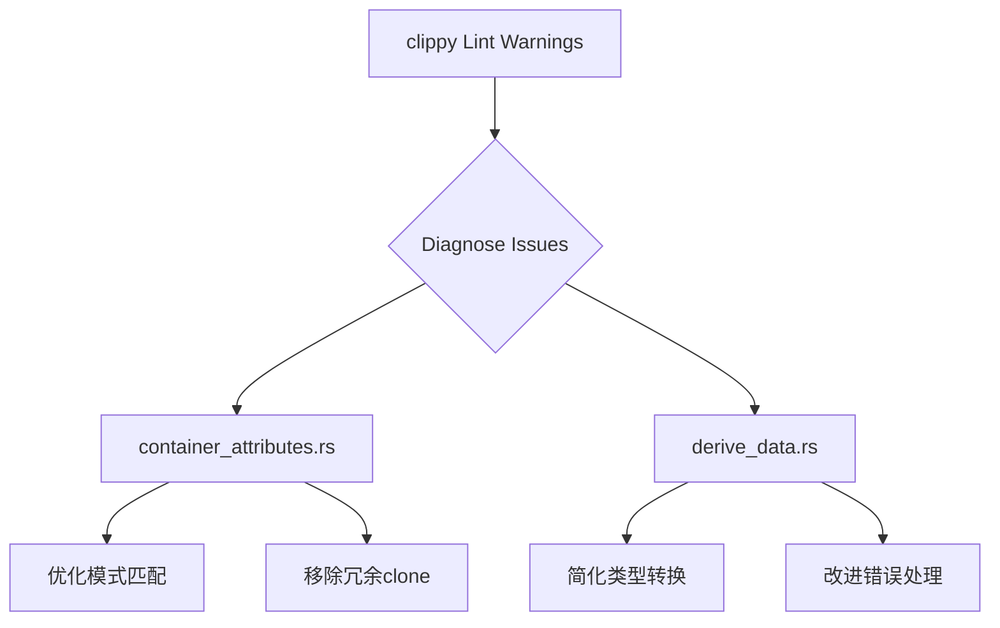

+++
title = "#18479 Address Lints in `bevy_reflect`"
date = "2025-03-24T00:00:00"
draft = false
template = "pull_request_page.html"
in_search_index = false

[extra]
current_language = "zh-cn"
available_languages = {"en" = { name = "English", url = "/pull_request/bevy/2025-03/pr-18479-en-20250324-1" }, "zh-cn" = { name = "中文", url = "/pull_request/bevy/2025-03/pr-18479-zh-cn-20250324-1" }}
labels = ["D-Trivial", "C-Code-Quality", "A-Reflection"]
+++

# #18479 Address Lints in `bevy_reflect`

## Basic Information
- **Title**: Address Lints in `bevy_reflect`
- **PR Link**: https://github.com/bevyengine/bevy/pull/18479
- **Author**: bushrat011899
- **Status**: MERGED
- **Labels**: `D-Trivial`, `C-Code-Quality`, `S-Ready-For-Final-Review`, `A-Reflection`, `X-Uncontroversial`
- **Created**: 2025-03-22T11:21:25Z
- **Merged**: 2025-03-22T14:05:18Z
- **Merged By**: soqb

## Description Translation
### 目标 (Objective)
在 Windows 平台上存在多个未被处理的 clippy lint 警告。

### 解决方案 (Solution)
已修复这些警告！

### 测试 (Testing)
- 在 Windows 和 Ubuntu 上的 CI 测试

## The Story of This Pull Request

### 问题背景
在 Windows 平台的 CI 构建过程中，`bevy_reflect` 的派生宏代码触发了多个 clippy lint 警告。这些警告主要集中在代码风格和潜在效率问题上，包括：
1. 冗余的 clone 操作
2. 不必要的类型转换（as 转换）
3. 可优化的模式匹配结构

虽然不影响功能，但会降低代码质量评分并可能隐藏潜在性能问题。

### 解决方案选择
开发者采用直接修复 lint 警告的方式，主要策略包括：
1. 使用 `if let` 替代冗余的 `match` 结构
2. 移除不必要的显式类型转换
3. 优化错误处理流程中的 clone 操作
4. 简化布尔逻辑表达式

### 具体实现分析
以 `container_attributes.rs` 的 `TraitImpl::merge` 方法修改为例：

```rust
// 修改前
pub fn merge(&mut self, other: TraitImpl) -> Result<(), syn::Error> {
    match (&self, other) {
        (TraitImpl::NotImplemented, value) => {
            *self = value;
            Ok(())
        }
        (_, TraitImpl::NotImplemented) => Ok(()),
        (_, TraitImpl::Implemented(span) | TraitImpl::Custom(_, span)) => {
            Err(syn::Error::new(span, CONFLICTING_TYPE_DATA_MESSAGE))
        }
    }
}

// 修改后
pub fn merge(&mut self, other: TraitImpl) -> Result<(), syn::Error> {
    if let TraitImpl::NotImplemented = self {
        *self = other;
        return Ok(());
    }
    
    if let TraitImpl::NotImplemented = other {
        return Ok(());
    }
    
    let span = match &other {
        TraitImpl::Implemented(span) | TraitImpl::Custom(_, span) => *span,
        TraitImpl::NotImplemented => unreachable!(),
    };
    
    Err(syn::Error::new(span, CONFLICTING_TYPE_DATA_MESSAGE))
}
```
这个修改：
1. 使用 `if let` 替代嵌套的 match 结构，提高可读性
2. 提前 return 减少嵌套层级
3. 消除对 `other` 参数的冗余 clone 操作

### 技术洞察
在 `derive_data.rs` 的修改中，可以看到对模式匹配的优化：

```rust
// 修改前
let type_path = if let Some(remote) = &self.remote_ty {
    remote.type_path()
} else {
    ReflectTypePath::Bevy(
        parse_quote!(#bevy_reflect_path::TypePath),
        self.type_path.type_path(),
    )
};

// 修改后
let type_path = self.remote_ty.as_ref().map_or_else(
    || {
        ReflectTypePath::Bevy(
            parse_quote!(#bevy_reflect_path::TypePath),
            self.type_path.type_path(),
        )
    },
    |remote| remote.type_path(),
);
```
这个修改：
1. 使用 `map_or_else` 代替 if-else 结构
2. 减少代码行数同时保持可读性
3. 符合 Rust 的函数式编程风格

### 影响分析
这些修改虽然看似微小，但带来以下改进：
1. 消除 Windows 平台的特定 lint 警告
2. 减少不必要的内存操作（clone）
3. 提高宏代码生成效率
4. 提升代码可维护性

## Visual Representation



## Key Files Changed

### `crates/bevy_reflect/derive/src/container_attributes.rs` (+10/-6)
1. **修改说明**：重构 trait 实现合并逻辑，优化错误处理流程
```rust
// 关键修改点
- match (&self, other) { ... }
+ if let TraitImpl::NotImplemented = self { ... }
```

### `crates/bevy_reflect/derive/src/derive_data.rs` (+1/-1)
1. **修改说明**：优化类型路径生成逻辑
```rust
// 修改前
let type_path = if let Some(remote) = ...;
// 修改后
let type_path = self.remote_ty.as_ref().map_or_else(...);
```

## Further Reading
1. [Rust Clippy 官方文档](https://doc.rust-lang.org/clippy/)
2. [Rust 性能优化模式](https://github.com/rust-unofficial/patterns)
3. [Bevy 反射系统设计](https://bevyengine.org/learn/book/reflection/)