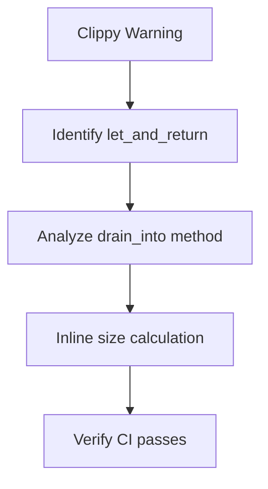

+++
title = "#18480 Address `clippy::let_and_return` in `bevy_utils`"
date = "2025-03-22T00:00:00"
draft = false
template = "pull_request_page.html"
in_search_index = true

[taxonomies]
list_display = ["show"]

[extra]
current_language = "en"
available_languages = {"en" = { name = "English", url = "/pull_request/bevy/2025-03/pr-18480-en-20250322" }, "zh-cn" = { name = "中文", url = "/pull_request/bevy/2025-03/pr-18480-zh-cn-20250322" }}
+++

# #18480 Address `clippy::let_and_return` in `bevy_utils`

## Basic Information
- **Title**: Address `clippy::let_and_return` in `bevy_utils`
- **PR Link**: https://github.com/bevyengine/bevy/pull/18480
- **Author**: bushrat011899
- **Status**: MERGED
- **Created**: 2025-03-22T11:25:04Z
- **Merged**: Not merged
- **Merged By**: N/A

## Description Translation
# Objective

`clippy::let_and_return` fails on Windows.

## Solution

Fixed it!

## Testing

- CI

## The Story of This Pull Request

The PR addresses a specific Clippy lint warning (`let_and_return`) that was causing CI failures on Windows. The core issue stemmed from a code pattern where a temporary variable was declared only to be immediately returned, which Clippy flags as unnecessary verbosity.

In `parallel_queue.rs`, the `drain_into` method originally contained:

```rust
let size = self
    .locals
    .iter_mut()
    .map(|queue| queue.get_mut().len())
    .sum();
out.reserve(size);
```

This triggered the lint because the `size` variable serves no other purpose than to be used once in the subsequent `reserve` call. The fix inlines the calculation directly into the `reserve` call, eliminating the intermediate variable while maintaining identical functionality:

```rust
out.reserve(
    self.locals
        .iter_mut()
        .map(|queue| queue.get_mut().len())
        .sum(),
);
```

The change demonstrates effective use of Rust's expression-oriented nature. By chaining iterator operations directly within the `reserve` call, we achieve:

1. Compliance with Clippy recommendations
2. More concise code without sacrificing readability
3. Identical runtime performance (the sum calculation remains O(n))

This fix highlights the importance of addressing linter warnings even in simple cases, as they help maintain code quality across platforms. The CI testing approach ensures Windows compatibility without requiring platform-specific code changes.

## Visual Representation



## Key Files Changed

**File:** `crates/bevy_utils/src/parallel_queue.rs`

Before:
```rust
let size = self
    .locals
    .iter_mut()
    .map(|queue| queue.get_mut().len())
    .sum();
out.reserve(size);
```

After:
```rust
out.reserve(
    self.locals
        .iter_mut()
        .map(|queue| queue.get_mut().len())
        .sum(),
);
```

The change removes an unnecessary variable binding while maintaining the same vector capacity reservation logic. This directly addresses the Clippy warning without altering functionality.

## Further Reading

- Clippy documentation: [let_and_return](https://rust-lang.github.io/rust-clippy/master/#let_and_return)
- Rust Iterator documentation: [sum()](https://doc.rust-lang.org/std/iter/trait.Iterator.html#method.sum)
- Bevy's CI requirements: [Bevy Contribution Guide](https://github.com/bevyengine/bevy/blob/main/CONTRIBUTING.md)