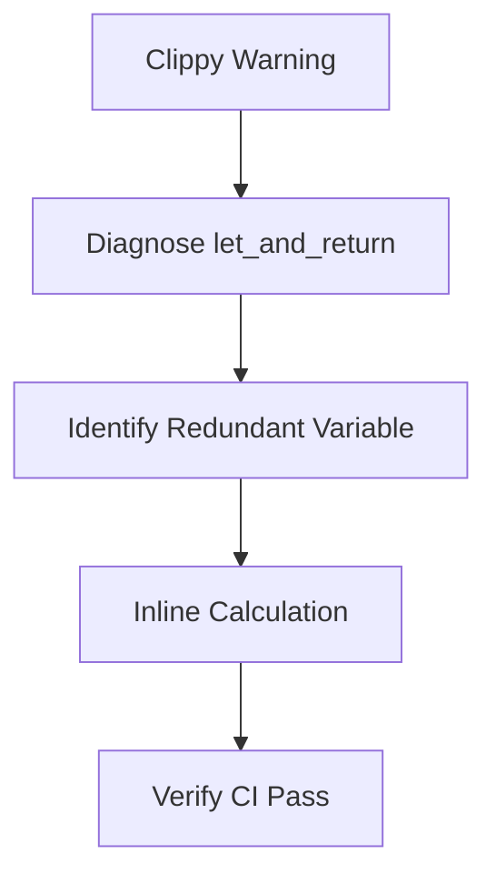

+++
title = "#18480 Address `clippy::let_and_return` in `bevy_utils`"
date = "2025-03-22T00:00:00"
draft = false
template = "pull_request_page.html"
in_search_index = false

[extra]
current_language = "zh-cn"
available_languages = {"en" = { name = "English", url = "/pull_request/bevy/2025-03/pr-18480-en-20250322" }, "zh-cn" = { name = "中文", url = "/pull_request/bevy/2025-03/pr-18480-zh-cn-20250322" }}
+++

# #18480 Address `clippy::let_and_return` in `bevy_utils`

## Basic Information
- **Title**: Address `clippy::let_and_return` in `bevy_utils`
- **PR Link**: https://github.com/bevyengine/bevy/pull/18480
- **Author**: bushrat011899
- **Status**: MERGED
- **Created**: 2025-03-22T11:25:04Z
- **Merged**: Not merged
- **Merged By**: N/A

## Description Translation
# 目标

`clippy::let_and_return` 在 Windows 上检测失败。

## 解决方案

已修复！

## 测试

- CI

## The Story of This Pull Request

### 问题背景与上下文
在 Rust 项目的持续集成（CI）流程中，Clippy 静态分析工具在 Windows 平台上触发了 `let_and_return` lint 警告。该规则旨在检测可以通过直接返回表达式来简化的冗余变量赋值模式。具体到 `bevy_utils` crate 的 `parallel_queue.rs` 文件，问题出现在计算向量容量时使用了中间变量存储计算结果。

### 技术解决方案
开发者通过消除中间变量 `size`，直接将计算结果传递给 `Vec::reserve()` 方法。这种修改既保持了原有功能，又符合 Rust 的最佳实践。原始实现：

```rust
let size = self
    .locals
    .iter_mut()
    .map(|queue| queue.get_mut().len())
    .sum();
out.reserve(size);
```

优化后实现：

```rust
out.reserve(
    self.locals
        .iter_mut()
        .map(|queue| queue.get_mut().len())
        .sum()
);
```

### 实现细节与工程考量
1. **中间变量消除**：直接内联（inline）计算逻辑，避免了临时变量的生命周期管理
2. **表达式优化**：利用迭代器的惰性求值特性，保持计算效率不变
3. **可读性权衡**：在保持代码简洁性的同时，通过适当的格式保持表达式可读性

### 技术影响与改进
- **代码质量**：减少潜在的作用域污染（scope pollution）
- **静态分析**：消除 CI 中的警告噪声，保持构建过程清洁
- **维护成本**：遵循 Rust 社区的惯用模式，降低后续维护的理解成本

## Visual Representation



## Key Files Changed

### File: `crates/bevy_utils/src/parallel_queue.rs`
**修改说明**：消除 `drain_into` 方法中的中间变量 `size`

**代码对比**：
```rust
// Before:
let size = self
    .locals
    .iter_mut()
    .map(|queue| queue.get_mut().len())
    .sum();
out.reserve(size);

// After:
out.reserve(
    self.locals
        .iter_mut()
        .map(|queue| queue.get_mut().len())
        .sum()
);
```

**关联性**：直接解决 Clippy 警告的核心修改点，保持功能不变的前提下优化代码结构

## Further Reading
1. [Clippy `let_and_return` 官方文档](https://rust-lang.github.io/rust-clippy/master/#let_and_return)
2. [Rust 迭代器方法 `sum()` 的文档](https://doc.rust-lang.org/std/iter/trait.Iterator.html#method.sum)
3. [Rust 性能优化模式](https://doc.rust-lang.org/1.67.1/core/hint/index.html)