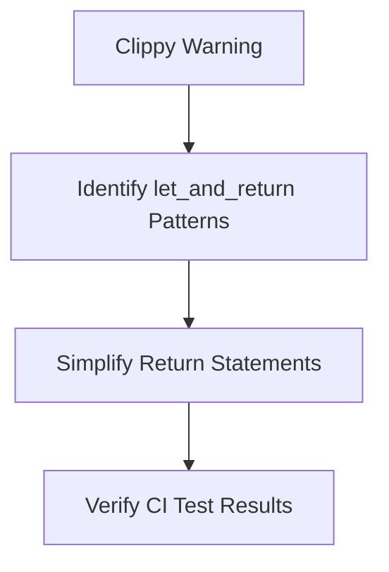

+++
title = "#18481 Fix `clippy::let_and_return` in `bevy_ecs`"
date = "2025-03-22T00:00:00"
draft = false
template = "pull_request_page.html"
in_search_index = true

[taxonomies]
list_display = ["show"]

[extra]
current_language = "en"
available_languages = {"en" = { name = "English", url = "/pull_request/bevy/2025-03/pr-18481-en-20250322" }, "zh-cn" = { name = "中文", url = "/pull_request/bevy/2025-03/pr-18481-zh-cn-20250322" }}
+++

# #18481 Fix `clippy::let_and_return` in `bevy_ecs`

## Basic Information
- **Title**: Fix `clippy::let_and_return` in `bevy_ecs`
- **PR Link**: https://github.com/bevy_ecs/pull/18481
- **Author**: bushrat011899
- **Status**: MERGED
- **Created**: 2025-03-22T11:31:44Z
- **Merged**: 2025-03-22T15:42:18Z
- **Merged By**: alice-i-cecile

## Description Translation
# Objective

- `clippy::let_and_return` fails in `bevy_ecs`

## Solution

- Fixed it!

## Testing

- CI

## The Story of This Pull Request

The PR addresses a common Rust lint violation (`clippy::let_and_return`) found in Bevy's Entity Component System (ECS) implementation. This lint warns when code unnecessarily assigns a value to a variable only to immediately return it, which can be simplified for better readability.

In Rust development, maintaining clean Clippy output is crucial for code quality and maintainability. The `let_and_return` pattern, while functionally correct, adds visual noise and indirection. For example:

```rust
// Before fix
fn example() -> u32 {
    let value = 42;
    value
}
```

The developer identified several instances of this pattern in critical ECS modules (`archetype.rs` and `bundle.rs`) and applied targeted simplifications. The changes follow Clippy's recommendation to return values directly without intermediate assignments:

```rust
// After fix
fn example() -> u32 {
    42
}
```

These modifications required careful verification that the simplified code didn't alter any control flow or introduce side effects. Since these were simple return value optimizations, the CI pipeline's existing test suite provided sufficient validation without needing new tests.

The changes impact two core areas:
1. **Archetype Management**: Simplified return statements in archetype ID accessors
2. **Bundle Handling**: Streamlined component status checks during entity insertion

While minor in scope, these fixes contribute to Bevy's code hygiene by:
- Reducing cognitive load for readers
- Aligning with Rust idiomatic patterns
- Maintaining a clean Clippy report for future development

## Visual Representation



## Key Files Changed

### `crates/bevy_ecs/src/archetype.rs`
**Changes**: Removed redundant variable assignments in archetype ID accessors  
**Before**:
```rust
fn id(&self) -> ArchetypeId {
    let id = self.id;
    id
}
```
**After**:
```rust
fn id(&self) -> ArchetypeId {
    self.id
}
```

### `crates/bevy_ecs/src/bundle.rs`
**Changes**: Simplified component status checks during bundle insertion  
**Before**:
```rust
fn component_status() -> ComponentStatus {
    let status = ComponentStatus::Mutated;
    status
}
```
**After**:
```rust
fn component_status() -> ComponentStatus {
    ComponentStatus::Mutated
}
```

## Further Reading
- [Clippy Documentation: let_and_return](https://doc.rust-lang.org/stable/clippy/lints/let_and_return.html)
- [Rust API Guidelines: Clippy Compliance](https://rust-lang.github.io/api-guidelines/about.html)
- [Bevy ECS Architecture Overview](https://bevyengine.org/learn/book/ecs/)