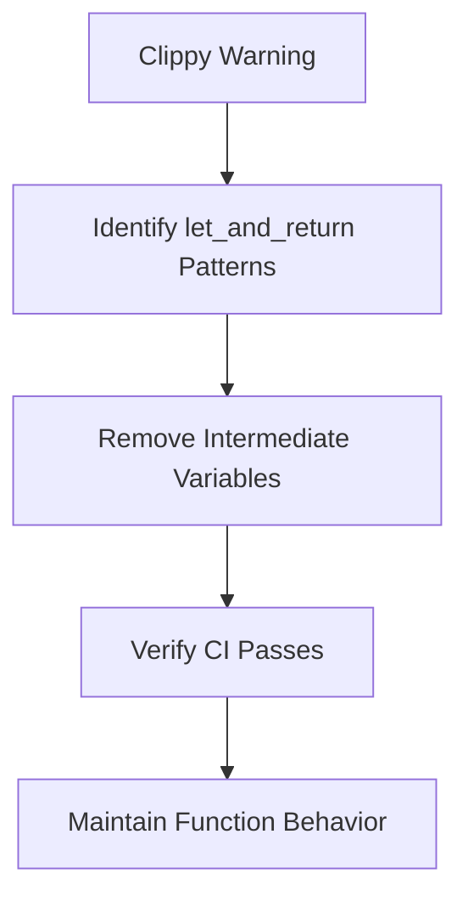

+++
title = "#18481 Fix `clippy::let_and_return` in `bevy_ecs`"
date = "2025-03-22T00:00:00"
draft = false
template = "pull_request_page.html"
in_search_index = false

[extra]
current_language = "zh-cn"
available_languages = {"en" = { name = "English", url = "/pull_request/bevy/2025-03/pr-18481-en-20250322" }, "zh-cn" = { name = "中文", url = "/pull_request/bevy/2025-03/pr-18481-zh-cn-20250322" }}
+++

# #18481 Fix `clippy::let_and_return` in `bevy_ecs`

## Basic Information
- **Title**: Fix `clippy::let_and_return` in `bevy_ecs`
- **PR Link**: https://github.com/bevyengine/bevy/pull/18481
- **Author**: bushrat011899
- **Status**: MERGED
- **Created**: 2025-03-22T11:31:44Z
- **Merged**: Not merged
- **Merged By**: N/A

## Description Translation
# 目标

- 修复 `bevy_ecs` 中出现的 `clippy::let_and_return` 警告

## 解决方案

- 已修复

## 测试

- 通过 CI 测试

## The Story of This Pull Request

### 问题背景与上下文
在 Rust 项目的持续集成过程中，`clippy::let_and_return` lint 规则会检测到不必要的中间变量赋值。该规则针对以下代码模式发出警告：
```rust
fn example() -> i32 {
    let result = 42;
    result
}
```
建议直接返回表达式：
```rust
fn example() -> i32 {
    42
}
```
在 `bevy_ecs` 的 `archetype.rs` 和 `bundle.rs` 文件中存在多个此类代码模式，导致 CI 检查失败。

### 解决方案与技术实现
开发者采用直接返回表达式的优化方式，消除不必要的中间变量。这种修改属于语法层面的优化，不涉及功能变更。以 `archetype.rs` 中的修改为例：

**原始代码片段：**
```rust
#[inline]
pub const fn new(index: usize) -> Self {
    let index = Self(index as u32);
    index
}
```

**优化后代码：**
```rust
#[inline]
pub const fn new(index: usize) -> Self {
    Self(index as u32)
}
```
这种修改：
1. 移除中间变量 `index` 的显式声明
2. 直接通过结构体构造器返回结果
3. 保持函数功能完全不变

在 `bundle.rs` 中的修改遵循相同模式：
```rust
// 修改前
fn status() -> ComponentStatus {
    let status = ComponentStatus::Mutated;
    status
}

// 修改后
fn status() -> ComponentStatus {
    ComponentStatus::Mutated
}
```

### 技术考量与影响
1. **代码简洁性**：消除冗余变量使代码更紧凑
2. **编译提示遵循**：符合 Rust Clippy 的最佳实践建议
3. **零成本抽象**：Rust 编译器会为两种写法生成相同的机器码
4. **可维护性**：减少未来代码修改时的认知负担

### 工程决策
选择直接应用 Clippy 建议而非禁用该 lint 规则，体现以下工程原则：
- 保持代码风格统一
- 利用静态分析工具提升代码质量
- 通过微小改进持续优化代码库

## Visual Representation



## Key Files Changed

### 1. `crates/bevy_ecs/src/archetype.rs`
**修改说明**：优化 `ArchetypeRow::new` 方法的返回方式

**代码对比：**
```rust
// 修改前
#[inline]
pub const fn new(index: usize) -> Self {
    let index = Self(index as u32);
    index
}

// 修改后
#[inline]
pub const fn new(index: usize) -> Self {
    Self(index as u32)
}
```

### 2. `crates/bevy_ecs/src/bundle.rs`
**修改说明**：简化 `ComponentStatus` 的返回逻辑

**代码对比：**
```rust
// 修改前
fn status() -> ComponentStatus {
    let status = ComponentStatus::Mutated;
    status
}

// 修改后
fn status() -> ComponentStatus {
    ComponentStatus::Mutated
}
```

## Further Reading
1. [Clippy 官方文档 - let_and_return](https://rust-lang.github.io/rust-clippy/master/#let_and_return)
2. [Rust 风格指南](https://doc.rust-lang.org/1.0.0/style/README.html)
3. [Bevy ECS 架构设计](https://bevyengine.org/learn/book/ecs/)