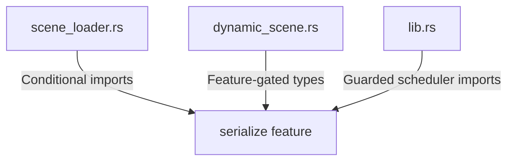

+++
title = "#18482 Properly gate imports in `bevy_scene`"
date = "2025-03-22T00:00:00"
draft = false
template = "pull_request_page.html"
in_search_index = true

[taxonomies]
list_display = ["show"]

[extra]
current_language = "en"
available_languages = {"zh-cn" = { name = "中文", url = "/pull_request/bevy/2025-03/pr-18482-zh-cn-20250322" }, "en" = { name = "English", url = "/pull_request/bevy/2025-03/pr-18482-en-20250322" }}
+++

# #18482 Properly gate imports in `bevy_scene`

## Basic Information
- **Title**: Properly gate imports in `bevy_scene`
- **PR Link**: https://github.com/bevyengine/bevy/pull/18482
- **Author**: bushrat011899
- **Status**: MERGED
- **Created**: 2025-03-22T11:40:29Z
- **Merged**: Not merged
- **Merged By**: N/A

## Description Translation
# Objective

- Some imports are only used with certain features.

## Solution

- Gate them!

## Testing

- CI

## The Story of This Pull Request

The PR addresses a common Rust ecosystem challenge: managing conditional compilation through feature gating. The Bevy engine's scene handling code contained several imports that were only relevant when specific features (particularly serialization) were enabled. This created potential compilation issues and unnecessary bloat when building without those features.

In `bevy_scene`, certain types like `ComponentCloneBehavior` and `RelationshipHookMode` were unconditionally imported in `dynamic_scene.rs`, despite only being used within `#[cfg(feature = "serialize")]` code blocks. Similarly, `scene_loader.rs` contained serialization-related imports that weren't properly gated. The changes ensure these imports are only included when their corresponding features are active.

The implementation demonstrates Rust's conditional compilation system through judicious use of `#[cfg(feature = "serialize")]` attributes. For example, in `scene_loader.rs`:

```rust
#[cfg(feature = "serialize")]
use {
    crate::{serde::SceneDeserializer, DynamicScene},
    bevy_asset::{io::Reader, AssetLoader, LoadContext},
    serde::de::DeserializeSeed,
};
```

This change eliminates unused import warnings and reduces compile-time dependencies when building without serialization support. The pattern is consistently applied across multiple files, showing attention to systematic code hygiene rather than isolated fixes.

In `lib.rs`, the PR gates scheduler-related imports that are only used in serialization contexts:

```rust
#[cfg(feature = "serialize")]
use {bevy_asset::AssetApp, bevy_ecs::schedule::IntoScheduleConfigs};
```

These changes maintain functionality while making the codebase more modular. The CI testing approach validates that both feature-enabled and feature-disabled configurations remain functional, though the PR description suggests this verification could be more explicit.

## Visual Representation



## Key Files Changed

### `crates/bevy_scene/src/scene_loader.rs` (+12/-6)
**Key Change:** Properly gate serialization-related imports
```rust
// Before (unconditional):
use bevy_asset::{io::Reader, AssetLoader, LoadContext};
use serde::de::DeserializeSeed;

// After (conditional):
#[cfg(feature = "serialize")]
use {
    bevy_asset::{io::Reader, AssetLoader, LoadContext},
    serde::de::DeserializeSeed,
};
```
Ensures serialization dependencies only load when needed

### `crates/bevy_scene/src/dynamic_scene.rs` (+8/-5)
**Key Change:** Move component behavior imports behind feature flag
```rust
// Before:
use bevy_ecs::component::ComponentCloneBehavior;
use bevy_ecs::relationship::RelationshipHookMode;

// After:
#[cfg(feature = "serialize")]
use bevy_ecs::{
    component::ComponentCloneBehavior,
    relationship::RelationshipHookMode,
};
```
Aligns imports with their actual usage context

### `crates/bevy_scene/src/lib.rs` (+3/-2)
**Key Change:** Guard scheduler configuration imports
```rust
// Before:
use {bevy_asset::AssetApp, bevy_ecs::schedule::IntoScheduleConfigs};

// After:
#[cfg(feature = "serialize")]
use {bevy_asset::AssetApp, bevy_ecs::schedule::IntoScheduleConfigs};
```
Prevents unnecessary scheduler dependencies in non-serialized builds

## Further Reading
- Rust Feature Gating: https://doc.rust-lang.org/cargo/reference/features.html
- Bevy Scene System: https://bevyengine.org/learn/book/getting-started/scene/
- Conditional Compilation in Rust: https://doc.rust-lang.org/reference/conditional-compilation.html