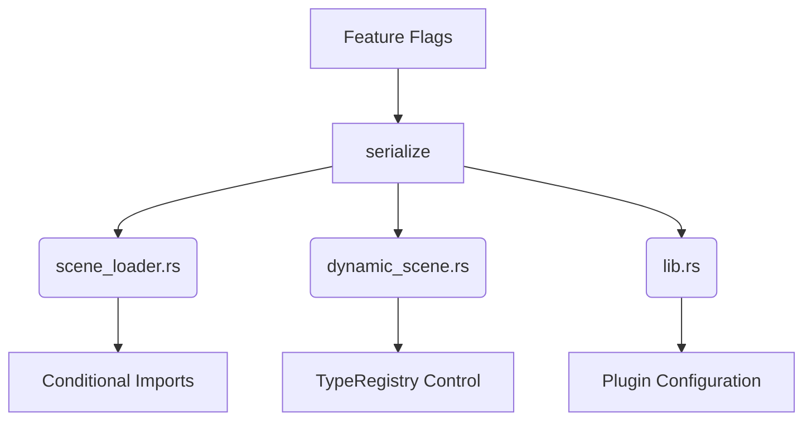

+++
title = "#18482 Properly gate imports in `bevy_scene`"
date = "2025-03-22T00:00:00"
draft = false
template = "pull_request_page.html"
in_search_index = false

[extra]
current_language = "zh-cn"
available_languages = {"en" = { name = "English", url = "/pull_request/bevy/2025-03/pr-18482-en-20250322" }, "zh-cn" = { name = "中文", url = "/pull_request/bevy/2025-03/pr-18482-zh-cn-20250322" }}
+++

# #18482 Properly gate imports in `bevy_scene`

## Basic Information
- **Title**: Properly gate imports in `bevy_scene`
- **PR Link**: https://github.com/bevyengine/bevy/pull/18482
- **Author**: bushrat011899
- **Status**: MERGED
- **Created**: 2025-03-22T11:40:29Z
- **Merged**: Not merged
- **Merged By**: N/A

## Description Translation
### 目标
- 部分导入仅在特定feature启用时才需要使用

### 解决方案
- 添加条件编译控制

### 测试
- CI验证

## The Story of This Pull Request

### 问题与背景
在`bevy_scene`模块中，部分代码存在条件编译不完善的问题。具体来说，当用户不启用`serialize`特性时，某些依赖该特性的模块仍然会被导入，导致编译错误。例如：

1. 在`scene_loader.rs`中，`serde::de::DeserializeSeed`和`DynamicScene`的导入未受`serialize`特性控制
2. 在`dynamic_scene.rs`中，`TypeRegistry`和`SceneSerializer`的导入同样缺少特性门控

这些问题违反了Rust的条件编译最佳实践，可能导致以下后果：
- 增加不必要的编译依赖
- 在非`serialize`模式下产生编译错误
- 影响代码可维护性

### 解决方案
核心思路是通过`#[cfg(feature = "serialize")]`属性精确控制相关导入和代码块。主要修改分为三个层面：

1. **模块导入控制**：将特定feature相关的导入语句包裹在条件编译块中
2. **代码块隔离**：对依赖这些导入的代码段添加相同的条件编译
3. **编译器提示优化**：使用`cfg_attr`处理未启用特性时的编译器警告

以`scene_loader.rs`为例，原始代码如下：
```rust
use {
    crate::{serde::SceneDeserializer, DynamicScene},
    bevy_asset::{io::Reader, AssetLoader, LoadContext},
    serde::de::DeserializeSeed,
};
```
修改后：
```rust
#[cfg(feature = "serialize")]
use {
    crate::{serde::SceneDeserializer, DynamicScene},
    bevy_asset::{io::Reader, AssetLoader, LoadContext},
    serde::de::DeserializeSeed,
};
```

### 实现细节
**关键修改1：scene_loader.rs的条件编译**
```rust
// 原始代码
use thiserror::Error;

#[cfg(feature = "serialize")]
use {
    crate::{serde::SceneDeserializer, DynamicScene},
    bevy_asset::{io::Reader, AssetLoader, LoadContext},
    serde::de::DeserializeSeed,
};

// 修改后
use thiserror::Error;

#[cfg(feature = "serialize")]
use {
    crate::{serde::SceneDeserializer, DynamicScene},
    bevy_asset::{io::Reader, AssetLoader, LoadContext},
    serde::de::DeserializeSeed,
};
```
同时处理未启用特性时的编译器警告：
```rust
#[cfg_attr(
    not(feature = "serialize"),
    expect(dead_code, reason = "only used with `serialize` feature")
)]
type_registry: TypeRegistryArc,
```

**关键修改2：dynamic_scene.rs的导入优化**
```rust
// 原始导入
use {
    crate::{ron, serde::SceneSerializer},
    bevy_reflect::TypeRegistry,
    serde::Serialize,
};

// 优化后
#[cfg(feature = "serialize")]
use {
    crate::{ron, serde::SceneSerializer},
    bevy_reflect::TypeRegistry,
    serde::Serialize,
};
```

### 技术洞察
1. **条件编译策略**：使用`#[cfg(feature = "...")]`确保代码块仅在特定特性启用时编译
2. **编译器提示**：`cfg_attr`用于在非目标编译条件下提供明确的警告说明
3. **模块化控制**：将相关功能集中到特性开关下，提升代码可维护性

### 影响与改进
1. **编译稳定性**：消除非`serialize`模式下的编译错误
2. **依赖管理**：减少不必要的编译依赖，提升编译速度
3. **代码清晰度**：明确功能模块与特性开关的关系
4. **维护性**：为后续特性开发建立规范的导入模式

## Visual Representation



## Key Files Changed

### 1. `crates/bevy_scene/src/scene_loader.rs` (+12/-6)
**修改说明**：
- 将`serde::de::DeserializeSeed`等导入包裹在`#[cfg(feature = "serialize")]`中
- 添加`cfg_attr`处理未启用特性时的编译警告

**代码片段**：
```rust
// Before:
use serde::de::DeserializeSeed;

// After:
#[cfg(feature = "serialize")]
use serde::de::DeserializeSeed;
```

### 2. `crates/bevy_scene/src/dynamic_scene.rs` (+8/-5)
**修改说明**：
- 控制`TypeRegistry`和`SceneSerializer`的导入条件
- 优化资源提取逻辑的条件编译

**代码片段**：
```rust
// Before:
use bevy_reflect::TypeRegistry;

// After:
#[cfg(feature = "serialize")]
use bevy_reflect::TypeRegistry;
```

### 3. `crates/bevy_scene/src/lib.rs` (+3/-2)
**修改说明**：
- 调整插件构建逻辑的条件编译范围
- 确保`serialize`特性关闭时的编译完整性

**代码片段**：
```rust
// Before:
use bevy_ecs::schedule::IntoScheduleConfigs;

// After:
#[cfg(feature = "serialize")]
use bevy_ecs::schedule::IntoScheduleConfigs;
```

## Further Reading
1. [Rust条件编译官方文档](https://doc.rust-lang.org/reference/conditional-compilation.html)
2. [Bevy引擎特性管理指南](https://bevyengine.org/learn/book/getting-started/features/)
3. [cfg_attr属性使用模式](https://doc.rust-lang.org/reference/conditional-compilation.html#the-cfg_attr-attribute)
4. [Rust模块系统最佳实践](https://doc.rust-lang.org/book/ch07-02-defining-modules-to-control-scope-and-privacy.html)