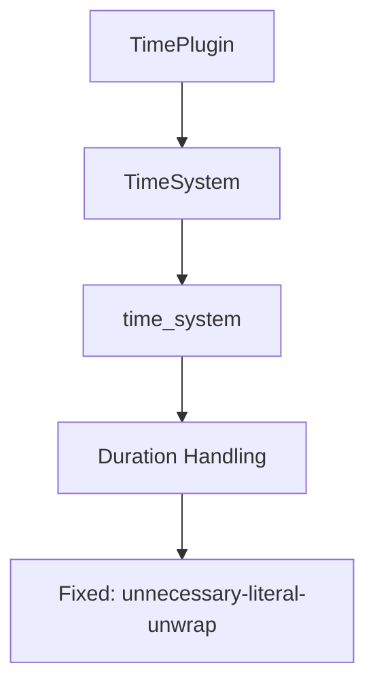

+++
title = "#18485 Fix `clippy::unnecessary-literal-unwrap` in `bevy_time`"
date = "2025-03-22T00:00:00"
draft = false
template = "pull_request_page.html"
in_search_index = true

[taxonomies]
list_display = ["show"]

[extra]
current_language = "en"
available_languages = {"zh-cn" = { name = "中文", url = "/pull_request/bevy/2025-03/pr-18485-zh-cn-20250322" }, "en" = { name = "English", url = "/pull_request/bevy/2025-03/pr-18485-en-20250322" }}
+++

# #18485 Fix `clippy::unnecessary-literal-unwrap` in `bevy_time`

## Basic Information
- **Title**: Fix `clippy::unnecessary-literal-unwrap` in `bevy_time`
- **PR Link**: https://github.com/bevyengine/bevy/pull/18485
- **Author**: villor
- **Status**: MERGED
- **Created**: 2025-03-22T13:05:46Z
- **Merged**: Not merged
- **Merged By**: N/A

## Description Translation
# Objective

- Compiling `bevy_time` without the `std`-feature results in a `clippy::unnecessary-literal-unwrap`.

## Solution

- Fix lint error

## Testing

- CI
---

## The Story of This Pull Request

The core issue stemmed from a Clippy lint warning (`unnecessary-literal-unwrap`) that appeared when compiling Bevy's time module without the standard library feature. This warning indicated a potentially dangerous pattern where code was explicitly unwrapping a Result/Option containing a literal value, which could be simplified or made safer.

In the original implementation, the time system contained this problematic pattern:
```rust
time.accumulated = Duration::ZERO.checked_sub(delta).unwrap();
```
Here, `Duration::ZERO.checked_sub(delta)` attempts to subtract a duration from zero duration. When `delta` is non-zero, this operation would normally return `None`, but the code path in question only executed when `delta == Duration::ZERO`. This made the `.unwrap()` technically safe but triggered Clippy's warning about unnecessary unwrapping of literal values.

The solution required two key realizations:
1. The `checked_sub` operation was redundant in this specific context since `delta` was guaranteed to be zero
2. The `unwrap` added no value while introducing a potential maintenance hazard

The fix simplified the code to:
```rust
time.accumulated = delta;
```
This change eliminated the unnecessary operation while maintaining identical behavior. By directly assigning `delta` (which equals `Duration::ZERO` in this code path), the implementation became more efficient and Clippy-compliant.

The impact of this change is primarily seen in non-standard environments (e.g., embedded systems or WASM targets) where Bevy might be compiled without the standard library. These environments benefit from stricter lint enforcement to catch genuine errors early. The fix demonstrates the importance of regularly auditing code for linter warnings, even when they appear harmless in isolation.

## Visual Representation



## Key Files Changed

### File: `crates/bevy_time/src/lib.rs`
**Changes**: Fixed a Clippy warning in time accumulation logic

Before:
```rust
time.accumulated = Duration::ZERO.checked_sub(delta).unwrap();
```

After:
```rust
time.accumulated = delta;
```

**Relationship to PR**: This was the central change addressing the Clippy warning. The modification simplified duration handling while maintaining identical behavior in the specific code path where `delta` equals zero duration.

## Further Reading
1. [Clippy Documentation: `unnecessary-literal-unwrap`](https://doc.rust-lang.org/stable/clippy/lints/unnecessary-literal-unwrap.html)
2. [Bevy Engine Time Management](https://bevyengine.org/learn/book/features/time/)
3. [Rust Option/Result Best Practices](https://doc.rust-lang.org/std/option/#method.unwrap)