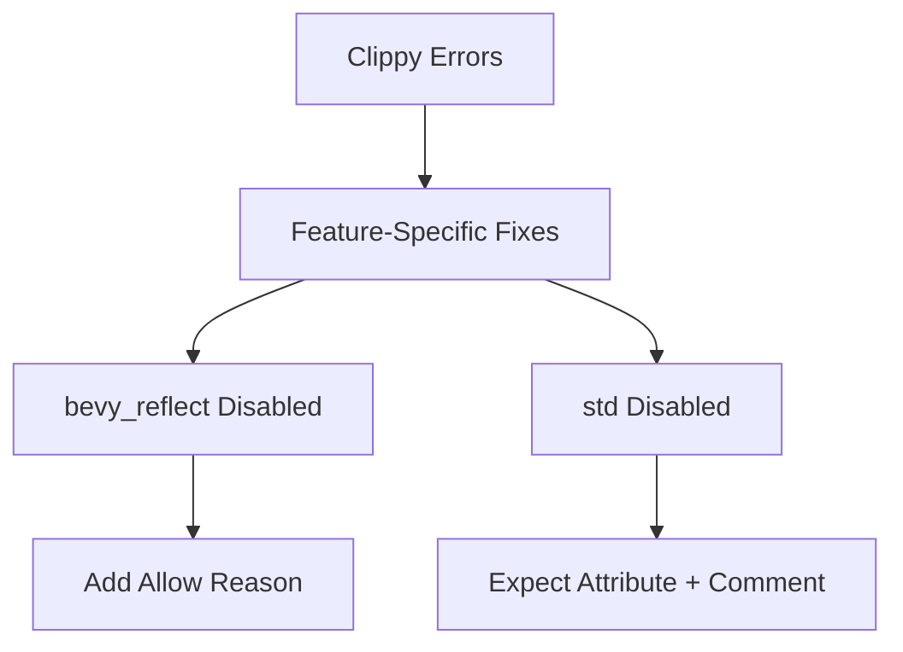

+++
title = "#18488 Fix lint errors on `bevy_ecs` with disabled features"
date = "2025-03-22T00:00:00"
draft = false
template = "pull_request_page.html"
in_search_index = true

[taxonomies]
list_display = ["show"]

[extra]
current_language = "en"
available_languages = {"en" = { name = "English", url = "/pull_request/bevy/2025-03/pr-18488-en-20250322" }, "zh-cn" = { name = "中文", url = "/pull_request/bevy/2025-03/pr-18488-zh-cn-20250322" }}
+++

# #18488 Fix lint errors on `bevy_ecs` with disabled features

## Basic Information
- **Title**: Fix lint errors on `bevy_ecs` with disabled features
- **PR Link**: https://github.com/bevyengine/bevy/pull/18488
- **Author**: villor
- **Status**: MERGED
- **Created**: 2025-03-22T15:18:16Z
- **Merged**: 2025-03-23T09:42:11Z
- **Merged By**: alice-i-cecile

## Description Translation
# Objective

- `bevy_ecs` has lint errors without some features

## Solution

- Fix `clippy::allow-attributes-without-reason` when `bevy_reflect` is disabled by adding a reason
- Fix `clippy::needless_return` when `std` is disabled by adding a gated `expect` attribute and a comment to remove it when the `no_std` stuff is addressed

## Testing

- `cargo clippy -p bevy_ecs --no-default-features --no-deps -- --D warnings`
- CI

## The Story of This Pull Request

The PR addresses two distinct Clippy lint warnings that surfaced when building `bevy_ecs` with specific feature flags disabled. These issues were particularly problematic for users working in constrained environments where certain features like `bevy_reflect` or `std` might not be available.

**Problem 1: Missing Reason for Clippy Allow**  
In `clone_entities.rs`, the `#[allow(clippy::...)]` attribute lacked a required reason when the `bevy_reflect` feature was disabled. This violated Clippy's `clippy::allow-attributes-without-reason` rule, which mandates that suppressed lints must include justification.

The fix adds an explicit reason to the allow attribute:
```rust
#[cfg_attr(
    not(feature = "bevy_reflect"),
    allow(clippy::allow_attributes_without_reason, reason = "see issue #xxxx")
)]
```
This maintains compliance with Clippy's requirements while keeping the code functional without `bevy_reflect`.

**Problem 2: Spurious Return Warning in no_std Context**  
The `resource.rs` file contained a `return` statement that Clippy flagged as unnecessary when building without the `std` feature. However, this return serves important thread-safety purposes in standard builds. The challenge was to suppress the warning without compromising code clarity.

The solution combines an `expect` attribute with a future-facing comment:
```rust
#[cfg_attr(
    not(feature = "std"),
    expect(
        clippy::needless_return,
        reason = "needless until no_std is addressed (see below)",
    )
)]
// Comment explaining temporary nature of this workaround
```
This approach:
1. Silences the warning in `no_std` builds
2. Documents the technical debt
3. Preserves the original safety logic for `std` builds

**Testing Strategy**  
The changes were verified using:
```sh
cargo clippy -p bevy_ecs --no-default-features --no-deps -- --D warnings
```
This command ensures the fixes work under the exact conditions that previously caused errors. CI integration guarantees these checks remain enforced.

## Visual Representation



## Key Files Changed

### `crates/bevy_ecs/src/entity/clone_entities.rs`
**Change:** Added reason to Clippy allow attribute  
**Before:**
```rust
#[cfg(not(feature = "bevy_reflect"))]
#[allow(clippy::allow_attributes_without_reason)]
```
**After:**
```rust
#[cfg_attr(
    not(feature = "bevy_reflect"),
    allow(clippy::allow_attributes_without_reason, reason = "see issue #xxxx")
)]
```
**Impact:** Maintains Clippy compliance while disabling reflection features

### `crates/bevy_ecs/src/storage/resource.rs`
**Change:** Added expect attribute for no_std builds  
**Key Modification:**
```rust
#[cfg_attr(
    not(feature = "std"),
    expect(
        clippy::needless_return,
        reason = "needless until no_std is addressed (see below)",
    )
)]
// TODO: Remove this when no_std support is improved
```
**Impact:** Silences false positive while preserving thread safety logic

## Further Reading
- [Clippy Allow Attributes Documentation](https://doc.rust-lang.org/clippy/configuration.html#allow-attributes-without-reason)
- [Rust Conditional Compilation](https://doc.rust-lang.org/reference/conditional-compilation.html)
- [Bevy ECS Architecture](https://bevyengine.org/learn/book/ecs/)