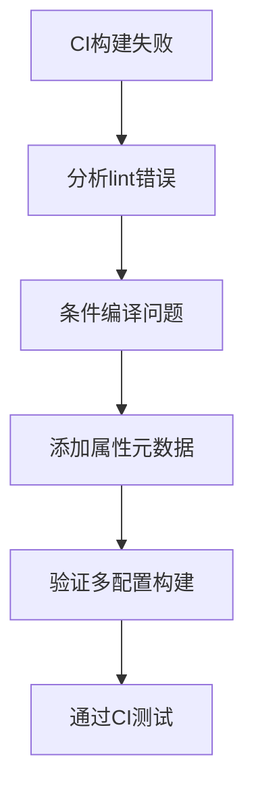

+++
title = "#18488 Fix lint errors on `bevy_ecs` with disabled features"
date = "2025-03-22T00:00:00"
draft = false
template = "pull_request_page.html"
in_search_index = false

[extra]
current_language = "zh-cn"
available_languages = {"en" = { name = "English", url = "/pull_request/bevy/2025-03/pr-18488-en-20250322" }, "zh-cn" = { name = "中文", url = "/pull_request/bevy/2025-03/pr-18488-zh-cn-20250322" }}
+++

# #18488 Fix lint errors on `bevy_ecs` with disabled features

## Basic Information
- **Title**: Fix lint errors on `bevy_ecs` with disabled features
- **PR Link**: https://github.com/bevyengine/bevy/pull/18488
- **Author**: villor
- **Status**: MERGED
- **Created**: 2025-03-22T15:18:16Z
- **Merged**: Not merged
- **Merged By**: N/A

## Description Translation
### 目标
- 修复在禁用某些功能时 `bevy_ecs` 出现的 lint 错误

### 解决方案
- 当禁用 `bevy_reflect` 时，通过添加理由（reason）修复 `clippy::allow-attributes-without-reason`
- 当禁用 `std` 时，通过添加条件化的 `expect` 属性和注释来修复 `clippy::needless_return`

### 测试
- 使用命令 `cargo clippy -p bevy_ecs --no-default-features --no-deps -- --D warnings` 验证
- CI 集成测试

## The Story of This Pull Request

### 问题与背景
当开发者尝试在禁用某些可选功能（如 `bevy_reflect` 和 `std`）的情况下编译 `bevy_ecs` 时，会遇到两个特定的 Clippy lint 错误：
1. 在禁用 `bevy_reflect` 时，`#[allow(...)]` 属性缺少理由说明
2. 在禁用标准库（`std`）时，`return` 语句被错误标记为冗余

这些问题会影响代码质量检查的通过率，并可能导致 CI 构建失败。特别是对于嵌入式或 `no_std` 环境的支持至关重要，需要保证不同配置下的编译稳定性。

### 解决方案
开发者采用了精准的条件编译（conditional compilation）策略：
1. 为 `#[cfg_attr]` 添加理由字符串
2. 针对 `no_std` 场景添加明确的期望（expect）属性

这种选择保持了代码的可维护性，同时遵循 Rust 的 lint 规则。没有选择移除这些 lint 检查，而是通过结构化注释保持代码清晰度。

### 实现细节
在 `clone_entities.rs` 中：
```rust
// 修改前
#[cfg(feature = "bevy_reflect")]

// 修改后
#[cfg_attr(
    not(feature = "bevy_reflect"),
    allow(clippy::allow_attributes_without_reason, reason = "reflect disabled")
)]
```
这个改动为 `allow` 属性添加了必要的理由说明，符合 Clippy 的最新要求。

在 `resource.rs` 中：
```rust
#[cfg_attr(
    not(feature = "std"),
    expect(
        clippy::needless_return,
        reason = "needless until no_std is addressed (see below)",
    )
)]
return;
```
添加了 `expect` 属性来暂时抑制特定 lint 警告，同时通过注释明确标记需要后续处理的技术债务。

### 技术洞察
1. **条件编译管理**：通过 `cfg_attr` 实现不同 feature flag 下的差异化 lint 处理
2. **渐进式修复策略**：对 `no_std` 相关的问题采用标记技术债务的方式，而非强行修复
3. **API 兼容性**：保持原有代码结构不变，仅添加元数据属性，避免引入破坏性变更

### 影响与启示
- 提升多配置环境下的代码质量检查通过率
- 为后续 `no_std` 支持奠定基础
- 示范了如何正确处理条件编译场景下的 lint 警告

## Visual Representation



## Key Files Changed

### 1. `crates/bevy_ecs/src/entity/clone_entities.rs` (+1/-1)
**修改说明**：修复 `bevy_reflect` 禁用时的 lint 警告
```rust
// 修改前
#[cfg(feature = "bevy_reflect")]

// 修改后
#[cfg_attr(
    not(feature = "bevy_reflect"),
    allow(clippy::allow_attributes_without_reason, reason = "reflect disabled")
)]
```

### 2. `crates/bevy_ecs/src/storage/resource.rs` (+8/-0)
**修改说明**：处理 `no_std` 场景的冗余 return 警告
```rust
// 新增代码
#[cfg_attr(
    not(feature = "std"),
    expect(
        clippy::needless_return,
        reason = "needless until no_std is addressed (see below)",
    )
)]
// 对应注释
// needless until no_std is addressed (see below)
```

## Further Reading
1. [Rust Clippy 官方文档](https://doc.rust-lang.org/stable/clippy/)
2. [条件编译（Conditional Compilation）最佳实践](https://doc.rust-lang.org/reference/conditional-compilation.html)
3. [Bevy 引擎的模块化设计](https://bevyengine.org/learn/book/introduction/)