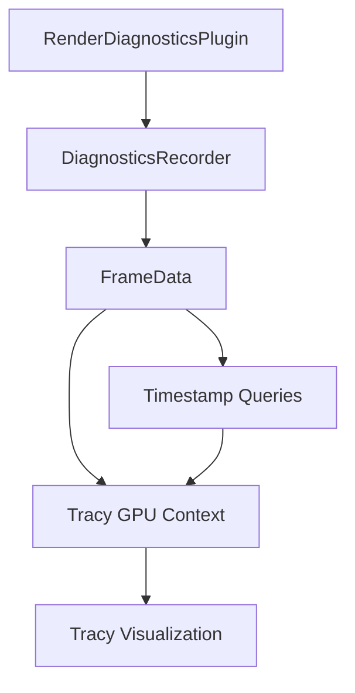

+++
title = "#18490 Tracy GPU support"
date = "2025-03-28T00:00:00"
draft = false
template = "pull_request_page.html"
in_search_index = true

[taxonomies]
list_display = ["show"]

[extra]
current_language = "en"
available_languages = {"en" = { name = "English", url = "/pull_request/bevy/2025-03/pr-18490-en-20250328" }, "zh-cn" = { name = "中文", url = "/pull_request/bevy/2025-03/pr-18490-zh-cn-20250328" }}
labels = ["A-Rendering", "C-Performance", "M-Needs-Release-Note", "A-Dev-Tools"]
+++

# #18490 Tracy GPU support

## Basic Information
- **Title**: Tracy GPU support
- **PR Link**: https://github.com/bevyengine/bevy/pull/18490
- **Author**: JMS55
- **Status**: MERGED
- **Labels**: `A-Rendering`, `C-Performance`, `S-Ready-For-Final-Review`, `M-Needs-Release-Note`, `A-Dev-Tools`
- **Created**: 2025-03-22T17:53:55Z
- **Merged**: Not merged
- **Merged By**: N/A

## Description Translation
# Objective

- Add tracy GPU support

## Solution

- Build on top of the existing render diagnostics recording to also upload gpu timestamps to tracy
- Copy code from https://github.com/Wumpf/wgpu-profiler

## Showcase


## The Story of This Pull Request

The PR addresses the need for comprehensive GPU performance profiling in Bevy's rendering pipeline. While existing CPU-side tracing with Tracy provided visibility into engine operations, developers lacked equivalent tools for analyzing GPU workloads. This gap made it difficult to optimize rendering performance holistically.

The solution leverages Bevy's existing diagnostic infrastructure, extending it to capture GPU timestamps through wgpu's timestamp query API. The implementation adapts proven patterns from the wgpu-profiler crate, ensuring reliable timestamp collection across different graphics backends. Key engineering decisions included:

1. **Backend-Specific Handling**: Different GPU APIs require varying timestamp approaches. The code handles Vulkan/DX12's native support while gracefully falling back to CPU timing on unsupported platforms like Metal.

2. **Tracy Integration**: A new `tracy_gpu` module bridges wgpu's timestamp data with Tracy's GPU context API. This required precise timestamp alignment between CPU and GPU timelines.

3. **Diagnostic Pipeline Extension**: The existing `DiagnosticsRecorder` was modified to manage Tracy GPU contexts alongside traditional CPU spans:

```rust
// In internal.rs
#[cfg(feature = "tracing-tracy")]
tracy_gpu_context: tracy_client::GpuContext,

// Initialization handling Tracy setup
pub fn new(adapter_info: &RenderAdapterInfo, device: &RenderDevice, queue: &RenderQueue) {
    #[cfg(feature = "tracing-tracy")]
    let tracy_gpu_context = /* ... */;
}
```

4. **Timestamp Workarounds**: The implementation includes a buffer copying workaround to handle wgpu API limitations when resolving timestamp queries:

```rust
// In tracy_gpu.rs
let mut copy_encoder = device.create_command_encoder(...);
copy_encoder.copy_buffer_to_buffer(...);
queue.submit([timestamp_encoder.finish(), copy_encoder.finish()]);
```

The changes enable precise GPU timing visualization in Tracy, showing GPU command execution aligned with CPU-side spans. Developers can now:
- Identify GPU-bound vs CPU-bound rendering bottlenecks
- Analyze individual render pass durations
- Compare shader execution times across frames

## Visual Representation



## Key Files Changed

1. `crates/bevy_render/src/diagnostic/tracy_gpu.rs` (+67/-0)
```rust
pub fn new_tracy_gpu_context(
    adapter_info: &RenderAdapterInfo,
    device: &RenderDevice,
    queue: &RenderQueue,
) -> GpuContext {
    // Backend-specific Tracy context initialization
    match adapter_info.backend {
        Backend::Vulkan => GpuContextType::Vulkan,
        // ... other backends
    }
}
```
Adds Tracy GPU context creation and timestamp initialization logic.

2. `crates/bevy_render/src/diagnostic/internal.rs` (+54/-13)
```rust
struct DiagnosticsRecorderInternal {
    #[cfg(feature = "tracing-tracy")]
    tracy_gpu_context: tracy_client::GpuContext,
    // ... existing fields
}
```
Integrates Tracy GPU context into diagnostic recording infrastructure.

3. `docs/profiling.md` (+20/-5)
```markdown
- [Tracy RenderQueue](#tracy-renderqueue)
```
Documents new GPU profiling capabilities in Bevy's performance guide.

## Further Reading

- [Tracy Profiler Documentation](https://github.com/wolfpld/tracy)
- [wgpu Timestamp Queries RFC](https://github.com/gfx-rs/wgpu/issues/6406)
- [Bevy Performance Optimization Guide](https://bevyengine.org/learn/book/performance-optimization/)