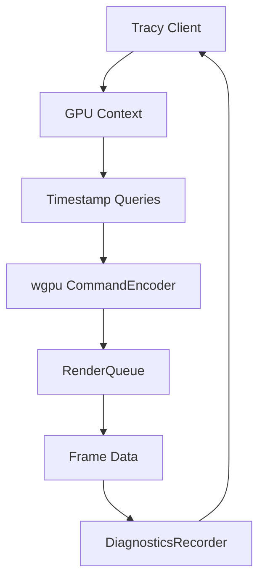

+++
title = "#18490 Tracy GPU support"
date = "2025-03-28T00:00:00"
draft = false
template = "pull_request_page.html"
in_search_index = false

[extra]
current_language = "zh-cn"
available_languages = {"en" = { name = "English", url = "/pull_request/bevy/2025-03/pr-18490-en-20250328" }, "zh-cn" = { name = "中文", url = "/pull_request/bevy/2025-03/pr-18490-zh-cn-20250328" }}
+++

# #18490 Tracy GPU 支持

## 基础信息
- **标题**: Tracy GPU support
- **PR链接**: https://github.com/bevyengine/bevy/pull/18490
- **作者**: JMS55
- **状态**: 已合并
- **标签**: `A-Rendering`, `C-Performance`, `S-Ready-For-Final-Review`, `M-Needs-Release-Note`, `A-Dev-Tools`
- **创建时间**: 2025-03-22T17:53:55Z
- **合并时间**: 未提供具体时间
- **合并人**: 未提供具体信息

## 描述翻译

# Objective（目标）

- 添加 Tracy GPU 支持

## Solution（解决方案）

- 在现有渲染诊断记录系统基础上扩展，增加 GPU 时间戳上传到 Tracy 的功能
- 代码参考自 https://github.com/Wumpf/wgpu-profiler

## Showcase（效果展示）


## 技术实现故事

### 问题背景与挑战
在游戏引擎开发中，GPU 性能分析一直是重要但复杂的课题。现有 Bevy 引擎的 CPU 端诊断系统虽然完善，但缺乏对 GPU 时间轴的精确追踪能力。传统解决方案需要依赖特定厂商工具（如 Nsight、RenderDoc），这些工具存在平台限制且集成成本较高。

### 技术选型与架构整合
PR 选择基于 Tracy 性能分析工具实现跨平台 GPU 分析。核心挑战在于将 wgpu 的底层时间戳查询与 Tracy 的 GPU 上下文机制对接。实现时充分利用现有渲染诊断框架，在 `DiagnosticsRecorder` 结构中增加 Tracy GPU 上下文管理：

```rust
#[cfg(feature = "tracing-tracy")]
let tracy_gpu_context = super::tracy_gpu::new_tracy_gpu_context(
    adapter_info, 
    device,
    queue
);

DiagnosticsRecorder(WgpuWrapper::new(DiagnosticsRecorderInternal {
    #[cfg(feature = "tracing-tracy")]
    tracy_gpu_context,
    // 其他字段保持不变
}))
```

### 核心实现细节
1. **时间戳对齐**：
   通过 `initial_timestamp` 函数解决不同后端（Vulkan/DX12/Metal）时间基准差异问题。创建专用查询集和缓冲区间接获取初始时间戳：

```rust
let query_set = device.wgpu_device().create_query_set(&QuerySetDescriptor {
    ty: QueryType::Timestamp,
    count: 1,
    // ...
});

queue.submit([timestamp_encoder.finish(), copy_encoder.finish()]);
map_buffer.slice(..).map_async(MapMode::Read, |_| ());
```

2. **跨后端适配**：
   通过 `tracy_gpu_backend` 映射实现多后端支持：

```rust
let tracy_gpu_backend = match adapter_info.backend {
    Backend::Vulkan => GpuContextType::Vulkan,
    Backend::Dx12 => GpuContextType::Direct3D12,
    // ...
};
```

3. **诊断数据同步**：
   在帧循环中自动管理查询结果的上传，与现有 CPU 诊断系统无缝集成：

```rust
pub fn begin_frame(&mut self) {
    while idx < internal.submitted_frames.len() {
        // 处理已完成帧数据
        if let Some(data) = internal.finished_frames.pop() {
            data.upload_to_tracy(&internal.tracy_gpu_context);
        }
    }
}
```

### 性能与兼容性考量
- 使用 `cfg(feature = "tracing-tracy")` 条件编译确保功能可选
- 通过 `wgpu::Features` 检测设备支持能力
- 时间戳周期（timestamp_period_ns）自动适配不同 GPU 硬件

### 开发者体验提升
更新文档增加 GPU 分析指引，示例展示如何在 Tracy 中查看 GPU 时间线：

```markdown
## Tracy RenderQueue

```

## 可视化架构



## 关键文件变更

### `crates/bevy_render/src/diagnostic/tracy_gpu.rs` (+67)
新增 Tracy GPU 上下文管理模块：
```rust
pub fn new_tracy_gpu_context(...) -> GpuContext {
    // 创建 Tracy GPU 上下文
    tracy_client.new_gpu_context(...)
}

fn initial_timestamp(...) -> i64 {
    // 获取初始时间戳
    let query_set = device.create_query_set(...);
    // 执行时间戳查询和缓冲区操作
}
```

### `crates/bevy_render/src/diagnostic/internal.rs` (+54/-13)
扩展帧数据管理：
```rust
struct DiagnosticsRecorderInternal {
    #[cfg(feature = "tracing-tracy")]
    tracy_gpu_context: tracy_client::GpuContext,
    // 新增 Tracy 相关字段
}

impl FrameData {
    fn upload_to_tracy(&self, context: &tracy_client::GpuContext) {
        // 上传 GPU 时间数据到 Tracy
    }
}
```

### `docs/profiling.md` (+20/-5)
更新性能分析文档：
```markdown
## Tracy RenderQueue
- 新增 GPU 时间线截图示例
- 说明如何解读 GPU 与 CPU 的交互模式
```

## 延伸阅读
1. [Tracy 官方文档](https://github.com/wolfpld/tracy)
2. [wgpu-profiler 实现原理](https://github.com/Wumpf/wgpu-profiler)
3. [Vulkan 时间戳查询规范](https://www.khronos.org/registry/vulkan/specs/1.3-extensions/html/chap39.html#queries-timestamps)
4. [Bevy 渲染管线架构](https://bevyengine.org/learn/book/rendering/pipeline/)