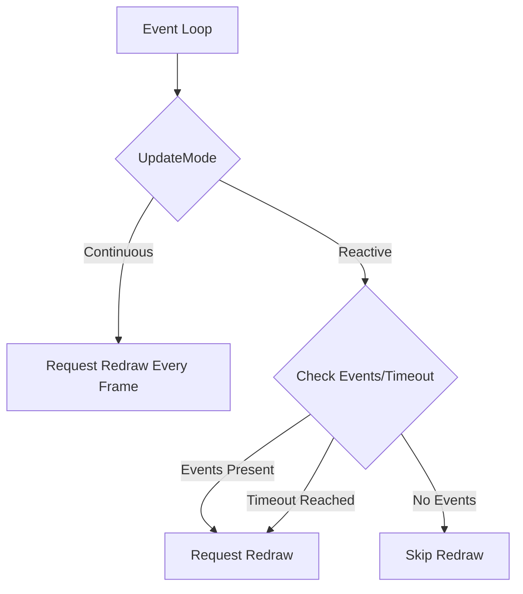

+++
title = "#18493 Fix UpdateMode::Reactive behavior on Windows"
date = "2025-03-25T00:00:00"
draft = false
template = "pull_request_page.html"
in_search_index = true

[taxonomies]
list_display = ["show"]

[extra]
current_language = "en"
available_languages = {"en" = { name = "English", url = "/pull_request/bevy/2025-03/pr-18493-en-20250325" }, "zh-cn" = { name = "中文", url = "/pull_request/bevy/2025-03/pr-18493-zh-cn-20250325" }}
labels = ["C-Bug", "A-Windowing"]
+++

# #18493 Fix UpdateMode::Reactive behavior on Windows

## Basic Information
- **Title**: Fix UpdateMode::Reactive behavior on Windows
- **PR Link**: https://github.com/bevyengine/bevy/pull/18493
- **Author**: aloucks
- **Status**: MERGED
- **Labels**: `C-Bug`, `A-Windowing`, `S-Ready-For-Final-Review`
- **Created**: 2025-03-22T20:39:30Z
- **Merged**: Not merged
- **Merged By**: N/A

## Description Translation
# Objective

The fix in #17488 forced Windows to always behave as if it were in `UpdateMode::Continuous`.

CC https://github.com/bevyengine/bevy/pull/17991

## Solution

Removed the unconditional `redraw_requested = true` and added a check for `Reactive` in `about_to_wait`.

## Testing

- Verified that the `low_power` example worked as expected with all `UpdateMode` options.
- Verified that animation continued in both `eased_motion ` and `low_power` examples when in `Continuous` update mode while:
  - Resizing the Window
  - Moving the window via clicking and dragging the title bar
- Verified that `window_settings` example still worked as expected.
- Verified that `monitor_info` example still worked as expected.

## The Story of This Pull Request

The PR addresses a regression in Bevy's windowing system where Windows platforms lost proper `UpdateMode::Reactive` behavior after a previous fix. The core issue stemmed from an unconditional `redraw_requested = true` assignment that overrode the intended update mode logic.

In Bevy's architecture, `UpdateMode::Reactive` allows applications to only update when there are new events or after a specified timeout, while `Continuous` mode updates every frame. The problematic code in `state.rs` forced continuous redraws regardless of mode due to a Windows-specific workaround from PR #17488.

The solution involved two key changes to the event loop handling:

1. **Removing the unconditional redraw request**:
```rust
// Before:
redraw_requested = true;

// After:
// (Removed line)
```

2. **Adding conditional Reactive mode handling**:
```rust
if matches!(update_mode, UpdateMode::Reactive { .. }) {
    if window_event_received
        || device_event_received
        || user_event_received
        || redraw_requested
        || !ran_update_since_last_redraw
        || (now >= last_update + update_mode.min_update_interval())
    {
        redraw_requested = true;
    }
}
```

This adjustment restores the proper control flow:
- In `Continuous` mode, the engine continues requesting redraws every frame
- In `Reactive` mode, redraws only occur when events are present or the minimum update interval has elapsed

The implementation maintains platform-specific behavior for Windows while preserving cross-platform consistency. Testing focused on validating both update modes under various window operations, ensuring animations maintain smoothness in Continuous mode while respecting power savings in Reactive mode.

## Visual Representation



## Key Files Changed

### `crates/bevy_winit/src/state.rs` (+4/-2)
**Key Changes:**
1. Removed forced redraw request that overrode update modes
2. Added conditional logic for Reactive mode checks

**Code Snippet:**
```rust
// Before (line 1278):
redraw_requested = true;

// After:
// Removed unconditional redraw request

// Added Reactive mode check (lines 1280-1290):
if matches!(update_mode, UpdateMode::Reactive { .. }) {
    if window_event_received
        || device_event_received
        || user_event_received
        || redraw_requested
        || !ran_update_since_last_redraw
        || (now >= last_update + update_mode.min_update_interval())
    {
        redraw_requested = true;
    }
}
```

## Further Reading
- [Bevy UpdateMode Documentation](https://docs.rs/bevy/latest/bevy/winit/enum.UpdateMode.html)
- [Windows Event Loop Architecture](https://github.com/bevyengine/bevy/blob/main/crates/bevy_winit/README.md)
- [Winit RedrawRequested Event Documentation](https://docs.rs/winit/latest/winit/event/enum.Event.html#variant.RedrawRequested)