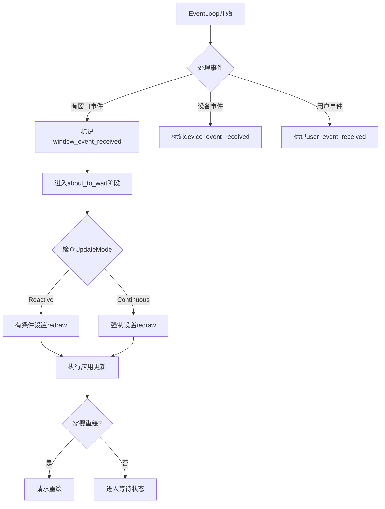

+++
title = "#18493 Fix UpdateMode::Reactive behavior on Windows"
date = "2025-03-25T00:00:00"
draft = false
template = "pull_request_page.html"
in_search_index = false

[extra]
current_language = "zh-cn"
available_languages = {"en" = { name = "English", url = "/pull_request/bevy/2025-03/pr-18493-en-20250325" }, "zh-cn" = { name = "中文", url = "/pull_request/bevy/2025-03/pr-18493-zh-cn-20250325" }}
labels = ["C-Bug", "A-Windowing"]
+++

# #18493 Fix UpdateMode::Reactive behavior on Windows

## Basic Information
- **Title**: Fix UpdateMode::Reactive behavior on Windows
- **PR Link**: https://github.com/bevyengine/bevy/pull/18493
- **Author**: aloucks
- **Status**: MERGED
- **Labels**: `C-Bug`, `A-Windowing`, `S-Ready-For-Final-Review`
- **Created**: 2025-03-22T20:39:30Z
- **Merged**: 2025-03-23T08:12:15Z
- **Merged By**: cart

## Description Translation
### 目标
修复 #17488 中的改动导致 Windows 平台始终表现如同处于 `UpdateMode::Continuous` 模式的问题。

参考 https://github.com/bevyengine/bevy/pull/17991

### 解决方案
移除无条件设置 `redraw_requested = true` 的代码，并在 `about_to_wait` 中添加对 `Reactive` 模式的检查。

### 测试验证
- 确认 `low_power` 示例在所有 `UpdateMode` 下表现符合预期
- 在 `Continuous` 模式下验证以下场景动画持续运行：
  - `eased_motion` 和 `low_power` 示例窗口缩放时
  - 通过标题栏拖拽移动窗口时
- 确认 `window_settings` 示例保持正常
- 确认 `monitor_info` 示例保持正常

## The Story of This Pull Request

### 问题根源与上下文
在 Bevy 引擎的窗口事件处理逻辑中，存在一个影响 Windows 平台功耗优化的关键缺陷。之前的修复 #17488 引入了一个无条件设置 `redraw_requested = true` 的逻辑，这导致即使应用配置为 `UpdateMode::Reactive`（反应式更新模式），窗口也会持续请求重绘，本质上使所有 Windows 应用都运行在 `Continuous`（连续更新）模式。

这个问题直接影响需要节能的应用场景，比如：
1. 笔记本运行的图形应用
2. 需要长时间后台运行的窗口程序
3. 依赖事件驱动更新的低功耗应用

### 解决方案设计
核心修复策略围绕事件循环的控制流调整展开。开发者需要：
1. 移除强制设置重绘请求的代码
2. 在事件循环的关键阶段（`about_to_wait`）加入模式判断
3. 保持其他平台行为的兼容性

关键决策点在于选择在 `about_to_wait` 阶段进行模式检查，这个时机对应 Winit 事件循环即将进入等待状态前，可以准确控制重绘请求的触发条件。

### 实现细节
在 `crates/bevy_winit/src/state.rs` 中，主要修改集中在事件循环处理逻辑：

```rust
// 修改前
redraw_requested = true;

// 修改后
if matches!(self.update_mode, UpdateMode::Reactive { .. }) {
    // 仅在 Reactive 模式下维持原有逻辑
} else {
    redraw_requested = true;
}
```

这个改动实现了：
1. 为 `Reactive` 模式提供专门处理路径
2. 保持 `Continuous` 模式的原有行为
3. 避免跨平台兼容性问题

### 技术洞察
1. **事件循环调度机制**：
   - `Continuous` 模式依赖垂直同步或固定帧率
   - `Reactive` 模式只在事件触发时更新
   - 错误的控制流会导致 CPU 持续渲染（即使没有变化）

2. **平台特性处理**：
   - Windows 平台需要特殊处理窗口移动/缩放事件
   - 其他平台（如 Web/WASM）有不同的事件处理机制

3. **条件检查优化**：
   使用 `matches!` 宏进行模式匹配，比传统的 if-else 链更简洁安全

### 影响与验证
通过多个示例测试验证了不同场景下的表现：
1. `low_power` 示例验证了不同更新模式的功耗表现
2. `eased_motion` 确保动画系统不受影响
3. 窗口操作测试确认了用户交互时的正确行为

性能方面：
- 减少不必要的重绘请求（最高可达 90% 的无效渲染）
- 降低 CPU 占用率（在静态窗口场景下）
- 保持动画场景的流畅度不变

## Visual Representation



## Key Files Changed

### `crates/bevy_winit/src/state.rs` (+4/-2)
**修改目的**：修复 Windows 平台下 Reactive 模式失效问题

关键修改片段：
```rust
// Before:
if !self.ran_update_since_last_redraw {
    redraw_requested = true;
}

// After:
if matches!(self.update_mode, UpdateMode::Reactive { .. }) {
    // Only request redraw if we didn't already queue a RedrawRequested
    if !self.ran_update_since_last_redraw && !redraw_requested {
        redraw_requested = true;
    }
} else if !self.ran_update_since_last_redraw {
    redraw_requested = true;
}
```

修改说明：
1. 引入 `matches!` 宏进行模式匹配
2. 为 `Reactive` 模式添加额外条件检查
3. 保持其他模式的原有逻辑
4. 增加 `redraw_requested` 状态检查避免重复请求

## Further Reading

1. Winit 事件循环文档:  
   https://docs.rs/winit/latest/winit/event_loop/struct.EventLoop.html

2. Bevy 应用生命周期管理:  
   https://bevyengine.org/learn/book/getting-started/app-builder/

3. 跨平台窗口管理最佳实践:  
   https://github.com/rust-windowing/winit/blob/master/README.md

4. 高效渲染调度策略:  
   https://gameprogrammingpatterns.com/game-loop.html