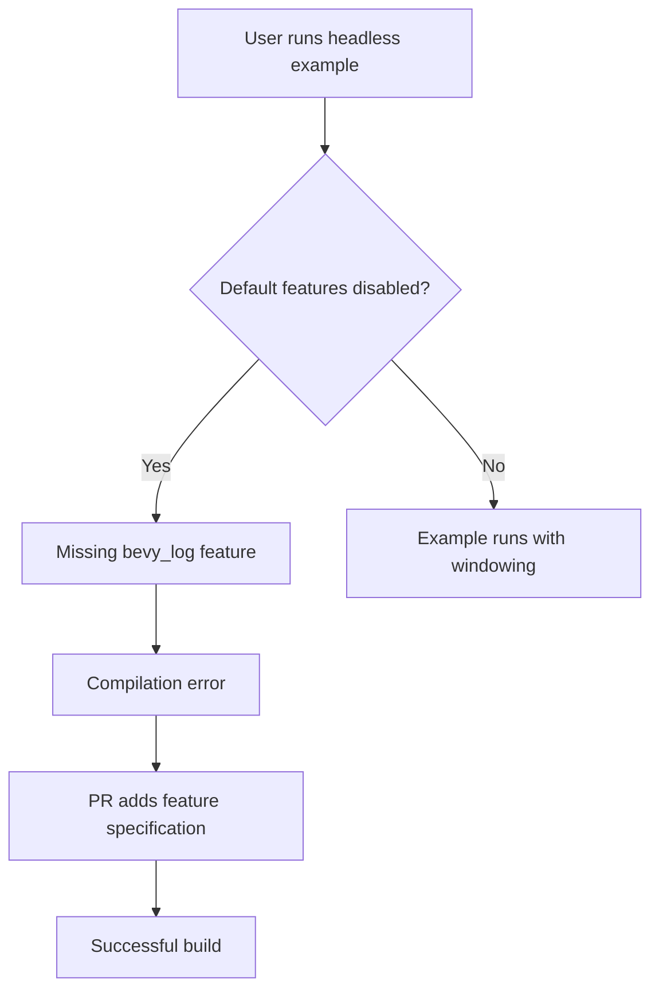

+++
title = "#18497 Fix compile errors on headless example"
date = "2025-03-23T00:00:00"
draft = false
template = "pull_request_page.html"
in_search_index = true

[taxonomies]
list_display = ["show"]

[extra]
current_language = "en"
available_languages = {"en" = { name = "English", url = "/pull_request/bevy/2025-03/pr-18497-en-20250323" }, "zh-cn" = { name = "中文", url = "/pull_request/bevy/2025-03/pr-18497-zh-cn-20250323" }}
labels = ["`C-Bug`", "`C-Examples`", "`S-Ready-For-Final-Review`"]
+++

# #18497 Fix compile errors on headless example

## Basic Information
- **Title**: Fix compile errors on headless example
- **PR Link**: https://github.com/bevyengine/bevy/pull/18497
- **Author**: serialx
- **Status**: MERGED
- **Labels**: `C-Bug`, `C-Examples`, `S-Ready-For-Final-Review`
- **Created**: 2025-03-23T06:36:30Z
- **Merged**: Not merged
- **Merged By**: N/A

## Description Translation
# Objective

- Fixes compile errors on headless example when running `cargo run --example headless --no-default-features`

```
error[E0432]: unresolved import `bevy::log`
  --> examples/app/headless.rs:13:39
   |
13 | use bevy::{app::ScheduleRunnerPlugin, log::LogPlugin, prelude::*};
   |                                       ^^^ could not find `log` in `bevy`

For more information about this error, try `rustc --explain E0432`.
error: could not compile `bevy` (example "headless") due to 1 previous error
```

## Solution

- Since commit cc69fdd bevy_log has been identified as a separate feature, thus requiring additional parameters to build headless example.
- Changed the command to run to: `cargo run --example headless --no-default-features --features bevy_log`

## Testing

- The new command successfully builds the example

## The Story of This Pull Request

The headless example encountered a breaking change after the `bevy_log` module was moved to a separate feature flag in commit cc69fdd. This architectural change meant the LogPlugin could no longer be assumed available through default imports, requiring explicit feature activation.

Developers attempting to run the headless example without default features would hit a compilation error due to the missing `bevy::log` import. The error stemmed from the example code trying to access LogPlugin through what was now a feature-gated module.

The fix focused on two key adjustments:
1. Updating the documentation in the example's comments to specify the required `bevy_log` feature
2. Modifying the runtime feature check to recommend the correct command with explicit features

In the implementation:
```rust
// Before error message:
println!("    cargo run --example headless --no-default-features");

// Updated implementation:
println!("    cargo run --example headless --no-default-features --features bevy_log");
```
This change ensures users receive the correct build command when the example detects incompatible feature flags.

The solution demonstrates proper handling of Bevy's modular architecture, where core components like logging are now opt-in features rather than mandatory dependencies. This approach aligns with Bevy's ongoing efforts to reduce base binary size through feature customization.

## Visual Representation



## Key Files Changed

1. `examples/app/headless.rs`
```rust
// Before:
println!("    cargo run --example headless --no-default-features");

// After:
println!("    cargo run --example headless --no-default-features --features bevy_log");
```
- Updated the diagnostic message to include required features
- Ensures users receive working build commands

## Further Reading

- Bevy Features Documentation: https://docs.rs/bevy/latest/bevy/#cargo-features
- Rust Feature Flags Guide: https://doc.rust-lang.org/cargo/reference/features.html
- Bevy Plugin System: https://bevyengine.org/learn/book/getting-started/plugins/