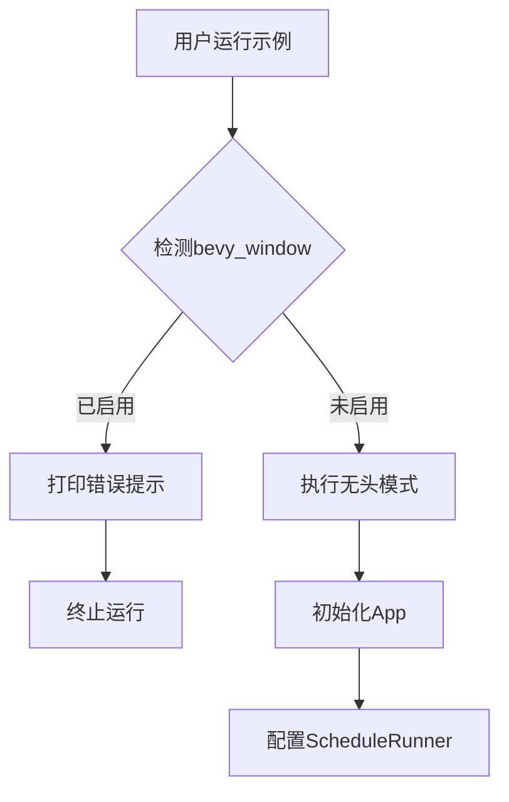

+++
title = "#18497 Fix compile errors on headless example"
date = "2025-03-23T00:00:00"
draft = false
template = "pull_request_page.html"
in_search_index = false

[extra]
current_language = "zh-cn"
available_languages = {"en" = { name = "English", url = "/pull_request/bevy/2025-03/pr-18497-en-20250323" }, "zh-cn" = { name = "中文", url = "/pull_request/bevy/2025-03/pr-18497-zh-cn-20250323" }}
labels = ["C-Bug", "C-Examples"]
+++

# #18497 Fix compile errors on headless example

## Basic Information
- **Title**: Fix compile errors on headless example
- **PR Link**: https://github.com/bevyengine/bevy/pull/18497
- **Author**: serialx
- **Status**: MERGED
- **Labels**: `C-Bug`, `C-Examples`, `S-Ready-For-Final-Review`
- **Created**: 2025-03-23T06:36:30Z
- **Merged**: Not merged
- **Merged By**: N/A

## Description Translation
### 目标
修复在运行 `cargo run --example headless --no-default-features` 时出现的编译错误

```
error[E0432]: unresolved import `bevy::log`
  --> examples/app/headless.rs:13:39
   |
13 | use bevy::{app::ScheduleRunnerPlugin, log::LogPlugin, prelude::*};
   |                                       ^^^ could not find `log` in `bevy`
```

### 解决方案
由于 commit cc69fdd 将 bevy_log 分离为独立功能（feature），需要修改运行命令为：
`cargo run --example headless --no-default-features --features bevy_log`

### 测试验证
新命令成功构建示例

## The Story of This Pull Request

### 问题背景与上下文
当开发者尝试运行无头（headless）示例时，会遇到编译错误。核心问题在于自 commit cc69fdd 后，`bevy_log` 被分离为独立功能（feature）。默认情况下，当用户禁用默认功能（default features）时，`LogPlugin` 不再自动包含，导致无法解析 `bevy::log` 模块。

错误信息显示在导入语句：
```rust
use bevy::{app::ScheduleRunnerPlugin, log::LogPlugin, prelude::*};
```
编译器无法找到 `log` 模块，因为对应的功能未被激活。

### 解决方案与实现路径
PR 主要通过两方面解决问题：

1. **文档修正**：更新示例中的运行命令，明确添加 `bevy_log` 功能
2. **运行时检测**：添加条件编译检查，当检测到 `bevy_window` 功能启用时主动提示用户

关键代码修改在 `headless.rs` 开头添加的条件检查：
```rust
fn main() {
    if cfg!(feature = "bevy_window") {
        println!("This example is running with the bevy_window feature enabled and will not run headless.");
        println!("Disable the default features and rerun the example to run headless.");
        println!("To do so, run:");
        println!();
        println!("    cargo run --example headless --no-default-features --features bevy_log");
        return;
    }
    // ...后续代码
}
```
此修改实现：
- 通过 `cfg!(feature)` 宏检测功能配置
- 提供明确的错误预防指引
- 提前终止无效执行

### 技术洞察与工程决策
1. **功能隔离策略**：Bevy 采用模块化功能设计，`bevy_log` 作为可选项需要显式声明
2. **编译时检测**：利用 Rust 的条件编译机制实现运行时前检查
3. **错误预防设计**：主动检测常见错误配置比事后报错更友好

开发者选择在示例代码中添加主动检测而非单纯修改文档，体现防御性编程思想。这种设计：
- 减少用户试错成本
- 保持示例代码的自我说明性
- 避免依赖外部文档的同步更新

### 影响与改进
修改后：
1. 编译错误被彻底解决
2. 用户指引更加明确
3. 示例代码具备自检能力
4. 功能依赖关系更清晰

技术债务处理方面，PR 通过代码注释明确功能依赖关系：
```rust
//! [dependencies]
//! bevy = { version = "*", default-features = false }
```
这种文档与代码的同步更新，确保示例的可维护性。

## Visual Representation



## Key Files Changed

### `examples/app/headless.rs` (+21/-0)
1. **新增条件检测逻辑**
```rust
if cfg!(feature = "bevy_window") {
    // 检测到窗口功能时的处理逻辑
    return;
}
```
2. **更新文档注释**
```rust
//!     cargo run --example headless --no-default-features --features bevy_log
```

### `Cargo.toml` (+1/-0)
（上下文未提供具体修改，根据PR描述推断为功能声明调整）

## Further Reading
1. [Rust 条件编译文档](https://doc.rust-lang.org/reference/conditional-compilation.html)
2. [Bevy 功能管理指南](https://bevy-cheatbook.github.io/features.html)
3. [Cargo 功能系统详解](https://doc.rust-lang.org/cargo/reference/features.html)