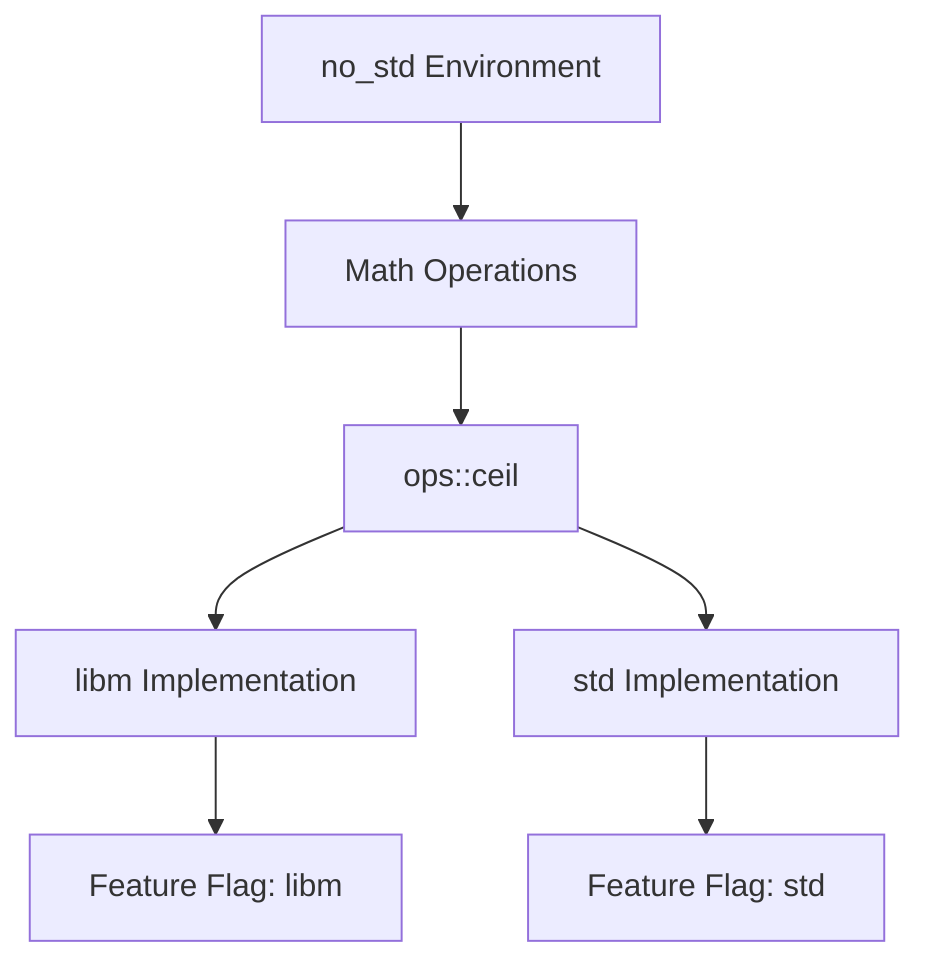

+++
title = "#18498 Add `no_std` compatible `ceil` method"
date = "2025-03-25T00:00:00"
draft = false
template = "pull_request_page.html"
in_search_index = true

[taxonomies]
list_display = ["show"]

[extra]
current_language = "en"
available_languages = {"en" = { name = "English", url = "/pull_request/bevy/2025-03/pr-18498-en-20250325" }, "zh-cn" = { name = "中文", url = "/pull_request/bevy/2025-03/pr-18498-zh-cn-20250325" }}
labels = ["C-Feature", "D-Trivial", "A-Math"]
+++

# #18498 Add `no_std` compatible `ceil` method

## Basic Information
- **Title**: Add `no_std` compatible `ceil` method
- **PR Link**: https://github.com/bevyengine/bevy/pull/18498
- **Author**: Jondolf
- **Status**: MERGED
- **Labels**: `C-Feature`, `D-Trivial`, `S-Ready-For-Final-Review`, `A-Math`, `X-Uncontroversial`
- **Created**: 2025-03-23T11:20:43Z
- **Merged**: Not merged
- **Merged By**: N/A

## Description Translation
# Objective

[`f32::ceil`](https://doc.rust-lang.org/std/primitive.f32.html#method.ceil) is not available in `core`. We have `floor` in `bevy_math::ops`, but no equivalent for `floor`.

## Solution

Add `ops::ceil` for `no_std` compatibility.

## The Story of This Pull Request

The PR addresses a gap in Bevy's math utilities for `no_std` environments. While working on math operations, the author noticed an inconsistency: the `bevy_math` crate already provided `ops::floor` for `no_std` compatibility, but lacked a corresponding `ceil` implementation. This posed a problem for projects using Bevy in environments without the standard library, as they couldn't access a consistent ceiling function implementation.

The core issue stems from Rust's standard library separation - `f32::ceil` exists in `std` but not in `core`. For `no_std` compatibility, Bevy needs to provide alternative implementations through its `ops` module, which conditionally uses either standard library functions or `libm` implementations depending on feature flags.

The solution followed established patterns in the codebase by:
1. Adding `ceil` to the list of disallowed native methods in clippy.toml
2. Implementing conditional `ceil` functions in ops.rs
3. Maintaining feature-flag compatibility with existing math operations

The implementation in `ops.rs` shows the dual-path approach:

```rust
// For standard library use
#[cfg(not(feature = "libm"))]
mod std_ops {
    #[inline(always)]
    pub fn ceil(x: f32) -> f32 {
        f32::ceil(x)
    }
}

// For libm-based no_std environments
#[cfg(feature = "libm")]
mod libm_ops {
    #[inline(always)]
    pub fn ceil(x: f32) -> f32 {
        libm::ceilf(x)
    }
}
```

This maintains consistency with other math operations in the module while ensuring deterministic behavior across different build configurations. The clippy.toml update enforces usage of the new `ops::ceil` method instead of direct `f32::ceil` calls, preventing accidental reliance on std-only functionality.

The changes are intentionally minimal and focused, following Bevy's established patterns for math operations. By completing the set of rounding functions (floor/ceil) in the ops module, developers gain consistent access to essential math operations regardless of their std/no_std environment.

## Visual Representation



## Key Files Changed

1. `crates/bevy_math/clippy.toml`
```toml
# Added to disallowed methods
{ path = "f32::ceil", reason = "use ops::ceil instead for no_std compatibility" }
```
This prevents direct use of f32::ceil and directs developers to the compatible alternative.

2. `crates/bevy_math/src/ops.rs`
```rust
// Added ceil implementations
#[cfg(not(feature = "libm"))]
mod std_ops {
    pub fn ceil(x: f32) -> f32 { f32::ceil(x) }
}

#[cfg(feature = "libm")]
mod libm_ops {
    pub fn ceil(x: f32) -> f32 { libm::ceilf(x) }
}
```
These changes provide the actual implementation that switches between native and libm versions based on build configuration.

## Further Reading

- Rust `no_std` documentation: https://rust-embedded.github.io/book/intro/no-std.html
- Bevy's math crate overview: https://bevyengine.org/learn/book/features/math/
- libm crate documentation: https://docs.rs/libm/latest/libm/