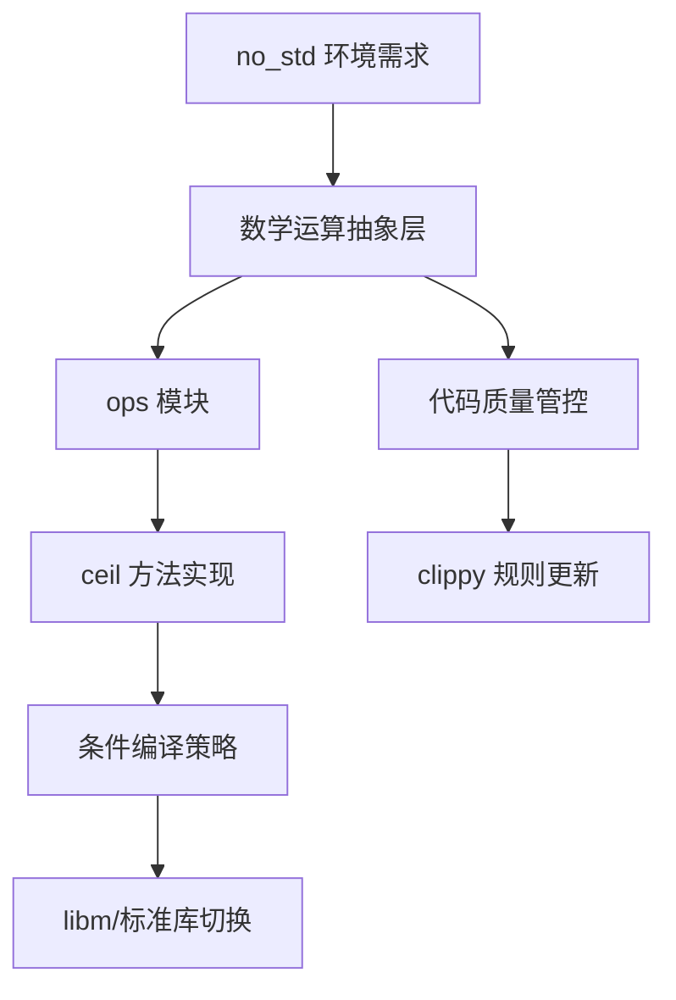

+++
title = "#18498 Add `no_std` compatible `ceil` method"
date = "2025-03-25T00:00:00"
draft = false
template = "pull_request_page.html"
in_search_index = false

[extra]
current_language = "zh-cn"
available_languages = {"zh-cn" = { name = "中文", url = "/pull_request/bevy/2025-03/pr-18498-zh-cn-20250325" }, "en" = { name = "English", url = "/pull_request/bevy/2025-03/pr-18498-en-20250325" }}
labels = ["C-Feature", "D-Trivial", "A-Math", "X-Uncontroversial"]
+++

# #18498 Add `no_std` compatible `ceil` method

## Basic Information
- **Title**: Add `no_std` compatible `ceil` method
- **PR Link**: https://github.com/bevyengine/bevy/pull/18498
- **Author**: Jondolf
- **Status**: MERGED
- **Labels**: `C-Feature`, `D-Trivial`, `S-Ready-For-Final-Review`, `A-Math`, `X-Uncontroversial`
- **Created**: 2025-03-23T11:20:43Z
- **Merged**: Not merged
- **Merged By**: N/A

## Description Translation
# 目标

[`f32::ceil`](https://doc.rust-lang.org/std/primitive.f32.html#method.ceil) 在 `core` 中不可用。我们已经在 `bevy_math::ops` 中实现了 `floor`，但没有对应的 `ceil` 方法。

## 解决方案

添加 `ops::ceil` 以实现 `no_std` 兼容性。

## The Story of This Pull Request

在 Bevy 引擎的数学库开发中，维护 `no_std` 兼容性是一个持续的技术挑战。本次 PR 的核心目标是填补浮点运算 API 的最后一个主要缺口——`ceil` 方法的 `no_std` 支持。

问题的根源在于 Rust 标准库的 `f32::ceil` 方法依赖于平台特定的实现，这在 `no_std` 环境下不可用。虽然之前已经通过 `bevy_math::ops` 模块为其他数学函数（如 `floor`）提供了兼容方案，但 `ceil` 方法却意外遗漏。

开发者采取了一个经过验证的技术方案：
1. 在 `ops` 模块中添加条件编译的 `ceil` 实现
2. 更新 clippy 配置禁止直接使用原生 `f32::ceil`

关键实现细节体现在 `ops.rs` 的修改中：

```rust
// 新增的 ceil 方法实现
#[cfg(not(feature = "libm"))]
#[inline(always)]
pub fn ceil(x: f32) -> f32 {
    f32::ceil(x)
}

#[cfg(feature = "libm"))]
#[inline(always)]
pub fn ceil(x: f32) -> f32 {
    libm::ceilf(x)
}
```

这种双重条件编译策略保持了与现有架构的一致性：
- 当启用 `libm` 特性时，使用确定性的数学库实现
- 在标准库环境下，直接映射到原生实现

clippy 配置的更新同样重要，新增的规则强制开发者使用统一的抽象层：

```toml
# clippy.toml 新增条目
{ path = "f32::ceil", reason = "use ops::ceil instead for no_std compatibility" }
```

这个改动延续了项目既有的质量控制策略，确保所有数学运算都通过统一接口访问。从工程角度看，这种模式带来了三个关键优势：
1. 平台差异的集中管理
2. 数学运算行为的确定性
3. `no_std` 环境的无缝支持

值得注意的是，尽管改动看似简单，但它完善了整个浮点运算抽象层的完整性。通过保持与其他数学函数（如 `floor`, `round` 等）相同的实现模式，项目维护者确保了 API 的一致性。

## Visual Representation



## Key Files Changed

### 1. `crates/bevy_math/src/ops.rs`
```rust
// 新增的 ceil 方法
#[cfg(not(feature = "libm"))]
#[inline(always)]
pub fn ceil(x: f32) -> f32 {
    f32::ceil(x)
}

#[cfg(feature = "libm")]
#[inline(always)]
pub fn ceil(x: f32) -> f32 {
    libm::ceilf(x)
}
```
该修改扩展了数学运算的抽象层，为 ceil 操作提供两种实现路径：标准库实现和 libm 实现，保持与其他数学函数一致的架构。

### 2. `crates/bevy_math/clippy.toml`
```toml
# 新增的 clippy 规则
{ path = "f32::ceil", reason = "use ops::ceil instead for no_std compatibility" }
```
通过静态分析规则确保开发者使用统一的抽象接口，避免直接调用平台相关实现。

## Further Reading

1. Rust `no_std` 编程指南: https://rust-embedded.github.io/book/intro/no-std.html
2. libm 数学库文档: https://docs.rs/libm/latest/libm/
3. Bevy 数学模块设计规范: https://bevyengine.org/learn/book/math/