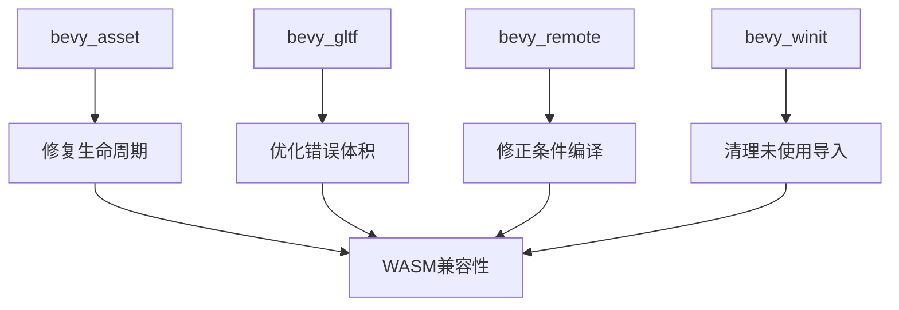

+++
title = "#18500 修复 wasm32 构建时的错误和 lint 问题"
date = "2025-03-23T00:00:00"
draft = false
template = "pull_request_page.html"
in_search_index = false

[extra]
current_language = "zh-cn"
available_languages = {"zh-cn" = { name = "中文", url = "/pull_request/bevy/2025-03/pr-18500-zh-cn-20250323" }}
+++

# #18500 fix error and lints when building for wasm32

## Basic Information
- **标题**: 修复 wasm32 构建时的错误和 lint 问题
- **PR 链接**: https://github.com/bevyengine/bevy/pull/18500
- **作者**: mockersf
- **状态**: 已合并
- **标签**: `C-Code-Quality`, `O-Web`
- **创建时间**: 2025-03-23T21:10:37Z
- **合并时间**: 2025-03-24T08:15:22Z
- **合并者**: cart

## 问题描述翻译

# Objective（目标）

- 部分 crate 在构建 wasm32 时无法编译或存在 clippy 警告

## Solution（解决方案）

- bevy_asset: 移除未使用的生命周期参数
- bevy_gltf: 在 wasm32 平台下错误类型体积不会过大
- bevy_remote: 修复因 http 特性在 wasm32 下被禁用导致的编译失败
- bevy_winit: 移除未使用的 `error` 导入

## 技术实现分析

### 问题背景与上下文
在 WebAssembly（wasm32）目标平台构建时，多个 Bevy 子模块出现编译错误和 lint 警告。这些问题主要源于：
1. 未使用的生命周期参数导致编译警告
2. 错误类型体积过大触发 clippy 的 result_large_err 规则
3. 条件编译逻辑错误导致 http 特性冲突
4. 未使用的导入语句

### 解决方案与技术实现

#### bevy_asset 生命周期修复
在 `wasm.rs` 中移除未使用的 `'a` 生命周期参数：

```rust
// 修复前
fn js_value_to_err<'a>(context: &str) -> impl FnOnce(JsValue) -> std::io::Error + '_ {}

// 修复后
fn js_value_to_err(context: &str) -> impl FnOnce(JsValue) -> std::io::Error + '_ {}
```
此修改消除了 Rust 编译器关于未使用生命周期参数的警告，同时保持函数功能不变。

#### bevy_gltf 错误体积优化
调整 `mesh.rs` 中的 clippy 规则限制条件：

```rust
#[cfg_attr(
    not(target_arch = "wasm32"),  // 新增 wasm32 平台排除
    expect(
        clippy::result_large_err,
        reason = "`GltfError` is only barely past the threshold for large errors."
    )
)]
pub(crate) fn primitive_topology(mode: Mode) -> Result<PrimitiveTopology, GltfError> {
    // 函数实现保持不变
}
```
此修改在 wasm32 平台下禁用 result_large_err lint，因为该平台对错误类型体积限制更宽松。

#### bevy_remote HTTP 特性修复
调整条件编译逻辑以正确处理 wasm32 平台：

```rust
// 修改前
#[cfg(all(feature = "http", not(target_family = "wasm")))]
use {crate::schemas::open_rpc::ServerObject, bevy_utils::default};

// 修改后
#[cfg(all(feature = "http", not(target_arch = "wasm32")))]  // 修正平台判断条件
use {crate::schemas::open_rpc::ServerObject, bevy_utils::default};
```
修正后的条件编译确保在 wasm32 平台下不启用与 http 特性冲突的依赖。

#### bevy_winit 导入优化
移除未使用的 error 导入：

```rust
// 修改前
#[cfg(any(not(target_arch = "wasm32"), feature = "custom_cursor"))]
use bevy_log::error;

// 修改后
#[cfg(any(not(target_arch = "wasm32"), feature = "custom_cursor"))]
use bevy_log::warn;  // 修正为实际使用的日志级别
```
此修改消除编译器关于未使用导入的警告，同时保持日志功能完整性。

### 技术洞察与影响
1. **条件编译优化**：通过精确控制平台特定代码的条件编译（如 `target_arch = "wasm32"`），确保各平台构建的兼容性
2. **错误类型体积控制**：利用 Rust 的 cfg_attr 属性在不同平台应用不同的 lint 规则，平衡代码质量与平台特性
3. **编译警告清理**：通过删除未使用参数和导入，提升代码整洁度，减少维护成本

## 关键文件变更

### `crates/bevy_gltf/src/loader/gltf_ext/mesh.rs`
```rust
// 修改前
#[cfg_attr(
    not(target_arch = "wasm"),
    expect(...)
]

// 修改后
#[cfg_attr(
    not(target_arch = "wasm32"),
    expect(...)
]
```
修正平台判断条件，确保 wasm32 平台下禁用 result_large_err lint

### `crates/bevy_remote/src/builtin_methods.rs`
```rust
// 修改前
#[cfg(all(feature = "http", not(target_family = "wasm")))]
use {...};

// 修改后
#[cfg(all(feature = "http", not(target_arch = "wasm32")))]
use {...};
```
精确控制 http 特性的平台兼容性

## 架构关系图



## 扩展阅读
1. [Rust 条件编译文档](https://doc.rust-lang.org/reference/conditional-compilation.html)
2. [Clippy 的 result_large_err 规则说明](https://rust-lang.github.io/rust-clippy/master/index.html#result_large_err)
3. [WebAssembly 平台特性指南](https://rustwasm.github.io/docs/book/reference/js-ffi.html)