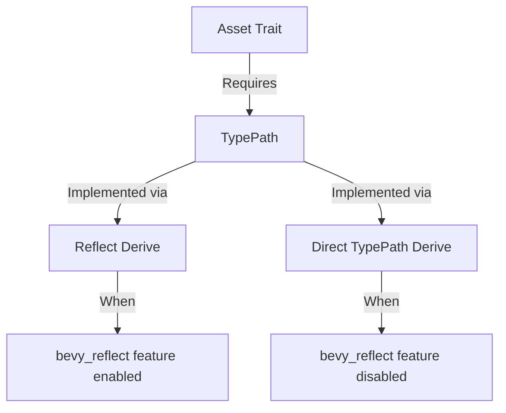

+++
title = "#18501 bevy_image: derive TypePath when Reflect is not available"
date = "2025-03-30T00:00:00"
draft = false
template = "pull_request_page.html"
in_search_index = true

[taxonomies]
list_display = ["show"]

[extra]
current_language = "en"
available_languages = {"en" = { name = "English", url = "/pull_request/bevy/2025-03/pr-18501-en-20250330" }, "zh-cn" = { name = "中文", url = "/pull_request/bevy/2025-03/pr-18501-zh-cn-20250330" }}
labels = ["A-Assets", "C-Code-Quality", "A-Reflection"]
+++

# #18501 bevy_image: derive TypePath when Reflect is not available

## Basic Information
- **Title**: bevy_image: derive TypePath when Reflect is not available
- **PR Link**: https://github.com/bevyengine/bevy/pull/18501
- **Author**: mockersf
- **Status**: MERGED
- **Labels**: `A-Assets`, `C-Code-Quality`, `S-Ready-For-Final-Review`, `A-Reflection`
- **Created**: 2025-03-23T21:31:03Z
- **Merged**: Not merged
- **Merged By**: N/A

## Description Translation

# Objective

- bevy_image fails to build without default features:
```
error[E0277]: `image::Image` does not implement `TypePath` so cannot provide static type path information
   --> crates/bevy_image/src/image.rs:341:12
    |
341 | pub struct Image {
    |            ^^^^^ the trait `bevy_reflect::type_path::TypePath` is not implemented for `image::Image`
    |
    = note: consider annotating `image::Image` with `#[derive(Reflect)]` or `#[derive(TypePath)]`
    = help: the following other types implement trait `bevy_reflect::type_path::TypePath`:
              &'static Location<'static>
              &'static T
              &'static mut T
              ()
              (P,)
              (P1, P0)
              (P1, P2, P0)
              (P1, P2, P3, P0)
            and 146 others
note: required by a bound in `Asset`
   --> /home/runner/work/bevy-releasability/bevy-releasability/crates/bevy_asset/src/lib.rs:415:43
    |
415 | pub trait Asset: VisitAssetDependencies + TypePath + Send + Sync + 'static {}
    |                                           ^^^^^^^^ required by this bound in `Asset`
...
```
- `Asset` trait depends on `TypePath` which is in bevy_reflect. it's usually implemented by the `Reflect` derive

## Solution

- make bevy_reflect not an optional dependency
- when feature `bevy_reflect` is not enabled, derive `TypePath` directly


## The Story of This Pull Request

The core challenge stemmed from Bevy's asset system requiring TypePath implementations for all Asset types, while the bevy_image crate's optional reflection support created a dependency gap. When users disabled the default features (including bevy_reflect), critical TypePath implementations became missing, breaking compilation.

The solution required two coordinated fixes. First, the team made bevy_reflect a mandatory dependency in Cargo.toml while keeping its reflection functionality optional. This ensured TypePath availability regardless of feature flags:

```toml
# Before: Optional dependency
bevy_reflect = { path = "../bevy_reflect", version = "0.16.0-dev", optional = true }

# After: Required dependency with feature-controlled functionality
bevy_reflect = { path = "../bevy_reflect", version = "0.16.0-dev" }
```

Second, they implemented conditional TypePath derivation in the affected structs. When reflection is enabled, TypePath comes through Reflect derivation. When disabled, it's derived directly:

```rust
// Before: Only Reflect-derived when feature enabled
#[cfg(feature = "bevy_reflect")]
#[derive(Reflect)]
pub struct Image;

// After: Always derive TypePath through different mechanisms
#[cfg_attr(feature = "bevy_reflect", derive(Reflect))]
#[cfg_attr(not(feature = "bevy_reflect"), derive(TypePath))]
pub struct Image;
```

This approach maintained compatibility with Bevy's reflection system while allowing minimal builds without reflection overhead. The team prioritized backward compatibility by preserving existing feature flags while fixing the underlying dependency chain.

## Visual Representation



## Key Files Changed

1. **crates/bevy_image/Cargo.toml** (+4/-2)
- Made bevy_reflect dependency mandatory
- Updated feature documentation to clarify reflection controls
```toml
# Before:
# bevy_reflect = { path = "../bevy_reflect", version = "0.16.0-dev", optional = true }

# After:
[features]
bevy_reflect = ["bevy_math/bevy_reflect"]  # Controls reflection features
```

2. **crates/bevy_image/src/image.rs** (+3/-0)
- Added conditional TypePath derivation for Image struct
```rust
#[cfg(not(feature = "bevy_reflect"))]
use bevy_reflect::TypePath;

#[cfg_attr(feature = "bevy_reflect", derive(Reflect))]
#[cfg_attr(not(feature = "bevy_reflect"), derive(TypePath))]
pub struct Image;
```

3. **crates/bevy_image/src/texture_atlas.rs** (+3/-0)
- Applied same pattern to TextureAtlasLayout
```rust
#[cfg(not(feature = "bevy_reflect"))]
use bevy_reflect::TypePath;

#[cfg_attr(feature = "bevy_reflect", derive(Reflect))]
#[cfg_attr(not(feature = "bevy_reflect"), derive(TypePath))]
pub struct TextureAtlasLayout;
```

## Further Reading

1. [Bevy Reflection System Documentation](https://bevyengine.org/learn/book/reflection/)
2. [Rust Conditional Compilation with Features](https://doc.rust-lang.org/cargo/reference/features.html)
3. [TypePath Trait in Bevy Reflect](https://docs.rs/bevy_reflect/latest/bevy_reflect/type_path/trait.TypePath.html)