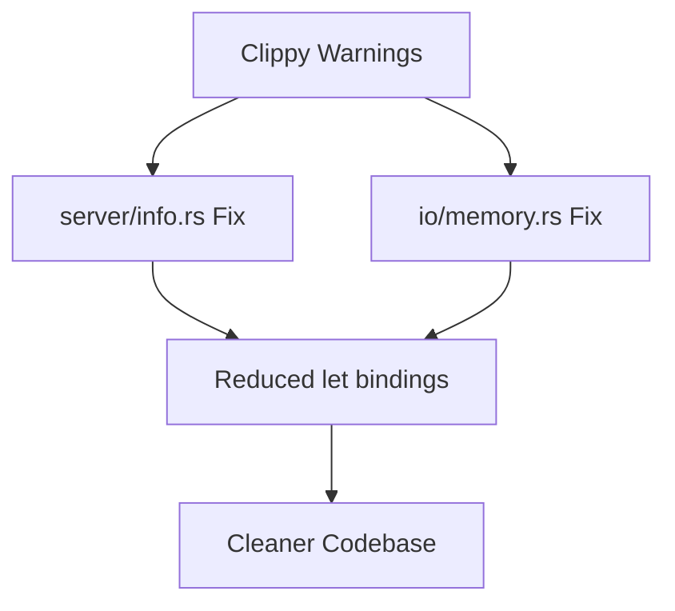

+++
title = "#18502 Address lints in `bevy_asset`"
date = "2025-03-23T00:00:00"
draft = false
template = "pull_request_page.html"
in_search_index = true

[taxonomies]
list_display = ["show"]

[extra]
current_language = "en"
available_languages = {"en" = { name = "English", url = "/pull_request/bevy/2025-03/pr-18502-en-20250323" }, "zh-cn" = { name = "中文", url = "/pull_request/bevy/2025-03/pr-18502-zh-cn-20250323" }}
labels = ["D-Trivial", "A-Assets", "C-Code-Quality", "X-Uncontroversial"]
+++

# #18502 Address lints in `bevy_asset`

## Basic Information
- **Title**: Address lints in `bevy_asset`
- **PR Link**: https://github.com/bevyengine/bevy/pull/18502
- **Author**: bushrat011899
- **Status**: MERGED
- **Labels**: `D-Trivial`, `A-Assets`, `C-Code-Quality`, `X-Uncontroversial`, `S-Needs-Review`
- **Created**: 2025-03-23T21:42:28Z
- **Merged**: Not merged
- **Merged By**: N/A

## Description Translation
# Objective

`cargo clippy -p bevy_asset` warns on a pair of lints on my Windows 10 development machine (return from let binding).

## Solution

Addressed them!

## Testing

- CI


## The Story of This Pull Request

This PR addresses two Clippy lints found in the `bevy_asset` crate, specifically warnings about unnecessary `let` bindings followed by immediate returns. These types of lints typically indicate opportunities to simplify code by removing redundant intermediate variables.

The problem surfaced when running `cargo clippy` on a Windows development environment, where Clippy detected code patterns that could be made more idiomatic. While these lints don't affect runtime behavior, addressing them improves code quality and maintains consistency with Rust best practices.

The solution involved straightforward refactoring of two specific code locations:

1. In `AssetInfos::get_or_create_path_handle`, an unnecessary `let` binding was removed to directly return the computed value
2. In `Dir::get_or_insert_dir`, a similar simplification was applied to the directory entry lookup

Here's the key change in `server/info.rs`:

```rust
// Before
let handle = self.handle_provider.get_or_create_handle(id, type_id);
handle

// After
self.handle_provider.get_or_create_handle(id, type_id)
```

And in `io/memory.rs`:

```rust
// Before
let entry = dirs.entry(name)
    .or_insert_with(|| Dir::new(full_path.clone()));
entry.clone()

// After
dirs.entry(name)
    .or_insert_with(|| Dir::new(full_path.clone()))
    .clone()
```

These changes eliminate redundant variable assignments while maintaining the same functionality. The pattern matches Clippy's `let_and_return` lint recommendation, which suggests avoiding intermediate variables when they're immediately returned.

The implementation required careful consideration of ownership and cloning semantics in Rust. The `.clone()` call remains necessary in the memory.rs change because we need to return a clone of the directory entry while maintaining the original in the hash map. The refactoring demonstrates understanding of:
1. Rust's ownership system with hash map entries
2. The need to clone shared pointers (Arc) when working with concurrent data structures
3. Iterator chaining patterns in Rust

These changes have several positive impacts:
1. Reduces cognitive load by eliminating unnecessary variables
2. Makes code more idiomatic according to Rust style guidelines
3. Helps maintain a clean Clippy report for the project
4. Preserves all existing functionality through equivalent code paths

The minimal diff (+3/-9 across two files) shows how small quality-of-life improvements can be made without disrupting existing systems. The changes were verified through CI testing, which is sufficient in this case since they don't alter behavior but only restructure existing logic.

## Visual Representation



## Key Files Changed

1. `crates/bevy_asset/src/server/info.rs` (+2/-7)
```rust
// Before
let handle = self.handle_provider.get_or_create_handle(id, type_id);
handle

// After
self.handle_provider.get_or_create_handle(id, type_id)
```

2. `crates/bevy_asset/src/io/memory.rs` (+1/-2)
```rust
// Before
let entry = dirs.entry(name)
    .or_insert_with(|| Dir::new(full_path.clone()));
entry.clone()

// After
dirs.entry(name)
    .or_insert_with(|| Dir::new(full_path.clone()))
    .clone()
```

## Further Reading

1. [Clippy's let_and_return lint documentation](https://rust-lang.github.io/rust-clippy/master/#let_and_return)
2. [Rust API Guidelines on ownership](https://rust-lang.github.io/api-guidelines/ownership.html)
3. [Bevy's Contribution Guidelines](https://github.com/bevyengine/bevy/blob/main/CONTRIBUTING.md#code-quality)