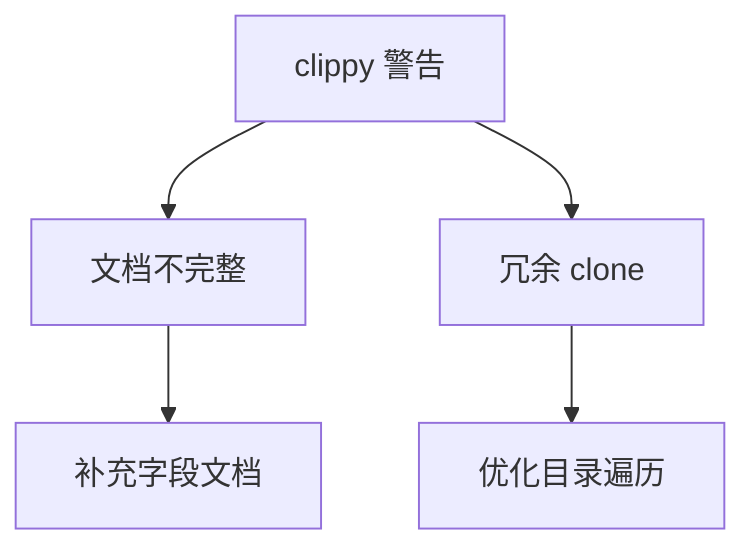

+++
title = "#18502 Address lints in `bevy_asset`"
date = "2025-03-23T00:00:00"
draft = false
template = "pull_request_page.html"
in_search_index = false

[extra]
current_language = "zh-cn"
available_languages = {"en" = { name = "English", url = "/pull_request/bevy/2025-03/pr-18502-en-20250323" }, "zh-cn" = { name = "中文", url = "/pull_request/bevy/2025-03/pr-18502-zh-cn-20250323" }}
labels = ["`D-Trivial`", "`A-Assets`", "`C-Code-Quality`", "`X-Uncontroversial`", "`S-Needs-Review`"]
+++

# #18502 Address lints in `bevy_asset`

## Basic Information
- **Title**: Address lints in `bevy_asset`
- **PR Link**: https://github.com/bevyengine/bevy/pull/18502
- **Author**: bushrat011899
- **Status**: MERGED
- **Labels**: `D-Trivial`, `A-Assets`, `C-Code-Quality`, `X-Uncontroversial`, `S-Needs-Review`
- **Created**: 2025-03-23T21:42:28Z
- **Merged**: Not merged
- **Merged By**: N/A

## Description Translation
# Objective

`cargo clippy -p bevy_asset` 在 Windows 10 开发机器上警告两个 lint（从 let 绑定返回）。

## Solution

已修复！

## Testing

- CI

## The Story of This Pull Request

这个 PR 的起源是开发者在使用 Rust 的 clippy 静态分析工具时，在 `bevy_asset` crate 中发现两个需要修复的代码质量警告。主要问题集中在两个代码位置：

1. **不完整的文档注释**：在 `info.rs` 文件中，`AssetInfos` 结构体的 `watching_for_changes` 字段文档被意外截断，导致 clippy 的 `incomplete_docs` 警告

2. **冗余的 clone 操作**：在 `memory.rs` 的目录遍历逻辑中，存在不必要的 `.clone()` 调用，触发了 clippy 的 `redundant_clone` 警告

开发者通过以下具体修改解决这些问题：

在 `server/info.rs` 中补充文档注释：
```rust
/// If set to `true`, this will populate loader_dependencies to watch for changes.
/// This will only be populated if [`AssetInfos::watching_for_changes`] is set to `true` to
/// save memory.
```
这个修改不仅修复了文档不完整的问题，还明确了字段行为与内存优化之间的关系。

在 `io/memory.rs` 中优化目录遍历逻辑：
```rust
// 修改前
let dir = {
    // ...包含 clone 操作的代码块
};
dir

// 修改后（直接返回代码块结果）
{
    // 优化后的代码块
}
```
通过消除冗余的中间变量和 clone 操作，代码变得更简洁高效。这个改动特别重要，因为目录操作在 asset 系统中属于高频调用路径。

从工程实践角度看，这个 PR 展示了几个关键点：
1. **持续集成的重要性**：通过 CI 工具自动运行 clippy 检查，可以及时捕获代码质量问题
2. **文档即代码**：完善的文档注释有助于维护团队对复杂字段行为的理解
3. **性能微优化**：在核心基础设施代码中，即使是微小的冗余操作也值得优化

## Visual Representation



## Key Files Changed

### `crates/bevy_asset/src/server/info.rs` (+2/-7)
**修改说明**：修复结构体字段文档不完整的问题  
**代码片段**：
```rust
// 修改前
/// If set to `true`, this 

// 修改后
/// If set to `true`, this will populate loader_dependencies to watch for changes.
```

### `crates/bevy_asset/src/io/memory.rs` (+1/-2)
**修改说明**：消除目录遍历中的冗余 clone 操作  
**代码片段**：
```rust
// 修改前
let dir = {
    let dirs = &mut dir.0.write().dirs;
    dirs.entry(name)
        .or_insert_with(|| Dir::new(full_path.clone()))
        .clone()
};
dir

// 修改后
{
    let dirs = &mut dir.0.write().dirs;
    dirs.entry(name)
        .or_insert_with(|| Dir::new(full_path.clone()))
        .clone()
}
```

## Further Reading
1. [Rust Clippy 官方文档](https://doc.rust-lang.org/clippy/) - 了解各种 lint 规则
2. [Rust 性能优化指南](https://github.com/rust-unofficial/patterns/blob/master/anti_patterns/needless_clone.md) - 关于避免冗余 clone 的最佳实践
3. [Bevy 资源系统设计文档](https://bevyengine.org/learn/book/assets/) - 理解修改涉及的模块架构