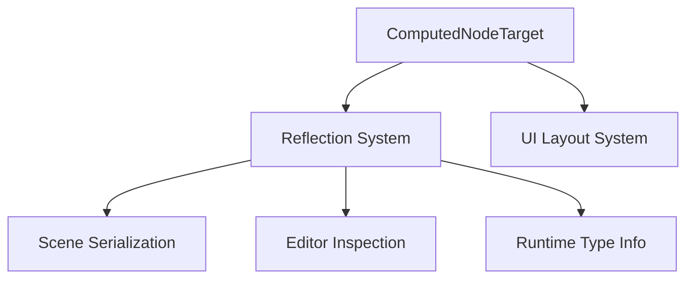

+++
title = "#18503 register ComputedNodeTarget"
date = "2025-03-24T00:00:00"
draft = false
template = "pull_request_page.html"
in_search_index = true

[taxonomies]
list_display = ["show"]

[extra]
current_language = "en"
available_languages = {"en" = { name = "English", url = "/pull_request/bevy/2025-03/pr-18503-en-20250324" }, "zh-cn" = { name = "中文", url = "/pull_request/bevy/2025-03/pr-18503-zh-cn-20250324" }}
labels = ["D-Trivial", "A-UI", "A-Reflection"]
+++

# #18503 register ComputedNodeTarget

## Basic Information
- **Title**: register ComputedNodeTarget
- **PR Link**: https://github.com/bevyengine/bevy/pull/18503
- **Author**: darthLeviN
- **Status**: MERGED
- **Labels**: `D-Trivial`, `A-UI`, `S-Ready-For-Final-Review`, `A-Reflection`
- **Created**: 2025-03-23T22:20:13Z
- **Merged**: 2025-03-24T02:47:12Z
- **Merged By**: alice-i-cecile

## Description Translation
I had no reference to `ComputedNodeTarget` in my project. After updating to bevy 0.16.0-rc1 i got a compile error complaining about this.

## The Story of This Pull Request

### The Problem and Context
When upgrading to Bevy 0.16.0-rc1, users encountered compilation errors related to the `ComputedNodeTarget` type not being registered with Bevy's reflection system. This occurred because the UI component lacked proper reflection registration, breaking projects that relied on Bevy's reflection capabilities for features like serialization or editor tooling.

### The Solution Approach
The fix required registering `ComputedNodeTarget` with Bevy's type registration system. The developer achieved this by adding the `#[reflect(Component)]` attribute to the type definition, leveraging Bevy's existing reflection infrastructure. This approach maintains consistency with how other UI components handle reflection registration.

### The Implementation
The core change modifies the `ComputedNodeTarget` struct definition in `bevy_ui/src/lib.rs`:

```rust
#[derive(Component, Debug, Reflect)]
#[reflect(Component)]
pub struct ComputedNodeTarget;
```

The `#[reflect(Component)]` attribute triggers automatic registration of the type with Bevy's reflection system during app building. This registration enables the type to be recognized by systems that:
1. Serialize/deserialize scenes
2. Provide editor inspection capabilities
3. Handle component type checking at runtime

### Technical Insights
Bevy's reflection system requires explicit type registration through either:
- Manual registration via `App::register_type::<T>()`
- Automatic registration using `#[derive(Reflect)]` with `#[reflect(Component)]`

The chosen approach follows Bevy's established patterns for component registration while minimizing maintenance overhead. By deriving `Reflect` and using the component-specific attribute, we ensure the registration stays synchronized with the component definition.

### The Impact
This change resolves compilation errors in projects using Bevy's reflection features and:
- Enables proper serialization of UI components containing `ComputedNodeTarget`
- Maintains compatibility with Bevy's editor tooling ecosystem
- Prevents future breakage when reflection is required for UI systems

## Visual Representation



## Key Files Changed

### `crates/bevy_ui/src/lib.rs` (+1/-0)
**Purpose**: Add reflection support for `ComputedNodeTarget` component

Before:
```rust
#[derive(Component, Debug)]
pub struct ComputedNodeTarget;
```

After:
```rust
#[derive(Component, Debug, Reflect)]
#[reflect(Component)]
pub struct ComputedNodeTarget;
```

This change adds the necessary reflection traits to the component definition, ensuring it participates in Bevy's reflection system like other UI components.

## Further Reading
1. [Bevy Reflection Documentation](https://docs.rs/bevy_reflect/latest/bevy_reflect/)
2. [Component Registration in Bevy](https://bevyengine.org/learn/book/getting-started/components/#reflection)
3. [Bevy UI System Overview](https://github.com/bevyengine/bevy/blob/main/docs/plugins_guidelines.md#ui-systems)