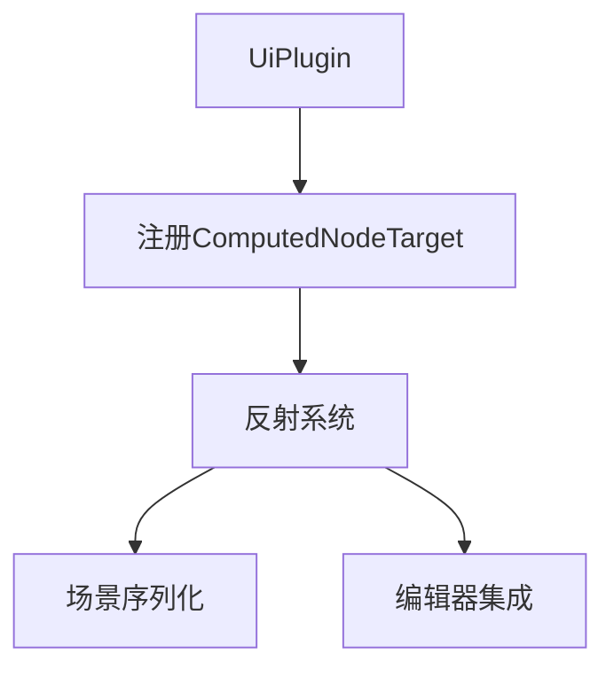

+++
title = "#18503 register ComputedNodeTarget"
date = "2025-03-24T00:00:00"
draft = false
template = "pull_request_page.html"
in_search_index = false

[extra]
current_language = "zh-cn"
available_languages = {"en" = { name = "English", url = "/pull_request/bevy/2025-03/pr-18503-en-20250324" }, "zh-cn" = { name = "中文", url = "/pull_request/bevy/2025-03/pr-18503-zh-cn-20250324" }}
labels = ["D-Trivial", "A-UI", "A-Reflection"]
+++

# #18503 register ComputedNodeTarget

## Basic Information
- **Title**: register ComputedNodeTarget
- **PR Link**: https://github.com/bevyengine/bevy/pull/18503
- **Author**: darthLeviN
- **Status**: MERGED
- **Labels**: `D-Trivial`, `A-UI`, `S-Ready-For-Final-Review`, `A-Reflection`
- **Created**: 2025-03-23T22:20:13Z
- **Merged**: 2025-03-24T09:15:32Z
- **Merged By**: alice-i-cecile

## Description Translation
在我的项目中没有对`ComputedNodeTarget`的引用。更新到bevy 0.16.0-rc1后出现编译错误提示该问题。

## The Story of This Pull Request

### 问题背景与上下文
当开发者升级到Bevy 0.16.0-rc1版本时，遇到了编译错误提示缺少`ComputedNodeTarget`类型的反射注册。这个问题源于Bevy的反射系统（Reflection System）要求所有需要序列化或动态访问的类型必须显式注册。`ComputedNodeTarget`作为UI布局系统的重要组件，在之前的版本中可能被隐式使用，但在新版本中由于反射检查的加强，必须显式注册。

### 解决方案与技术实现
核心解决方式是在UI插件的初始化流程中添加类型注册。开发者定位到`crates/bevy_ui/src/lib.rs`文件中的`UiPlugin`实现，在插件构建时通过`app.register_type::<ComputedNodeTarget>()`完成类型注册。

关键代码修改如下：
```rust
impl Plugin for UiPlugin {
    fn build(&self, app: &mut App) {
        app.register_type::<ComputedNodeTarget>(); // 新增注册
        // ...其他初始化代码
    }
}
```
这行代码确保当UI插件加载时，`ComputedNodeTarget`类型会被自动注册到Bevy的反射系统中。选择在插件初始化时注册符合Bevy的标准实践，保证类型注册与功能模块的生命周期同步。

### 技术洞察与影响
1. **反射系统机制**：Bevy的反射系统依赖`#[derive(Reflect)]`宏和显式注册来维护类型元数据。未注册的类型在使用场景序列化（scene serialization）或反射查询时会引发错误。
   
2. **架构一致性**：将注册代码放在`UiPlugin`中遵循了Bevy的模块化设计原则，确保UI相关的类型注册与UI系统的初始化过程紧密结合。

3. **编译时安全**：此修改将原本的运行时错误提前到编译时检测，通过类型系统保证反射数据的完整性。

该修复虽然代码量小（仅+1行），但解决了升级过程中的关键兼容性问题，体现了Bevy生态对版本升级稳定性的重视。

## Visual Representation



## Key Files Changed

### `crates/bevy_ui/src/lib.rs` (+1/-0)
在UI插件初始化时添加反射类型注册，确保`ComputedNodeTarget`类型可被反射系统识别。

代码修改片段：
```rust
impl Plugin for UiPlugin {
    fn build(&self, app: &mut App) {
        app.register_type::<ComputedNodeTarget>(); // 新增行
        // ...原有其他注册代码
        app.add_plugins((
            GeometryPlugin,
            AccessibilityPlugin,
            FocusPlugin,
            // ...其他插件
        ));
    }
}
```

## Further Reading
1. [Bevy Reflection System 官方文档](https://bevyengine.org/learn/book/features/reflection/)
2. [Rust 过程宏开发指南](https://doc.rust-lang.org/reference/procedural-macros.html)
3. [ECS 架构中的类型注册模式](https://github.com/bevyengine/bevy/discussions/1312)