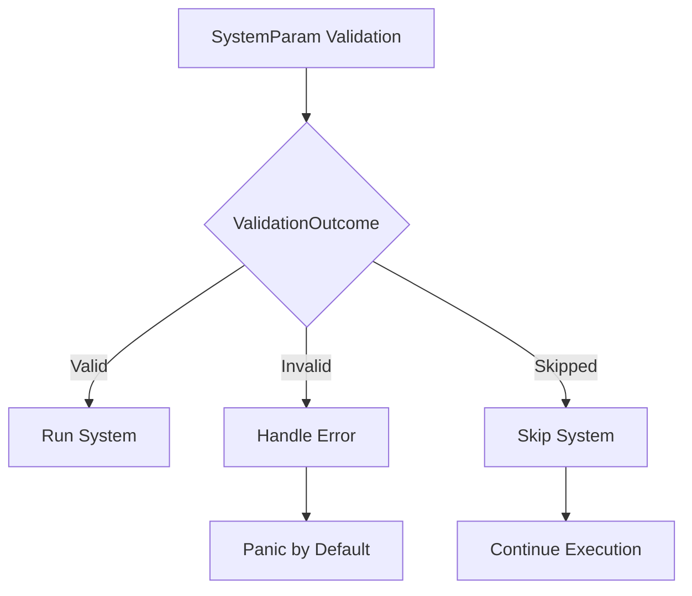

+++
title = "#18504 Define system param validation on a per-system parameter basis"
date = "2025-03-25T00:00:00"
draft = false
template = "pull_request_page.html"
in_search_index = true

[taxonomies]
list_display = ["show"]

[extra]
current_language = "en"
available_languages = {"zh-cn" = { name = "中文", url = "/pull_request/bevy/2025-03/pr-18504-zh-cn-20250325" }, "en" = { name = "English", url = "/pull_request/bevy/2025-03/pr-18504-en-20250325" }}
labels = ["C-Bug", "C-Feature", "A-ECS"]
+++

# #18504 Define system param validation on a per-system parameter basis

## Basic Information
- **Title**: Define system param validation on a per-system parameter basis
- **PR Link**: https://github.com/bevyengine/bevy/pull/18504
- **Author**: alice-i-cecile
- **Status**: MERGED
- **Labels**: `C-Bug`, `C-Feature`, `A-ECS`, `S-Ready-For-Final-Review`, `M-Needs-Migration-Guide`
- **Created**: 2025-03-23T23:40:48Z

## Description Translation

# Objective

When introduced, `Single` was intended to simply be silently skipped, allowing for graceful and efficient handling of systems during invalid game states (such as when the player is dead).

However, this also caused missing resources to *also* be silently skipped, leading to confusing and very hard to debug failures. In 0.15.1, this behavior was reverted to a panic, making missing resources easier to debug, but largely making `Single` (and `Populated`) worthless, as they would panic during expected game states.

Ultimately, the consensus is that this behavior should differ on  a per-system-param basis. However, there was no sensible way to *do* that before this PR.

## Solution

Swap `SystemParam::validate_param` from a `bool` to:

```rust
/// The outcome of system / system param validation,
/// used by system executors to determine what to do with a system.
pub enum ValidationOutcome {
    /// All system parameters were validated successfully and the system can be run.
    Valid,
    /// At least one system parameter failed validation, and an error must be handled.
    /// By default, this will result in1 a panic. See [crate::error] for more information.
    ///
    /// This is the default behavior, and is suitable for system params that should *always* be valid,
    /// either because sensible fallback behavior exists (like [`Query`] or because
    /// failures in validation should be considered a bug in the user's logic that must be immediately addressed (like [`Res`]).
    Invalid,
    /// At least one system parameter failed validation, but the system should be skipped due to [`ValidationBehavior::Skip`].
    /// This is suitable for system params that are intended to only operate in certain application states, such as [`Single`].
    Skipped,
}
```
Then, inside of each `SystemParam` implementation, return either Valid, Invalid or Skipped.

Currently, only `Single`, `Option<Single>` and `Populated` use the `Skipped` behavior. Other params (like resources) retain their current failing

## Testing

Messed around with the fallible_params example. Added a pair of tests: one for panicking when resources are missing, and another for properly skipping `Single` and `Populated` system params.

## To do

- [x] get https://github.com/bevyengine/bevy/pull/18454 merged
- [x] fix the todo!() in the macro-powered tuple implementation (please help 🥺)
- [x] test
- [x] write a migration guide
- [x] update the example comments

## Migration Guide

Various system and system parameter validation methods (`SystemParam::validate_param`, `System::validate_param` and `System::validate_param_unsafe`) now return and accept a `ValidationOutcome` enum, rather than a `bool`.  The previous `true` values map to `ValidationOutcome::Valid`, while `false` maps to `ValidationOutcome::Invalid`.

However, if you wrote a custom schedule executor, you should now respect the new `ValidationOutcome::Skipped` parameter, skipping any systems whose validation was skipped. By contrast, `ValidationOutcome::Invalid` systems should also be skipped, but you should call the `default_error_handler` on them first, which by default will result in a panic.

If you are implementing a custom `SystemParam`, you should consider whether failing system param validation is an error or an expected state, and choose between `Invalid` and `Skipped` accordingly. In Bevy itself, `Single` and `Populated` now once again skip the system when their conditions are not met. This is the 0.15.0 behavior, but stands in contrast to the 0.15.1 behavior, where they would panic.

## The Story of This Pull Request

The core problem stemmed from conflicting validation requirements for different system parameters. Parameters like `Single` needed to gracefully skip systems when their conditions weren't met, while resource parameters like `Res` required strict validation to prevent silent failures. Previous implementations used a boolean validation approach that couldn't differentiate between these cases, leading to either overly strict or overly permissive behavior.

The solution introduces a three-state validation system through the `ValidationOutcome` enum. This allows each system parameter to declare its failure mode:

```rust
pub enum ValidationOutcome {
    Valid,
    Invalid,
    Skipped,
}
```

Key implementation changes occurred in the validation infrastructure:

1. **System Parameter Traits**:
```rust
// Before:
fn validate_param(...) -> bool;

// After:
fn validate_param(...) -> ValidationOutcome;
```

2. **Executor Handling**:
All executors (single-threaded, multi-threaded, simple) were updated to handle the new validation states. For example in `single_threaded.rs`:

```rust
match outcome {
    ValidationOutcome::Valid => {}
    ValidationOutcome::Invalid => {
        (error_handler)(error, ErrorContext::SystemParamValidation);
    }
    ValidationOutcome::Skipped => {
        self.completed_systems.insert(system_index);
        continue;
    }
}
```

3. **Parameter Implementations**:
Critical parameters were updated to return appropriate outcomes. For `Single<T>`:

```rust
fn validate_param(...) -> ValidationOutcome {
    if entity.exists() {
        ValidationOutcome::Valid
    } else {
        ValidationOutcome::Skipped
    }
}
```

This approach maintains strict validation for essential parameters while allowing optional ones to skip systems cleanly. The migration required updating all system parameter implementations and executors to handle the new enum, ensuring consistent error handling across the ECS framework.

## Visual Representation



## Key Files Changed

### `crates/bevy_ecs/src/system/system_param.rs`
- Introduced `ValidationOutcome` enum
- Updated all `SystemParam` implementations to return specific outcomes
- Modified validation logic for `Single`, `Option<Single>`, and `Populated`

Critical code change:
```rust
// Before:
impl<'w, T: Component> SystemParam for Single<'w, T> {
    fn validate_param(...) -> bool {
        entity.exists()
    }
}

// After:
impl<'w, T: Component> SystemParam for Single<'w, T> {
    fn validate_param(...) -> ValidationOutcome {
        if entity.exists() {
            ValidationOutcome::Valid
        } else {
            ValidationOutcome::Skipped
        }
    }
}
```

### `crates/bevy_ecs/src/schedule/executor/mod.rs`
- Updated executor trait definitions
- Modified system validation flow

```rust
// Updated executor interface:
pub(super) trait SystemExecutor: Send + Sync {
    fn run(
        &mut self,
        schedule: &mut SystemSchedule,
        world: &mut World,
        skip_systems: Option<&FixedBitSet>,
        error_handler: fn(BevyError, ErrorContext),
    );
}
```

### Executor Implementations
All executors received similar updates to handle validation outcomes:

```rust
// In multi_threaded.rs:
let outcome = system.validate_param();
match outcome {
    ValidationOutcome::Valid => {}
    ValidationOutcome::Invalid => {
        (error_handler)(error, ErrorContext::SystemParamValidation);
    }
    ValidationOutcome::Skipped => {
        completed_systems.insert(system_index);
        return;
    }
}
```

## Further Reading
- [Bevy ECS System Param Documentation](https://bevyengine.org/learn/book/ecs/system-params/)
- [Rust Enums for State Management](https://doc.rust-lang.org/book/ch06-01-defining-an-enum.html)
- [Error Handling in ECS Frameworks](https://www.amethyst.rs/book/master/concepts/system.html#error-handling)