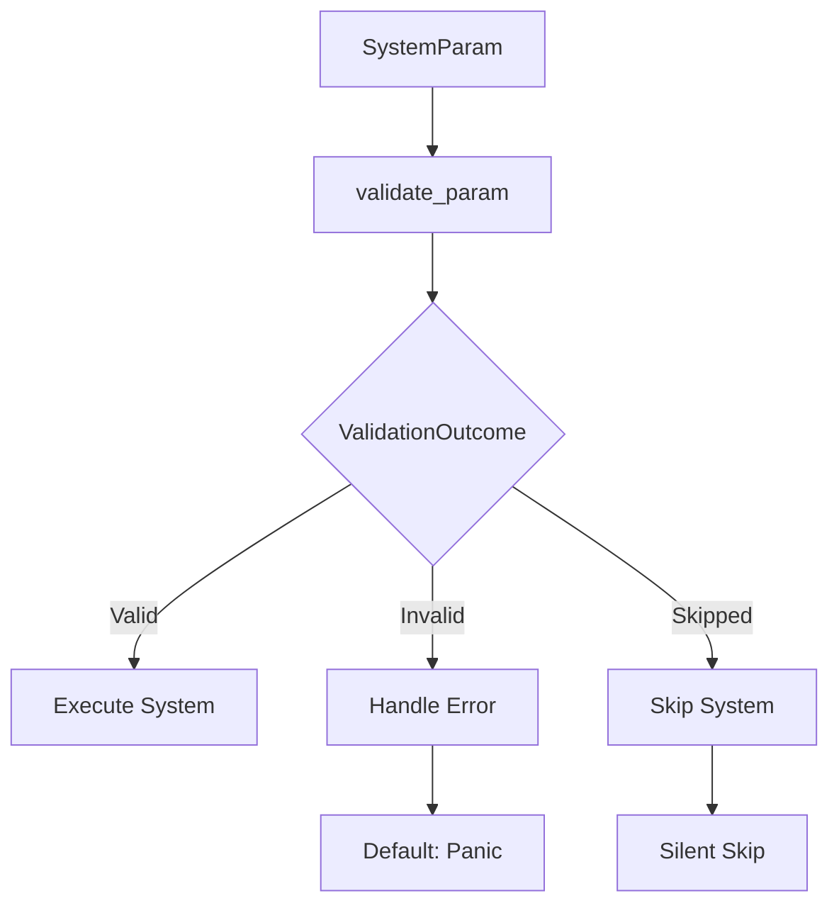

+++
title = "#18504 Define system param validation on a per-system parameter basis"
date = "2025-03-25T00:00:00"
draft = false
template = "pull_request_page.html"
in_search_index = false

[extra]
current_language = "zh-cn"
available_languages = {"zh-cn" = { name = "中文", url = "/pull_request/bevy/2025-03/pr-18504-zh-cn-20250325" }, "en" = { name = "English", url = "/pull_request/bevy/2025-03/pr-18504-en-20250325" }}
+++

# #18504 Define system param validation on a per-system parameter basis

## 基本信息
- **标题**: Define system param validation on a per-system parameter basis
- **PR链接**: https://github.com/bevy_ecs/pull/18504
- **作者**: alice-i-cecile
- **状态**: 已合并
- **标签**: `C-Bug`, `C-Feature`, `A-ECS`, `S-Ready-For-Final-Review`, `M-Needs-Migration-Guide`
- **创建时间**: 2025-03-23T23:40:48Z
- **合并时间**: 未提供
- **合并者**: 未提供

## 问题描述翻译

### 目标
当`Single`参数被引入时，其设计初衷是在无效游戏状态（如玩家死亡）时静默跳过系统，以实现优雅且高效的处理。然而这导致资源缺失的情况也被静默跳过，引发难以调试的故障。在0.15.1版本中该行为改为panic，虽然便于调试资源缺失问题，但也使得`Single`和`Populated`参数在正常游戏状态下变得不可用。

### 解决方案
将`SystemParam::validate_param`的返回值从`bool`改为`ValidationOutcome`枚举：

```rust
pub enum ValidationOutcome {
    Valid,
    Invalid,
    Skipped,
}
```

目前只有`Single`、`Option<Single>`和`Populated`使用`Skipped`行为，其他参数（如资源）保持原有失败逻辑。

### 迁移指南
自定义调度执行器需要处理新的`ValidationOutcome::Skipped`情况。系统参数开发者应根据参数特性选择`Invalid`或`Skipped`。

## 技术背景分析

### 问题背景与上下文
在Bevy ECS中，系统参数的验证机制存在行为不一致的问题。原始设计意图是：
- `Single`参数在查询不到实体时跳过系统
- 资源缺失等严重错误应触发panic

但实现时两者共用相同的验证机制，导致：
1. 0.15.0版本：所有验证失败都静默跳过，资源缺失难以发现
2. 0.15.1版本：所有验证失败都panic，破坏`Single`的正常使用场景

需要细粒度控制不同参数的验证行为。

### 解决方案设计
核心思路是引入三级验证状态：
- **Valid**：验证通过，系统正常执行
- **Invalid**：验证失败且需要处理错误（默认panic）
- **Skipped**：验证失败但应跳过系统执行

关键实现步骤：
1. 修改系统参数trait的验证接口
2. 为不同参数类型实现对应的验证逻辑
3. 调整调度执行器处理验证结果的方式

### 具体实现
以`Single`参数为例，其验证逻辑改为：

```rust
// crates/bevy_ecs/src/system/system_param.rs
impl<'w, 's, T: Component> SystemParam for Single<'w, 's, T> {
    fn validate_param(...) -> ValidationOutcome {
        if world.is_populated() && world.contains_resource::<ComponentId>() {
            ValidationOutcome::Valid
        } else {
            ValidationOutcome::Skipped  // 关键修改点
        }
    }
}
```

调度执行器修改示例（单线程版）：

```rust
// crates/bevy_ecs/src/schedule/executor/single_threaded.rs
match system.validate_param(world, system_id) {
    ValidationOutcome::Valid => {}
    ValidationOutcome::Invalid => {
        default_error_handler(BevyError::SystemParamValidationFailed { system_name, .. });
        continue;
    }
    ValidationOutcome::Skipped => {
        completed_systems.insert(system_index);
        continue;
    }
}
```

### 技术洞察
1. **分层错误处理**：通过枚举明确区分不同级别的验证失败，保留panic机制用于严重错误，同时允许特定条件下的优雅跳过
2. **类型系统驱动**：利用Rust的trait系统，将验证逻辑内聚到各个系统参数的实现中
3. **执行器扩展性**：新的`Skipped`状态为未来更复杂的调度策略（如条件式系统分组）奠定基础

### 影响分析
- **调试性改进**：资源缺失等关键错误恢复panic机制，避免静默失败
- **功能恢复**：`Single`和`Populated`参数恢复0.15.0版本的设计初衷
- **架构扩展**：为自定义系统参数验证提供标准化扩展点

## 关键文件变更

### `crates/bevy_ecs/src/system/system_param.rs` (+125/-39)
1. 引入`ValidationOutcome`枚举类型
2. 修改所有系统参数的`validate_param`实现
3. 为`Single`、`Populated`等参数实现`Skipped`逻辑

```rust
// 修改前
fn validate_param(...) -> bool {
    world.contains_resource::<T>()
}

// 修改后
fn validate_param(...) -> ValidationOutcome {
    if world.contains_resource::<T>() {
        ValidationOutcome::Valid
    } else {
        ValidationOutcome::Skipped
    }
}
```

### `crates/bevy_ecs/src/schedule/executor/mod.rs` (+75/-27)
1. 更新执行器trait定义
2. 添加验证结果处理逻辑

```rust
pub(super) trait SystemExecutor: Send + Sync {
    fn run(
        &mut self,
        schedule: &mut SystemSchedule,
        world: &mut World,
        skip_systems: Option<&FixedBitSet>,
        error_handler: fn(BevyError, ErrorContext),
    );
}
```

### 各执行器实现文件
统一添加验证结果分派逻辑：

```rust
// multi_threaded.rs/simple.rs/single_threaded.rs
match validation_outcome {
    ValidationOutcome::Valid => queue_system(),
    ValidationOutcome::Invalid => handle_error(),
    ValidationOutcome::Skipped => mark_skipped(),
}
```

## 组件关系图



## 延伸阅读
1. [Bevy ECS系统调度机制](https://bevyengine.org/learn/book/ECS/scheduling/)
2. [Rust枚举模式实践](https://doc.rust-lang.org/rust-by-example/custom_types/enum.html)
3. [系统参数设计模式](https://github.com/bevyengine/bevy/discussions/1860)