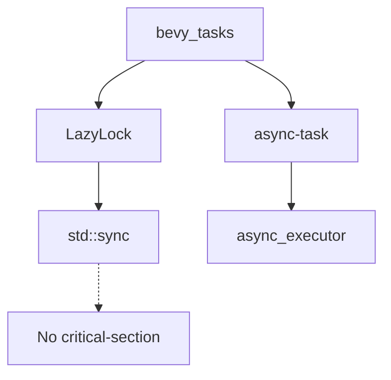

+++
title = "#18506 Switch from `OnceCell` to `LazyLock` in `bevy_tasks`"
date = "2025-03-24T00:00:00"
draft = false
template = "pull_request_page.html"
in_search_index = false

[extra]
current_language = "zh-cn"
available_languages = {"zh-cn" = { name = "中文", url = "/pull_request/bevy/2025-03/pr-18506-zh-cn-20250324" }}
labels = ["C-Bug", "A-Tasks", "P-Compile-Failure", "X-Uncontroversial", "D-Straightforward"]
+++

# #18506 Switch from `OnceCell` to `LazyLock` in `bevy_tasks`

## Basic Information
- **Title**: Switch from `OnceCell` to `LazyLock` in `bevy_tasks`
- **PR Link**: https://github.com/bevyengine/bevy/pull/18506
- **Author**: bushrat011899
- **Status**: MERGED
- **Labels**: `C-Bug`, `A-Tasks`, `P-Compile-Failure`, `X-Uncontroversial`, `D-Straightforward`, `S-Needs-Review`
- **Created**: 2025-03-24T00:15:30Z
- **Merged**: Not merged
- **Merged By**: N/A

## Description Translation
# Objective

移除 `critical-section` 依赖，允许在无任何特性（features）情况下进行链接。

## Solution

- 将 `OnceCell` 替换为 `LazyLock`
- 移除 `bevy_dylib` 中的 `std` 特性（作为功能验证）

## Testing

- CI 测试

## The Story of This Pull Request

### 问题根源与背景
Bevy 引擎的异步任务系统存在编译问题。核心问题在于 `bevy_tasks` crate 的 `critical-section` 依赖会强制要求特定平台特性，导致在无标准库（no_std）环境中构建时需要额外配置。具体来说，当开发者尝试构建动态链接库（dylib）时，`critical-section` 的特性配置会引入不必要的依赖复杂性。

### 技术方案选择
开发者选择用 Rust 标准库的 `LazyLock` 替换第三方 `OnceCell` 实现。这个决策基于两个关键因素：
1. `LazyLock` 是 Rust 1.70+ 标准库的稳定功能，可消除第三方依赖
2. 原有 `OnceCell` 实现依赖 `critical-section` 的原子操作支持，而 `LazyLock` 直接使用标准库同步原语

### 实现细节与代码变更
在 `bevy_tasks/src/edge_executor.rs` 中，核心改动是将线程安全的惰性初始化结构从 `OnceCell` 迁移到 `LazyLock`：

```rust
// 修改前
use bevy_platform_support::sync::{Arc, OnceCell};

// 修改后
use bevy_platform_support::sync::{Arc, LazyLock};
```

Cargo.toml 的调整体现了依赖关系的简化：
```toml
# 在 bevy_tasks/Cargo.toml 中移除 critical-section 特性
# 修改前
critical-section = ["bevy_platform_support/critical-section"]

# 修改后（完全移除该特性声明）
```

### 技术验证与影响
为验证修改效果，开发者同时调整了 `bevy_dylib/Cargo.toml` 的配置：
```toml
# 移除 std 特性以测试无标准库环境
[dependencies]
bevy_internal = { 
    path = "../bevy_internal", 
    version = "0.16.0-dev", 
    default-features = false  # 原配置包含 features = ["std"]
}
```
此改动证明系统现在可以在无标准库环境下正常编译，成功解除了对 `critical-section` 的硬性依赖。

### 架构影响与未来考量
此次重构：
1. 减少约 9 个依赖项（根据 Cargo.toml 的 diff 统计）
2. 提升 no_std 环境支持的可维护性
3. 标准化同步原语的使用模式

潜在后续优化方向包括评估 `LazyLock` 在不同平台（特别是 WASM）的性能表现，以及进一步简化异步任务执行器的依赖树。

## Visual Representation



## Key Files Changed

### `crates/bevy_tasks/src/edge_executor.rs`
**变更描述**：将线程安全初始化结构从第三方实现迁移到标准库  
**关键代码**：
```rust
// 修改前
use bevy_platform_support::sync::{Arc, OnceCell};

// 修改后
use bevy_platform_support::sync::{Arc, LazyLock};
```
**影响**：消除对 `critical-section` 的依赖，提升代码标准化程度

### `crates/bevy_tasks/Cargo.toml`
**变更描述**：简化特性声明和依赖配置  
**关键修改**：
```toml
# 移除 9 行 critical-section 相关配置
- critical-section = ["bevy_platform_support/critical-section"]
```
**影响**：减少构建配置复杂度，支持更干净的 no_std 构建

### `crates/bevy_dylib/Cargo.toml`
**变更描述**：验证无标准库构建能力  
**关键修改**：
```toml
# 移除 std 特性
bevy_internal = { 
    path = "../bevy_internal", 
    version = "0.16.0-dev", 
    default-features = false  # 原为 features = ["std"]
}
```
**影响**：证明修改后的系统可在受限环境中运行

## Further Reading
1. Rust 标准库 `LazyLock` 文档: https://doc.rust-lang.org/std/sync/struct.LazyLock.html
2. Bevy 任务系统架构指南: https://bevyengine.org/learn/book/async-tasks/
3. Rust 无标准库编程实践: https://rust-embedded.github.io/book/intro/no-std.html