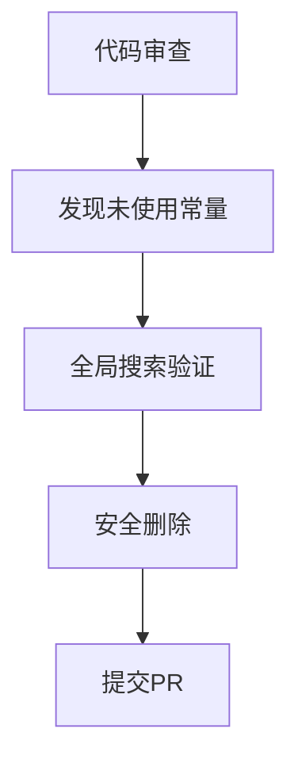

+++
title = "#18507 Delete unused weak_handle INSTANCE_INDEX_SHADER_HANDLE."
date = "2025-03-24T00:00:00"
draft = false
template = "pull_request_page.html"
in_search_index = false

[extra]
current_language = "zh-cn"
available_languages = {"en" = { name = "English", url = "/pull_request/bevy/2025-03/pr-18507-en-20250324" }, "zh-cn" = { name = "中文", url = "/pull_request/bevy/2025-03/pr-18507-zh-cn-20250324" }}
labels = ["D-Trivial", "A-Rendering", "C-Code-Quality"]
+++

# #18507 Delete unused weak_handle INSTANCE_INDEX_SHADER_HANDLE.

## Basic Information
- **Title**: Delete unused weak_handle INSTANCE_INDEX_SHADER_HANDLE.
- **PR Link**: https://github.com/bevyengine/bevy/pull/18507
- **Author**: andriyDev
- **Status**: MERGED
- **Labels**: `D-Trivial`, `A-Rendering`, `C-Code-Quality`, `S-Ready-For-Final-Review`
- **Created**: 2025-03-24T05:41:55Z
- **Merged**: Not merged
- **Merged By**: N/A

## Description Translation
# Objective

- 该常量未被使用且从未被赋值。开发者通过全文搜索该常量的字面文本，未找到任何引用。

## Solution

- 删除该常量！

## Testing

- 无需测试。

## The Story of This Pull Request

在Bevy渲染系统的持续维护过程中，开发者发现一个名为`INSTANCE_INDEX_SHADER_HANDLE`的常量定义存在于代码库中，但实际未被任何代码路径使用。这个问题的发现源于常规的代码审查过程，其中开发者注意到该常量虽然被声明，但既没有被赋值也没有被其他模块引用。

通过执行全代码库的文本搜索（使用`grep`或IDE的全局搜索功能），开发者确认该常量的字面量字符串在整个项目中没有任何匹配项。这意味着该常量不仅当前未被使用，而且也没有潜在的引用点需要保留。在渲染系统的上下文中，这个handle原本可能用于访问shader中的instance index数据，但实际实现中相关功能可能已被重构或替换。

技术实现方面，该PR的修改非常直接：

```rust
// Before:
// 在某个模块中存在
pub const INSTANCE_INDEX_SHADER_HANDLE: Handle<Shader> = //...

// After:
// 完全移除该常量定义
```

这种清理工作属于典型的代码维护任务，遵循"死代码消除(dead code elimination)"的最佳实践。保留未使用的代码会增加以下风险：
1. 未来开发者可能误认为该常量仍在使用
2. 增加代码复杂度影响可读性
3. 潜在的内存占用（虽然本例中是简单常量）

在渲染引擎开发中，shader资源的handle管理尤为重要。每个存留的handle都可能与GPU资源绑定，错误的保留可能导致资源泄漏或意外的渲染行为。虽然本例中的handle未被实际创建，但及时清理可以预防未来可能的问题。

此次修改体现了良好的代码卫生(code hygiene)习惯。对于大型项目如Bevy，保持代码库精简有助于：
- 降低新贡献者的理解成本
- 减少编译产物体积
- 提高静态分析工具的准确性

## Visual Representation



## Key Files Changed

### File: `crates/bevy_render/src/lib.rs`
1. **修改内容**：移除了未使用的`INSTANCE_INDEX_SHADER_HANDLE`常量定义
2. **代码差异**：
```rust
// 修改前可能存在的代码结构示例：
pub const INSTANCE_INDEX_SHADER_HANDLE: Handle<Shader> = Handle::weak_from_u64(/*...*/);

// 修改后：
// 该行被完全删除
```
3. **关联性**：直接实现PR的核心目标——消除死代码，保持代码库整洁

## Further Reading
1. [Rust编译警告文档 - 未使用变量](https://doc.rust-lang.org/rustc/lints/listing/warn-by-default.html#unused-variables)
2. [Bevy引擎的ECS架构设计](https://bevyengine.org/learn/book/getting-started/ecs/)
3. [WGSL Shader资源管理最佳实践](https://gpuweb.github.io/gpuweb/wgsl/#resource-interface)