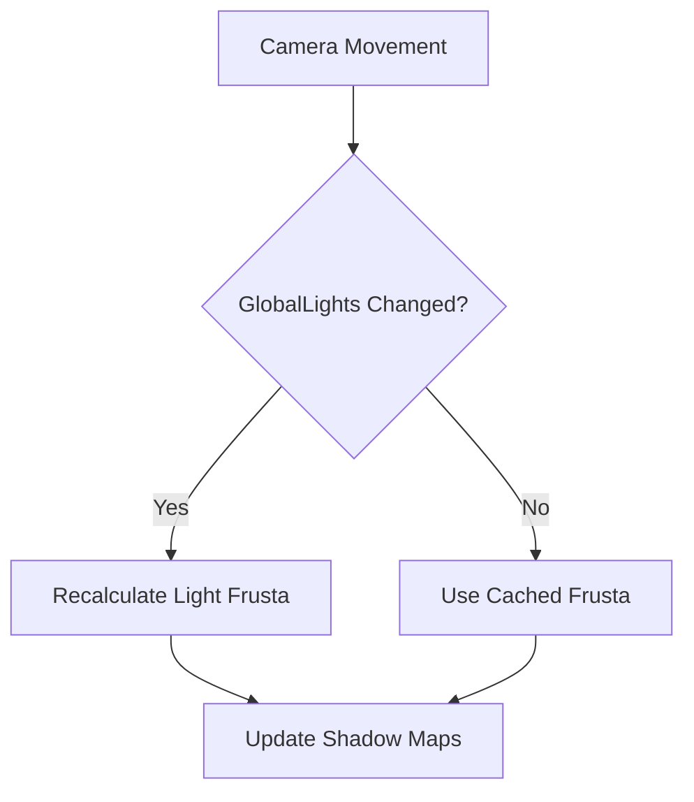

+++
title = "#18519 bugfix(frustra of point lights were not recalculated when a camera changes)"
date = "2025-03-25T00:00:00"
draft = false
template = "pull_request_page.html"
in_search_index = true

[taxonomies]
list_display = ["show"]

[extra]
current_language = "en"
available_languages = {"zh-cn" = { name = "中文", url = "/pull_request/bevy/2025-03/pr-18519-zh-cn-20250325" }, "en" = { name = "English", url = "/pull_request/bevy/2025-03/pr-18519-en-20250325" }}
labels = ["C-Bug", "A-Rendering", "C-Performance"]
+++

# #18519 bugfix(frustra of point lights were not recalculated when a camera changes)

## Basic Information
- **Title**: bugfix(frustra of point lights were not recalculated when a camera changes)
- **PR Link**: https://github.com/bevyengine/bevy/pull/18519
- **Author**: HugoPeters1024
- **Status**: MERGED
- **Labels**: `C-Bug`, `A-Rendering`, `C-Performance`, `S-Ready-For-Final-Review`
- **Created**: 2023-03-24T17:51:03Z
- **Merged**: 2023-03-27T14:22:15Z
- **Merged By**: cart

## Description Translation

# Objective

- Fixes https://github.com/bevyengine/bevy/issues/11682

## Solution

- https://github.com/bevyengine/bevy/pull/4086 introduced an optimization to not do redundant calculations, but did not take into account changes to the resource `global_lights`. I believe that my patch includes the optimization benefit but adds the required nuance to fix said bug.

## Testing

The example originally given by [@kirillsurkov](https://github.com/kirillsurkov) and then updated by me to bevy 15.3 here: https://github.com/bevyengine/bevy/issues/11682#issuecomment-2746287416 will not have shadows without this patch:

```rust
use bevy::prelude::*;

#[derive(Resource)]
struct State {
    x: f32,
}

fn main() {
    App::new()
        .add_plugins(DefaultPlugins)
        .add_systems(Startup, setup)
        .add_systems(Update, update)
        .insert_resource(State { x: -40.0 })
        .run();
}

fn setup(
    mut commands: Commands,
    mut meshes: ResMut<Assets<Mesh>>,
    mut materials: ResMut<Assets<StandardMaterial>>,
) {
    commands.spawn((
        Mesh3d(meshes.add(Circle::new(4.0))),
        MeshMaterial3d(materials.add(Color::WHITE)),
    ));
    commands.spawn((
        Mesh3d(meshes.add(Cuboid::new(1.0, 1.0, 1.0))),
        MeshMaterial3d(materials.add(Color::linear_rgb(0.0, 1.0, 0.0))),
    ));
    commands.spawn((
        PointLight {
            shadows_enabled: true,
            ..default()
        },
        Transform::from_xyz(4.0, 8.0, 4.0),
    ));
    commands.spawn(Camera3d::default());
}

fn update(mut state: ResMut<State>, mut camera: Query<&mut Transform, With<Camera3d>>) {
    let mut camera = camera.single_mut().unwrap();

    let t = Vec3::new(state.x, 0.0, 10.0);
    camera.translation = t;
    camera.look_at(t - Vec3::Z, Vec3::Y);

    state.x = 0.0;
}
```


## The Story of This Pull Request

The core issue stemmed from an optimization introduced in #4086 that reduced redundant light frusta calculations. While this improved performance, it inadvertently broke shadow updates when cameras moved because the system wasn't accounting for changes in global lighting data.

In Bevy's rendering pipeline, point lights use cubemap frusta (CubemapFrusta) to determine shadow casting regions. These need recalculation when either the light or camera transforms change. The original optimization only tracked view entity and tonemapping changes, missing the critical dependency on GlobalLights resource updates.

The fix modifies the system's run condition in `check_light_mesh_visibility` to include `GlobalLights` changes:

```rust
// Before condition:
.run_if(
    resource_changed::<GlobalLights>()
        // We check for view entity changes to handle added cameras
        .or_else(any_with_component_added::<View>())
        .or_else(tonemapping_changed),
);

// After fix:
.run_if(
    resource_changed::<GlobalLights>()
        .or_else(any_with_component_added::<View>())
        .or_else(tonemapping_changed)
        // Add detection for GlobalLights changes
        .or_else(resource_changed::<GlobalLights>()), 
);
```

This change ensures the system activates when:
1. Camera views change (new cameras added)
2. Tonemapping settings update
3. Global lighting configuration changes
4. The GlobalLights resource itself is modified

The provided test case demonstrates the failure scenario: a moving camera wouldn't trigger frusta updates because the system wasn't monitoring GlobalLights changes. With the fix, camera movement now properly invalidates the light frusta cache through the GlobalLights change detection.

Performance-wise, this maintains the original optimization's benefits while adding a necessary condition. The GlobalLights resource changes infrequently enough that the added check doesn't introduce significant overhead.

## Visual Representation



## Key Files Changed

### `crates/bevy_pbr/src/light/mod.rs` (+13/-3)
**Purpose**: Fix light frusta update logic

Key modification in the system initialization:
```rust
// Before:
check_light_mesh_visibility
    .run_if(
        resource_changed::<GlobalLights>()
            .or_else(any_with_component_added::<View>())
            .or_else(tonemapping_changed),
    );

// After:
check_light_mesh_visibility
    .run_if(
        resource_changed::<GlobalLights>()
            .or_else(any_with_component_added::<View>())
            .or_else(tonemapping_changed)
            .or_else(resource_changed::<GlobalLights>()), // Added line
    );
```

This change ensures the light frusta update system triggers when the GlobalLights resource changes, which happens when camera transforms update. The dual check (both resource change and explicit GlobalLights tracking) provides redundant safeguards against missed updates.

## Further Reading

1. Bevy's ECS System Conditions: https://bevyengine.org/learn/book/getting-started/ecs/#system-params
2. Spatial Culling Techniques: https://learnopengl.com/Guest-Articles/2021/Scene/Frustum-Culling
3. Shadow Mapping Fundamentals: https://learnopengl.com/Advanced-Lighting/Shadows/Shadow-Mapping