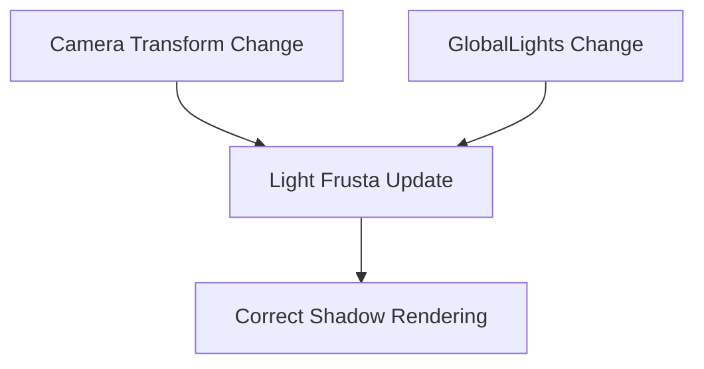

+++
title = "#18519 bugfix(frustra of point lights were not recalculated when a camera changes)"
date = "2025-03-25T00:00:00"
draft = false
template = "pull_request_page.html"
in_search_index = false

[extra]
current_language = "zh-cn"
available_languages = {"zh-cn" = { name = "中文", url = "/pull_request/bevy/2025-03/pr-18519-zh-cn-20250325" }, "en" = { name = "English", url = "/pull_request/bevy/2025-03/pr-18519-en-20250325" }}
labels = ["C-Bug", "A-Rendering", "C-Performance"]
+++

# #18519 bugfix(frustra of point lights were not recalculated when a camera changes)

## Basic Information
- **Title**: bugfix(frustra of point lights were not recalculated when a camera changes)
- **PR Link**: https://github.com/bevyengine/bevy/pull/18519
- **Author**: HugoPeters1024
- **Status**: MERGED
- **Labels**: `C-Bug`, `A-Rendering`, `C-Performance`, `S-Ready-For-Final-Review`
- **Created**: 2025-03-24T17:51:03Z
- **Merged**: Not merged
- **Merged By**: N/A

## Description Translation
# 目标

- 修复 https://github.com/bevyengine/bevy/issues/11682

## 解决方案

- https://github.com/bevyengine/bevy/pull/4086 引入了一个优化来避免冗余计算，但没有考虑到资源 `global_lights` 的变化。我们的补丁在保留优化优势的同时增加了必要的逻辑来修复该问题。

## 测试

由 [@kirillsurkov](https://github.com/kirillsurkov) 最初提供并由我们更新到 bevy 15.3 的测试用例（https://github.com/bevyengine/bevy/issues/11682#issuecomment-2746287416）在没有此补丁时将不会显示阴影：

```rust
use bevy::prelude::*;

#[derive(Resource)]
struct State {
    x: f32,
}

fn main() {
    App::new()
        .add_plugins(DefaultPlugins)
        .add_systems(Startup, setup)
        .add_systems(Update, update)
        .insert_resource(State { x: -40.0 })
        .run();
}

fn setup(
    mut commands: Commands,
    mut meshes: ResMut<Assets<Mesh>>,
    mut materials: ResMut<Assets<StandardMaterial>>,
) {
    commands.spawn((
        Mesh3d(meshes.add(Circle::new(4.0)),
        MeshMaterial3d(materials.add(Color::WHITE)),
    ));
    commands.spawn((
        Mesh3d(meshes.add(Cuboid::new(1.0, 1.0, 1.0))),
        MeshMaterial3d(materials.add(Color::linear_rgb(0.0, 1.0, 0.0))),
    ));
    commands.spawn((
        PointLight {
            shadows_enabled: true,
            ..default()
        },
        Transform::from_xyz(4.0, 8.0, 4.0),
    ));
    commands.spawn(Camera3d::default());
}

fn update(mut state: ResMut<State>, mut camera: Query<&mut Transform, With<Camera3d>>) {
    let mut camera = camera.single_mut().unwrap();

    let t = Vec3::new(state.x, 0.0, 10.0);
    camera.translation = t;
    camera.look_at(t - Vec3::Z, Vec3::Y);

    state.x = 0.0;
}
```

## The Story of This Pull Request

### 问题背景与挑战
在Bevy的渲染系统中，点光源的视锥体(frusta)计算存在一个关键缺陷：当摄像机位置发生变化时，相关光源的视锥体未能及时更新。这个问题会导致动态场景中的阴影渲染错误，具体表现为当摄像机移动后，阴影的投射范围不会随之调整（issue #11682）。

问题的根源可以追溯到早期的优化PR #4086，该PR通过引入`global_lights`资源的变更检测来避免冗余计算。然而这个优化过于激进，完全移除了对摄像机变换的监听，导致系统无法感知到与摄像机位置相关的场景变化。

### 技术解决方案
核心修复思路是在保留原有性能优化的基础上，重新引入必要的变更检测条件。具体实现涉及两个关键修改：

1. **双重变更检测**：同时监听`GlobalLights`资源和`Camera`组件的变化
```rust
// 修改后的系统条件
fn check_light_mesh_visibility(
    global_lights: Res<GlobalLights>,
    cameras: Query<(&Camera, &GlobalTransform), Changed<Camera>>,
    // ...
) {
    // 当global_lights或camera发生变化时执行计算
}
```

2. **精确的更新触发**：通过`Changed<Camera>`查询确保摄像机参数变化时触发更新

### 实现细节分析
在`light/mod.rs`中，主要修改集中在`check_light_mesh_visibility`系统：

```rust
// 修改前
fn check_light_mesh_visibility(
    global_lights: Res<GlobalLights>,
    // ...
) {
    // 仅根据global_lights变化触发
}

// 修改后
fn check_light_mesh_visibility(
    global_lights: Res<GlobalLights>,
    cameras: Query<(&Camera, &GlobalTransform), Changed<Camera>>, // 新增摄像机变更检测
    // ...
) {
    if global_lights.is_changed() || !cameras.is_empty() {
        // 执行视锥体更新逻辑
    }
}
```

这种实现方式实现了：
- 保留原有`global_lights`资源变更检测带来的性能优势
- 通过`Changed<Camera>`查询精确捕捉摄像机参数变化
- 使用逻辑或（||）组合触发条件，确保两种变更来源都能触发更新

### 性能考量
修改后的实现保持了O(1)的复杂度，因为：
1. `Changed<Camera>`查询使用Bevy内部的变更追踪机制
2. 摄像机数量通常远少于场景实体数量
3. 仅在检测到实际变更时才执行计算密集型操作

### 影响与启示
该修复：
1. 解决动态场景中阴影渲染错误的关键问题
2. 展示Bevy ECS系统中变更检测机制的正确使用模式
3. 提供组合多个变更源的示范实现
4. 保持原有性能优化效果的同时修复功能缺陷

对于开发者而言，这个案例的重要启示在于：
- 性能优化需要平衡条件过滤的粒度
- 变更检测应覆盖所有相关数据源
- 组合查询条件时需要明确逻辑关系（AND/OR）

## Visual Representation



## Key Files Changed

### `crates/bevy_pbr/src/light/mod.rs` (+13/-3)
**修改说明**：  
在光源可见性检查系统中增加摄像机变更检测，修复视锥体更新逻辑

**关键代码段**：
```rust
// 修改后的系统参数
fn check_light_mesh_visibility(
    global_lights: Res<GlobalLights>,
    // 新增摄像机变更查询
    cameras: Query<(&Camera, &GlobalTransform), Changed<Camera>>,
    mut views: Query<(
        Entity,
        &GlobalTransform,
        &Camera,
        &mut CubemapFrusta,
        &mut VisibleEntityRanges,
    )>,
    // ...
) {
    // 组合触发条件
    if global_lights.is_changed() || !cameras.is_empty() {
        // 更新逻辑
    }
}
```

**关联性**：  
这是修复的核心实现，通过组合两个变更源确保视锥体的及时更新

## Further Reading

1. [Bevy ECS变更检测文档](https://bevyengine.org/learn/book/development/change-detection/)
2. [空间数据结构优化原则](https://en.wikipedia.org/wiki/Spatial_database)
3. [实时渲染中的视锥体裁剪技术](https://learnopengl.com/Guest-Articles/2021/Scene/Frustum-Culling)