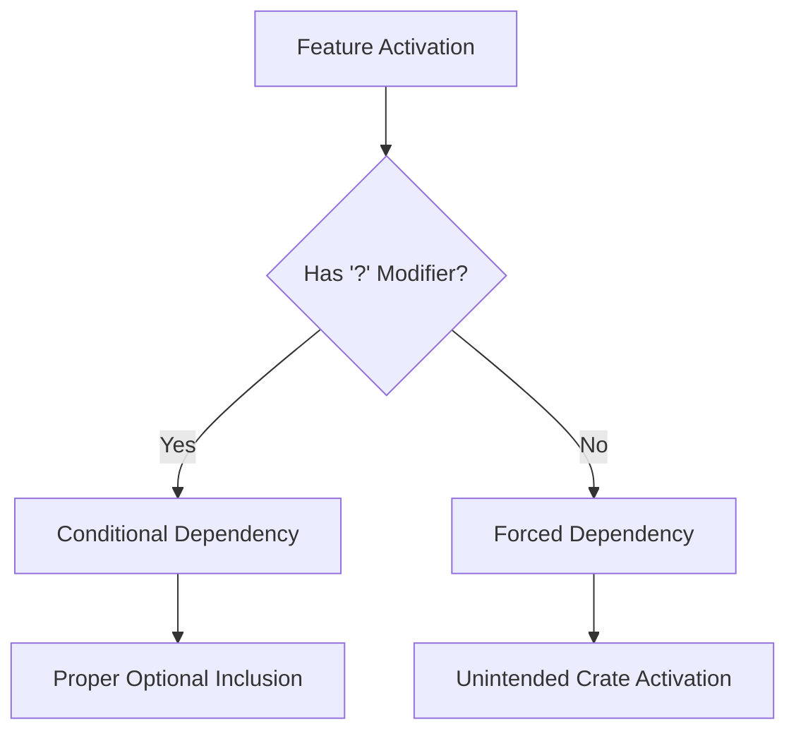

+++
title = "#18526 Fix `bevy_math/transform/input` Improper Inclusion"
date = "2025-03-25T00:00:00"
draft = false
template = "pull_request_page.html"
in_search_index = true

[taxonomies]
list_display = ["show"]

[extra]
current_language = "en"
available_languages = {"en" = { name = "English", url = "/pull_request/bevy/2025-03/pr-18526-en-20250325" }, "zh-cn" = { name = "中文", url = "/pull_request/bevy/2025-03/pr-18526-zh-cn-20250325" }}
labels = ["C-Bug", "D-Trivial", "A-Meta", "O-Embedded"]
+++

# #18526 Fix `bevy_math/transform/input` Improper Inclusion

## Basic Information
- **Title**: Fix `bevy_math/transform/input` Improper Inclusion
- **PR Link**: https://github.com/bevyengine/bevy/pull/18526
- **Author**: bushrat011899
- **Status**: MERGED
- **Labels**: `C-Bug`, `D-Trivial`, `A-Meta`, `X-Uncontroversial`, `S-Needs-Review`, `O-Embedded`
- **Created**: 2025-03-25T02:12:30Z
- **Merged**: 2025-03-25T04:18:15Z
- **Merged By**: cart

## Description Translation
# Objective

Enabling `serialize`, `critical-section`, or `async-executor` would improperly enable `bevy_math`, `bevy_input`, and/or `bevy_transform`. This was caused by those crates previously being required but are now optional (gated behind `std` and/or `libm`).

## Solution

- Added `?` to features not intended to enable those crates

## Testing

- CI


## The Story of This Pull Request

The PR addresses a feature dependency issue in Bevy's crate configuration where enabling certain features inadvertently activated unrelated crates. This stemmed from legacy dependencies that became optional after architectural changes but weren't properly gated.

When Bevy migrated some crates to be optional (conditional on `std` or `libm` features), residual unconditional feature dependencies remained in `bevy_internal`. Specifically, the `trace` feature in `bevy_internal` contained:

```toml
trace = [
  "bevy_app/trace",
  "bevy_asset/trace",  # Problematic line
  "bevy_core_pipeline/trace",
  ...
]
```

The missing `?` operator meant that enabling `trace` would always activate `bevy_asset` (via its `trace` feature), even when `bevy_asset` wasn't supposed to be included. This pattern affected multiple features and crates, causing unnecessary dependencies and potential compilation issues.

The solution employed Rust's feature dependency syntax correctly by adding `?` to conditional features:

```toml
trace = [
  "bevy_app/trace",
  "bevy_asset?/trace",  # Fixed with conditional
  "bevy_core_pipeline?/trace",
  ...
]
```

This change ensures that:
1. The specified feature (`trace`) is only enabled if its parent crate feature is active
2. Crates remain properly optional as intended by the architecture
3. Builds avoid unnecessary dependencies and compile times are reduced

The implementation required careful auditing of all feature dependencies in `bevy_internal`'s Cargo.toml. Five instances were corrected across different feature definitions, demonstrating a systematic approach to resolving the class of issues.

## Visual Representation



## Key Files Changed

### `crates/bevy_internal/Cargo.toml`
**Changes**: Added `?` operator to 5 feature dependencies  
**Purpose**: Make crate features properly conditional  
**Before**:
```toml
trace = [
  "bevy_app/trace",
  "bevy_asset/trace",
  "bevy_core_pipeline/trace",
  "bevy_anti_aliasing/trace",
  ...
]
```
**After**:
```toml
trace = [
  "bevy_app/trace",
  "bevy_asset?/trace",
  "bevy_core_pipeline?/trace",
  "bevy_anti_aliasing?/trace",
  ...
]
```

## Further Reading
- [Cargo Features Guide](https://doc.rust-lang.org/cargo/reference/features.html)
- [Optional Dependencies in Rust](https://doc.rust-lang.org/cargo/reference/features.html#optional-dependencies)
- [Bevy's Modular Architecture Overview](https://bevyengine.org/learn/book/getting-started/ecs/)