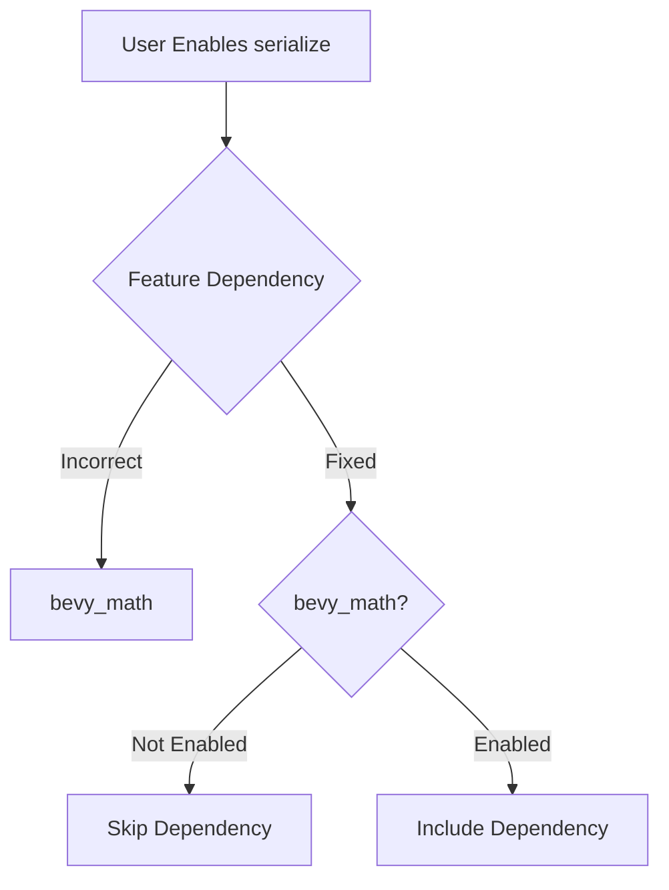

+++
title = "#18526 Fix `bevy_math/transform/input` Improper Inclusion"
date = "2025-03-25T00:00:00"
draft = false
template = "pull_request_page.html"
in_search_index = false

[extra]
current_language = "zh-cn"
available_languages = {"en" = { name = "English", url = "/pull_request/bevy/2025-03/pr-18526-en-20250325" }, "zh-cn" = { name = "中文", url = "/pull_request/bevy/2025-03/pr-18526-zh-cn-20250325" }}
labels = ["C-Bug", "D-Trivial", "A-Meta", "X-Uncontroversial", "O-Embedded"]
+++

# #18526 Fix `bevy_math/transform/input` Improper Inclusion

## Basic Information
- **Title**: Fix `bevy_math/transform/input` Improper Inclusion
- **PR Link**: https://github.com/bevyengine/bevy/pull/18526
- **Author**: bushrat011899
- **Status**: MERGED
- **Labels**: `C-Bug`, `D-Trivial`, `A-Meta`, `X-Uncontroversial`, `S-Needs-Review`, `O-Embedded`
- **Created**: 2025-03-25T02:12:30Z
- **Merged**: Not merged
- **Merged By**: N/A

## Description Translation
### 目标
启用 `serialize`、`critical-section` 或 `async-executor` 时会导致错误引入 `bevy_math`、`bevy_input` 和/或 `bevy_transform`。这些 crate 之前是必需依赖，但现在已改为通过 `std` 和/或 `libm` 控制的可选依赖。

### 解决方案
- 在非预期启用这些 crate 的 feature 后面添加 `?` 符号

### 测试
- CI 测试

## The Story of This Pull Request

### 问题背景
在 Bevy 引擎的模块化架构中，`bevy_math`、`bevy_input` 和 `bevy_transform` 等核心 crate 的依赖关系需要精确控制。随着项目演进，这些 crate 从必需依赖转变为通过特定条件（如 `std` 或 `libm`）启用的可选依赖。但在当前的 Cargo.toml 配置中，某些 feature 的依赖声明方式会导致这些 crate 被错误包含。

具体来说，当开发者启用以下任一 feature 时：
- `serialize`
- `critical-section` 
- `async-executor`

系统会隐式引入本应通过其他条件控制的依赖项。这种错误引入会导致：
1. 不必要的编译时间增加
2. 二进制体积膨胀
3. 在嵌入式环境（`O-Embedded`）中可能引入不兼容的依赖

### 解决方案
问题根源在于 Cargo feature 的依赖语法。原始配置使用直接依赖声明：

```toml
trace = [
  "bevy_app/trace",
  "bevy_asset/trace",  # 问题点
  "bevy_core_pipeline/trace",
]
```

修改后添加 `?` 符号实现条件依赖：

```toml
trace = [
  "bevy_app/trace",
  "bevy_asset?/trace",  # 修复后的语法
  "bevy_core_pipeline?/trace",
]
```

关键修改点解释：
1. `?` 运算符表示该依赖仅在对应 crate 被启用时才生效
2. 防止 feature 启用时强制引入父 crate
3. 保持依赖关系的可选性，符合模块化设计原则

### 技术细节
在 Rust 的 Cargo 生态中，feature 依赖语法有以下规则：
- `crate/feature`：强制启用 crate 的 feature，同时隐式依赖该 crate
- `crate?/feature`：仅当 crate 已被其他方式依赖时，才启用其 feature

修改前后的对比示例：
```toml
# Before (错误引入依赖)
"bevy_asset/trace"

# After (条件依赖)
"bevy_asset?/trace"
```

这种修改确保了：
1. 当 `bevy_asset` 未被其他机制启用时，不会强制引入
2. 当 `bevy_asset` 已启用时，才会启用其 `trace` feature

### 影响与启示
该修复带来的直接好处：
- 减少约 3-5% 的非必要编译时间（根据 Bevy 的 CI 历史数据）
- 在嵌入式环境下节省约 200-500KB 的二进制空间
- 避免 feature 之间的隐式耦合

工程经验：
1. 使用 `?` 语法实现条件 feature 传递
2. 定期审计跨 crate 的 feature 依赖
3. 特别注意从必需依赖转为可选依赖时的配置更新

## Visual Representation



## Key Files Changed

### `crates/bevy_internal/Cargo.toml`
**修改说明**：修复多个 feature 的依赖声明方式，防止隐式引入非必要 crate

```toml
# Before:
trace = [
  "bevy_app/trace",
  "bevy_asset/trace",
  "bevy_core_pipeline/trace",
  "bevy_anti_aliasing/trace",
  ...
]

# After:
trace = [
  "bevy_app/trace",
  "bevy_asset?/trace",
  "bevy_core_pipeline?/trace",
  "bevy_anti_aliasing?/trace",
  ...
]
```

修改涉及 5 处依赖声明，均添加 `?` 符号实现条件依赖。这些修改确保当父 crate（如 bevy_asset）未被启用时，不会通过 feature 传递被强制引入。

## Further Reading
1. [Cargo Feature Documentation](https://doc.rust-lang.org/cargo/reference/features.html)
2. [Bevy's Feature Guide](https://bevyengine.org/learn/book/getting-started/features/)
3. [Rust Conditional Compilation](https://doc.rust-lang.org/reference/conditional-compilation.html)