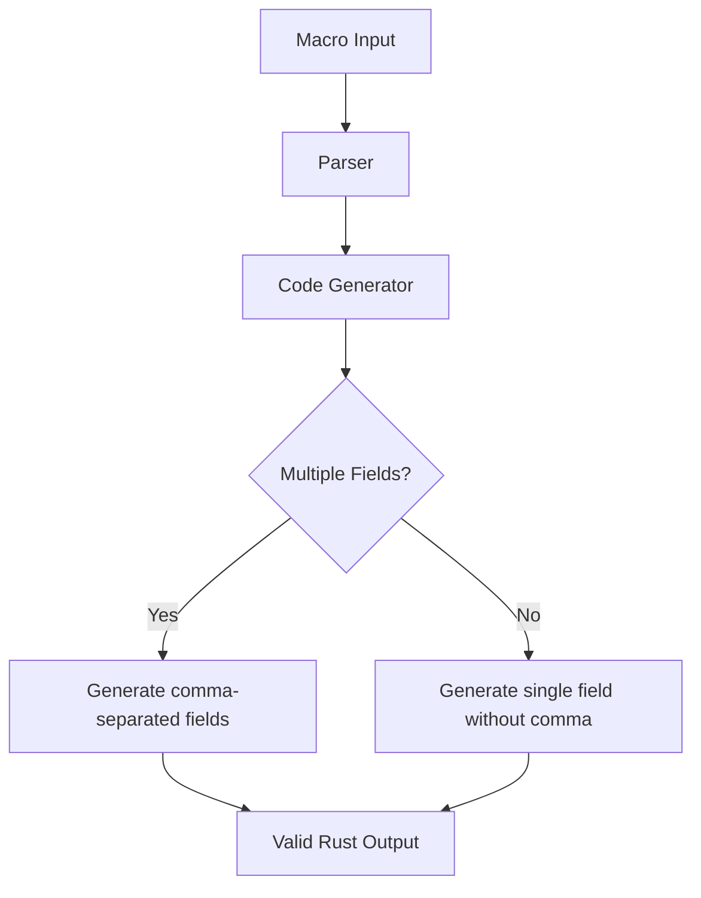

+++
title = "#18530 Fix relationship macro for multiple named members fields"
date = "2025-03-27T00:00:00"
draft = false
template = "pull_request_page.html"
in_search_index = true

[taxonomies]
list_display = ["show"]

[extra]
current_language = "en"
available_languages = {"zh-cn" = { name = "中文", url = "/pull_request/bevy/2025-03/pr-18530-zh-cn-20250327" }, "en" = { name = "English", url = "/pull_request/bevy/2025-03/pr-18530-en-20250327" }}
labels = ["C-Bug", "A-ECS", "D-Straightforward", "D-Macros"]
+++

# #18530 Fix relationship macro for multiple named members fields

## Basic Information
- **Title**: Fix relationship macro for multiple named members fields
- **PR Link**: https://github.com/bevyengine/bevy/pull/18530
- **Author**: krunchington
- **Status**: MERGED
- **Labels**: `C-Bug`, `A-ECS`, `S-Ready-For-Final-Review`, `D-Straightforward`, `D-Macros`
- **Created**: 2025-03-25T04:21:50Z
- **Merged**: 2025-03-26T15:22:18Z
- **Merged By**: alice-i-cecile

## Description Translation
# Objective

Fixes #18466 

## Solution

Updated the macro generation pattern to place the comma in the correct place in the pattern.

## Testing

- Tried named and unnamed fields in combination, and used rust expand macro tooling to see the generated code and verify its correctness (see screenshots in example below)

---

## Showcase

Screenshot showing expanded macro with multiple named fields


Screenshot showing expanded macro with single unnamed field


## Migration Guide

n/a

## The Story of This Pull Request

The PR addresses a specific issue in Bevy's ECS macros where deriving relationship components with multiple named fields would generate invalid Rust syntax. The root problem stemmed from incorrect comma placement in macro-generated code when handling structs with multiple fields.

In Bevy's relationship system, the `#[derive(Component)]` macro generates boilerplate code for managing entity relationships. The bug manifested when developers tried to create relationship components with multiple named fields, resulting in syntax errors like trailing commas in struct initialization. This violated Rust's syntax rules and broke compilation for valid use cases.

The solution involved modifying the procedural macro's code generation logic in `component.rs`. The original implementation used a pattern that incorrectly placed commas when generating field initializations. By restructuring the token generation sequence, the PR ensures commas only appear between fields, not after the last one.

Key changes occurred in the `derive_relationship` function's code generation logic. The macro now uses a more precise pattern for field initialization:

```rust
// Before (simplified):
quote! { #field_name: #field_value, }

// After (simplified):
quote! { #field_name: #field_value }
```

This adjustment prevents trailing commas in single-field cases while maintaining proper separation for multiple fields. The PR adds explicit comma tokens between fields rather than appending them to each field's generation.

The implementation maintains backward compatibility while expanding functionality. Developers can now create relationship components with mixed field types:

```rust
#[derive(Component)]
#[relationship(relationship_target = Children)]
pub struct ChildOf {
    #[relationship]
    pub parent: Entity,
    pub timestamp: u64,
    internal: u8,
};
```

The testing approach leveraged Rust's macro expansion inspection tools to verify generated code correctness. Screenshots in the PR demonstrate proper code generation for both single unnamed fields and multiple named fields.

## Visual Representation



## Key Files Changed

### File: `crates/bevy_ecs/macros/src/component.rs`
**Changes**: Fixed comma placement in generated field initializations
```rust
// Before:
let fields = fields.iter().map(|field| {
    quote! { #field_name: #field_value, }
});

// After:
let fields = fields.iter().map(|field| {
    quote! { #field_name: #field_value }
});
```

### File: `crates/bevy_ecs/src/relationship/mod.rs`
**Changes**: Updated documentation examples to demonstrate valid multi-field usage
```rust
// Before example showed single field:
pub struct ChildOf {
    #[relationship]
    pub parent: Entity,
};

// After shows multiple fields with Default:
pub struct ChildOf {
    #[relationship]
    pub parent: Entity,
    internal: u8,
};
```

## Further Reading
- [Rust Procedural Macros Guide](https://doc.rust-lang.org/reference/procedural-macros.html)
- [Bevy ECS Relationships Documentation](https://bevyengine.org/learn/book/ecs/relationships/)
- [syn crate for parsing Rust code](https://docs.rs/syn/latest/syn/)