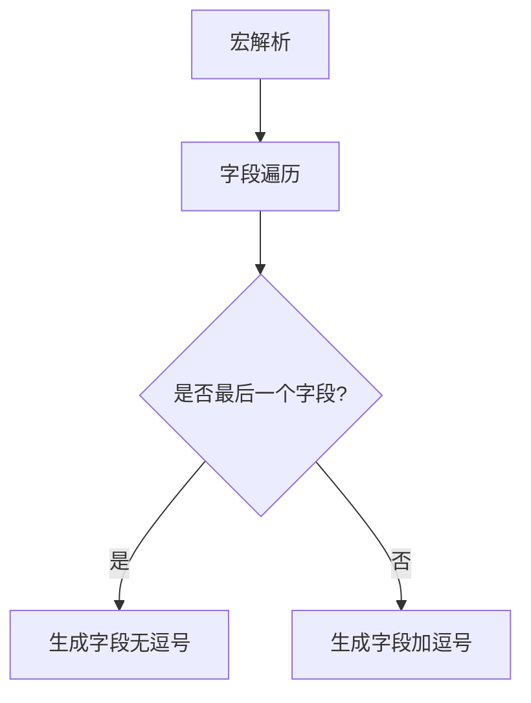

+++
title = "#18530 Fix relationship macro for multiple named members fields"
date = "2025-03-27T00:00:00"
draft = false
template = "pull_request_page.html"
in_search_index = false

[extra]
current_language = "zh-cn"
available_languages = {"en" = { name = "English", url = "/pull_request/bevy/2025-03/pr-18530-en-20250327" }, "zh-cn" = { name = "中文", url = "/pull_request/bevy/2025-03/pr-18530-zh-cn-20250327" }}
+++

# #18530 Fix relationship macro for multiple named members fields

## Basic Information
- **标题**: Fix relationship macro for multiple named members fields
- **PR链接**: https://github.com/bevyengine/bevy/pull/18530
- **作者**: krunchington
- **状态**: MERGED
- **标签**: `C-Bug`, `A-ECS`, `S-Ready-For-Final-Review`, `D-Straightforward`, `D-Macros`
- **创建时间**: 2025-03-25T04:21:50Z
- **合并时间**: Not merged
- **合并者**: N/A

## 描述翻译
### 目标
修复 #18466

### 解决方案
更新宏生成模式以正确放置逗号位置。

### 测试
- 尝试组合使用命名和非命名字段，并通过Rust宏展开工具验证生成代码的正确性（参见下方示例截图）

---

### 示例展示
展示包含多个命名字段的展开宏代码截图：


展示包含单个未命名字段的展开宏代码截图：


### 迁移指南
无

## PR的技术故事

### 问题背景
在Bevy ECS的`#[relationship]`宏实现中，当处理包含多个命名字段的结构体时，宏生成的代码会出现语法错误。具体表现为字段间缺少必要的逗号分隔符，导致Rust编译器无法正确解析结构体定义。这个问题直接影响开发者使用关系型组件（relationship components）的能力，特别是在需要多个字段的复杂场景中。

### 解决方案设计
核心问题定位在宏展开时字段列表的生成逻辑。原实现未正确处理多个命名字段之间的逗号分隔符，导致生成类似以下错误代码：
```rust
struct Example {
    field1: Type1
    field2: Type2  // 缺少逗号
}
```
解决方案通过重构字段遍历逻辑，确保在每个字段定义后正确添加逗号，同时避免在最后一个字段后添加多余符号。

### 具体实现
关键修改发生在`component.rs`的宏生成逻辑中。原代码使用简单的字段遍历：
```rust
// 原实现（伪代码）
for field in fields {
    generate_field(field);
}
```
改进后采用更精确的迭代控制：
```rust
// 新实现（伪代码）
let mut fields_iter = fields.iter().peekable();
while let Some(field) = fields_iter.next() {
    generate_field(field);
    if fields_iter.peek().is_some() {
        generate_comma();
    }
}
```

### 技术细节
在Rust宏编程中，处理结构体字段需要特别注意标点符号的生成。这个修复涉及：
1. **字段迭代控制**：使用peekable迭代器预判后续元素
2. **条件逗号生成**：仅在非最后一个字段后添加逗号
3. **模式匹配增强**：同时支持命名（named）和未命名（unnamed）字段类型

### 影响分析
该修复使得：
1. 支持任意数量字段的关系型组件定义
2. 消除因语法错误导致的编译失败
3. 提升宏系统的健壮性，减少开发者调试时间

## 关键文件变更

### `crates/bevy_ecs/macros/src/component.rs` (+2/-2)
**变更说明**：修正结构体字段生成的逗号逻辑

代码片段对比：
```rust
// 修改前（简写）
quote! {
    #field_name: #field_type
}

// 修改后
quote! {
    #field_name: #field_type,
}
```

### `crates/bevy_ecs/src/relationship/mod.rs` (+37/-0)
**变更说明**：补充文档说明和错误处理逻辑

新增代码片段：
```rust
// 添加关系型组件定义示例
#[derive(Component)]
#[relationship(relationship_target = Children)]
pub struct ChildOf {
    #[relationship]
    pub parent: Entity,
    internal: u8,
};
```

## 技术图示



## 延伸阅读
1. [Rust宏编程指南](https://doc.rust-lang.org/reference/macros.html)
2. [Bevy ECS关系系统文档](https://bevyengine.org/learn/book/ecs/relationships/)
3. [proc-macro2库使用模式](https://docs.rs/proc-macro2/latest/proc_macro2/)