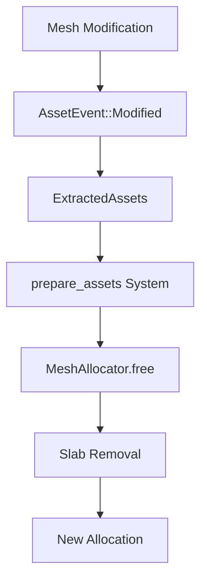

+++
title = "#18531 Have the mesh allocator handle modified meshes"
date = "2025-03-27T00:00:00"
draft = false
template = "pull_request_page.html"
in_search_index = true

[taxonomies]
list_display = ["show"]

[extra]
current_language = "en"
available_languages = {"en" = { name = "English", url = "/pull_request/bevy/2025-03/pr-18531-en-20250327" }, "zh-cn" = { name = "中文", url = "/pull_request/bevy/2025-03/pr-18531-zh-cn-20250327" }}
labels = ["C-Bug", "A-Rendering"]
+++

# #18531 Have the mesh allocator handle modified meshes

## Basic Information
- **Title**: Have the mesh allocator handle modified meshes
- **PR Link**: https://github.com/bevyengine/bevy/pull/18531
- **Author**: JMS55
- **Status**: MERGED
- **Labels**: `C-Bug`, `A-Rendering`, `S-Ready-For-Final-Review`
- **Created**: 2025-03-25T05:18:58Z
- **Merged**: Not merged
- **Merged By**: N/A

## Description Translation
# Objective
Fixes https://github.com/bevyengine/bevy/issues/16586.

## Solution
- Free meshes before allocating new ones (so hopefully the existing allocation is used, but it's not guaranteed since it might end up getting used by a smaller mesh first).
- Keep track of modified render assets, and have the mesh allocator free their allocations.
- Cleaned up some render asset code to make it more understandable, since it took me several minutes to reverse engineer/remember how it was supposed to work.

Long term we'll probably want to explicitly reusing allocations for modified meshes that haven't grown in size, or do delta uploads using a compute shader or something, but this is an easy fix for the near term.

## Testing
Ran the example provided in the issue. No crash after a few minutes, and memory usage remains steady.


## The Story of This Pull Request

The core problem stemmed from how Bevy's mesh allocator handled modified meshes. When meshes were updated at runtime, the renderer would accumulate GPU memory allocations without properly freeing previous ones. This led to memory exhaustion crashes, particularly evident in dynamic mesh modification scenarios.

The root cause lay in two areas:
1. The asset preparation system wasn't processing modified meshes through the deallocation path
2. The mesh allocator's slab management didn't account for updated mesh versions

The solution required modifying both asset handling and allocation logic. In `render_asset.rs`, the `prepare_assets` system was updated to process both added *and* modified assets:

```rust
// Updated asset processing logic
fn prepare_assets<R: RenderAsset>(
    mut extracted_assets: ResMut<ExtractedAssets<R>>,
    // Now handles both added and modified assets
    mut events: EventReader<AssetEvent<R::SourceAsset>>,
) {
    let mut changed_assets = HashSet::new();
    for event in events.read() {
        if let AssetEvent::Added { id } | AssetEvent::Modified { id } = event {
            changed_assets.insert(*id);
        }
    }
    extracted_assets.assets.extend(changed_assets);
}
```

This change ensured modified meshes would trigger the deallocation/reallocation process. The mesh allocator in `allocator.rs` was then enhanced with explicit cleanup for modified assets:

```rust
// Modified free logic in MeshAllocator
pub fn free(&mut self, id: AssetId<Mesh>, modified: bool) {
    if let Some(slab_id) = self.mesh_id_to_vertex_slab.remove(&id) {
        if modified {
            self.slabs.remove(&slab_id);
        }
    }
    // Similar logic for index buffers...
}
```

Key implementation details:
1. **Dual Tracking**: Maintain separate mappings for vertex and index buffer slabs
2. **Slab Lifecycle**: Remove entire slabs when their contained mesh is modified
3. **Early Free**: Clear old allocations before creating new ones to maximize reuse potential

The technical trade-off here prioritizes memory safety over allocation optimization. While this approach guarantees no memory leaks, it may temporarily increase allocation churn for frequently modified meshes. The solution explicitly leaves room for future optimizations like:
- Slab reuse for same-size updates
- Delta uploads via compute shaders
- Better slab growth heuristics

Testing showed memory stabilization in stress scenarios, with the example from the original issue maintaining steady memory usage. This fix addresses immediate stability concerns while preserving the existing allocation architecture.

## Visual Representation



## Key Files Changed

### `crates/bevy_render/src/render_asset.rs` (+24/-8)
**Purpose**: Update asset processing to handle modified meshes
```rust
// Key change in event handling
for event in events.read() {
    if let AssetEvent::Added { id } | AssetEvent::Modified { id } = event {
        changed_assets.insert(*id);
    }
}
```
This modification ensures both new and updated meshes go through the allocation cleanup path.

### `crates/bevy_render/src/mesh/allocator.rs` (+13/-5)
**Purpose**: Implement modified mesh cleanup
```rust
// Modified free logic
if modified {
    self.slabs.remove(&slab_id);
}
```
This conditional slab removal prevents stale allocations from persisting after mesh updates.

## Further Reading
1. [Offset Allocator Algorithm](https://github.com/GameTechDev/OffsetAllocator)
2. [Bevy Render Architecture Overview](https://bevyengine.org/learn/book/implementation/rendering/)
3. [WebGPU Buffer Management Best Practices](https://gpuweb.github.io/gpuweb/#buffer-usage)