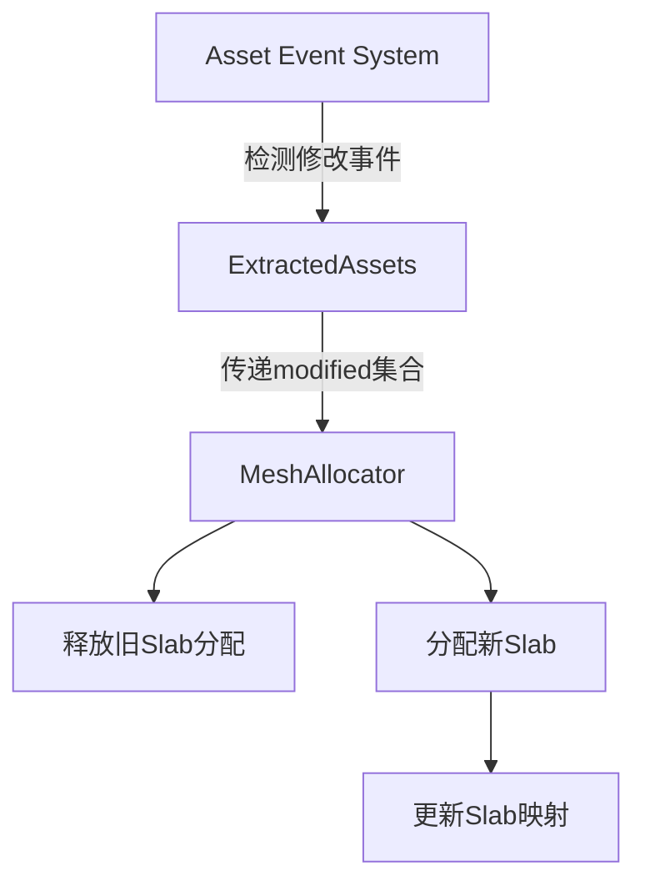

+++
title = "#18531 Have the mesh allocator handle modified meshes"
date = "2025-03-27T00:00:00"
draft = false
template = "pull_request_page.html"
in_search_index = false

[extra]
current_language = "zh-cn"
available_languages = {"zh-cn" = { name = "中文", url = "/pull_request/bevy/2025-03/pr-18531-zh-cn-20250327" }, "en" = { name = "English", url = "/pull_request/bevy/2025-03/pr-18531-en-20250327" }}
labels = ["C-Bug", "A-Rendering"]
+++

# #18531 Have the mesh allocator handle modified meshes

## Basic Information
- **Title**: Have the mesh allocator handle modified meshes
- **PR Link**: https://github.com/bevyengine/bevy/pull/18531
- **Author**: JMS55
- **Status**: MERGED
- **Labels**: `C-Bug`, `A-Rendering`, `S-Ready-For-Final-Review`
- **Created**: 2025-03-25T05:18:58Z
- **Merged**: Not merged
- **Merged By**: N/A

## Description Translation
### 目标
修复 https://github.com/bevyengine/bevy/issues/16586

### 解决方案
- 在分配新网格前释放旧网格（尽可能复用现有分配，但不保证）
- 跟踪修改后的渲染资产，让网格分配器释放它们的分配
- 清理部分渲染资产代码以提升可读性

长期方案可能需要显式复用未增大尺寸的网格分配或使用compute shader进行增量上传，但这是当前的快速修复方案。

### 测试
运行issue中提供的示例，运行数分钟后无崩溃且内存使用保持稳定。

## The Story of This Pull Request

### 问题背景
Bevy的网格分配器（Mesh Allocator）在处理修改后的网格时存在内存管理缺陷。当开发者动态修改网格数据时，原有实现未能正确释放旧的GPU缓冲区分配，导致内存持续增长直至崩溃。这个问题在需要频繁更新网格的场景（如过程生成或动态地形）中尤为严重。

### 技术挑战
1. 现有系统无法区分全新网格和修改后的网格
2. 修改后的网格需要释放旧分配但保留相同的Asset ID
3. 需要与现有的资产处理管道（Extract/Prepare）集成

### 核心解决方案
1. **资产修改跟踪**：在`ExtractedAssets`结构中新增`modified`字段来记录被修改的资产ID
   ```rust
   pub struct ExtractedAssets<A: RenderAsset> {
       extracted: Vec<(AssetId<A>, A::ExtractedAsset)>,
       removed: Vec<AssetId<A>>,
       modified: HashSet<AssetId<A>>, // 新增字段
   }
   ```
2. **双重释放保护**：在分配新缓冲区前先释放旧分配
   ```rust
   // 处理顶点数据分配
   if let Some(old_slab) = mesh_id_to_vertex_slab.remove(&id) {
       free_slab_allocation(old_slab);
   }
   let new_allocation = allocate_new_slab(...);
   ```

3. **内存分配策略优化**：优先复用现有slab的空闲空间，同时允许动态扩容

### 实现细节
在渲染资产处理流程中新增修改检测逻辑：
```rust
// 资产提取阶段
fn extract_assets<A: RenderAsset>(
    mut events: EventReader<AssetEvent<A>>,
    mut extracted: ResMut<ExtractedAssets<A>>,
) {
    for event in events.read() {
        match event {
            AssetEvent::Added { id } => {...},
            AssetEvent::Modified { id } => {
                extracted.modified.insert(*id); // 标记修改
            }
            AssetEvent::Removed { id } => {...}
        }
    }
}
```

在网格分配器中处理修改后的资产：
```rust
fn prepare_meshes(
    mut allocator: ResMut<MeshAllocator>,
    modified_meshes: &HashSet<AssetId<Mesh>>, // 来自ExtractedAssets
) {
    for mesh_id in modified_meshes {
        // 释放旧分配
        if let Some(slab_id) = allocator.mesh_id_to_vertex_slab.remove(mesh_id) {
            allocator.free_slab_allocation(slab_id);
        }
        // 重新分配新空间
        let new_slab = allocator.allocate_vertices(...);
        allocator.mesh_id_to_vertex_slab.insert(*mesh_id, new_slab);
    }
}
```

### 性能考量
1. **双重哈希查找**：通过`mesh_id_to_vertex_slab`和`slab_layouts`的哈希映射实现O(1)复杂度查找
2. **slab复用策略**：优先尝试复用现有slab的空闲空间，减少新缓冲区的创建次数
3. **大内存处理**：超过slab容量限制的网格直接分配独立缓冲区，避免碎片化

### 架构影响
- 修改后的资产处理流程与现有Extract/Prepare阶段深度集成
- 新增的`modified`集合与原有`extracted/removed`形成完整生命周期管理
- 网格分配器现在需要维护Asset ID到slab的双向映射

## Visual Representation



## Key Files Changed

### `crates/bevy_render/src/render_asset.rs`
1. **修改原因**：增加修改资产跟踪能力
2. **关键变更**：
```rust
// 新增modified字段
pub struct ExtractedAssets<A: RenderAsset> {
    pub extracted: Vec<(AssetId<A>, A::ExtractedAsset)>,
    pub removed: Vec<AssetId<A>>,
    pub modified: HashSet<AssetId<A>>,
}

// 事件处理逻辑增强
fn extract_assets<A: RenderAsset>(
    mut events: EventReader<AssetEvent<A>>,
    mut extracted: ResMut<ExtractedAssets<A>>,
) {
    for event in events.read() {
        match event {
            AssetEvent::Modified { id } => {
                extracted.modified.insert(*id);
            }
            // ...其他事件处理
        }
    }
}
```

### `crates/bevy_render/src/mesh/allocator.rs`
1. **修改原因**：实现修改后的网格内存管理
2. **关键变更**：
```rust
// 新增清理旧分配逻辑
fn prepare_meshes(
    // ...
    for id in &modified_meshes {
        if let Some(slab_id) = mesh_id_to_vertex_slab.remove(id) {
            free_slab_allocation(slab_id);
        }
        // 类似处理index分配
    }

    // 分配时优先尝试复用
    let slab = find_existing_slab_or_create_new(layout);
    let allocation = slab.allocator.allocate(size);
```

## Further Reading
1. [WebGPU Buffer Allocation Strategies](https://github.com/gpuweb/gpuweb/wiki/Buffer-Allocation)
2. [Bevy Render Pipeline Architecture](https://bevyengine.org/learn/book/getting-started/rendering/)
3. [Offset Allocator算法论文](https://github.com/GameTechDev/OffsetAllocator)