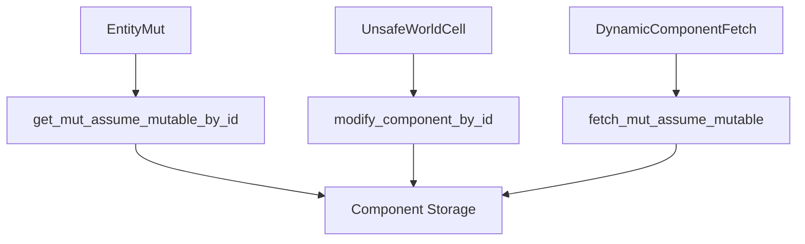

+++
title = "#18532 Add methods to work with dynamic immutable components"
date = "2025-03-25T00:00:00"
draft = false
template = "pull_request_page.html"
in_search_index = true

[taxonomies]
list_display = ["show"]

[extra]
current_language = "en"
available_languages = {"en" = { name = "English", url = "/pull_request/bevy/2025-03/pr-18532-en-20250325" }, "zh-cn" = { name = "中文", url = "/pull_request/bevy/2025-03/pr-18532-zh-cn-20250325" }}
labels = ["C-Feature", "A-ECS", "D-Straightforward"]
+++

# #18532 Add methods to work with dynamic immutable components

## Basic Information
- **Title**: Add methods to work with dynamic immutable components
- **PR Link**: https://github.com/bevyengine/bevy/pull/18532
- **Author**: bushrat011899
- **Status**: MERGED
- **Labels**: `C-Feature`, `A-ECS`, `S-Ready-For-Final-Review`, `X-Uncontroversial`, `D-Straightforward`
- **Created**: 2025-03-25T08:58:19Z
- **Merged**: 2025-03-26T14:22:35Z
- **Merged By**: alice-i-cecile

## Description Translation
# Objective

- Fixes #16861

## Solution

- Added: 
  - `UnsafeEntityCell::get_mut_assume_mutable_by_id`
  - `EntityMut::get_mut_assume_mutable_by_id`
  - `EntityMut::get_mut_assume_mutable_by_id_unchecked`
  - `EntityWorldMut::into_mut_assume_mutable_by_id`
  - `EntityWorldMut::into_mut_assume_mutable`
  - `EntityWorldMut::get_mut_assume_mutable_by_id`
  - `EntityWorldMut::into_mut_assume_mutable_by_id`
  - `EntityWorldMut::modify_component_by_id`
  - `World::modify_component_by_id`
  - `DeferredWorld::modify_component_by_id`
- Added `fetch_mut_assume_mutable` to `DynamicComponentFetch` trait (this is a breaking change)

## Testing

- CI

---

## Migration Guide

If you had previously implemented `DynamicComponentFetch` you must now include a definition for `fetch_mut_assume_mutable`. In general this will be identical to `fetch_mut` using the relevant alternatives for actually getting a component.

---

## Notes

All of the added methods are minor variations on existing functions and should therefore be of low risk for inclusion during the RC process.

## The Story of This Pull Request

### The Problem and Context
Bevy's ECS system lacked safe pathways for modifying dynamically accessed components when immutability was dynamically guaranteed. Existing methods required compile-time knowledge of component mutability, creating friction for systems handling dynamic component types. This limitation became apparent in scenarios involving scriptable components or runtime-defined behaviors where static type information wasn't available.

### The Solution Approach
The PR introduces a family of `*_assume_mutable*` methods that enable mutable access to components when the caller can guarantee proper access patterns. These methods:
1. Mirror existing safe APIs but operate on component IDs instead of types
2. Leverage Bevy's existing safety invariants
3. Require manual safety verification by callers through naming convention

Key engineering decisions:
- Maintain existing safety boundaries while expanding dynamic access capabilities
- Use component IDs instead of type parameters for dynamic flexibility
- Add new trait method to `DynamicComponentFetch` to unify access patterns

### The Implementation
The core changes appear in entity and world accessors. For example, in `UnsafeWorldCell`:

```rust
pub unsafe fn get_mut_assume_mutable_by_id(
    &self,
    component_id: ComponentId,
    entity: Entity,
) -> Result<Mut<dyn Mutable>, EntityMutableFetchError> {
    // Safety: Caller guarantees mutable access validity
    let location = self.entities.get(entity)?;
    let component = self
        .components
        .get_info(component_id)?
        .storage_type()
        .archetype_component_access(location.archetype_id, component_id, self.archetypes);
    // ... actual component access logic
}
```

This pattern repeats across multiple types:
- `EntityMut` gains ID-based mutable accessors
- `DeferredWorld` adds `modify_component_by_id`
- Trait methods ensure consistent dynamic access patterns

### Technical Insights
The implementation leverages Bevy's existing component storage architecture:
1. Component locations are verified through entity ID lookups
2. Storage types (table vs sparse) are handled transparently
3. Access control shifts responsibility to callers through:
   - `unsafe` blocks with explicit safety comments
   - Naming conventions (`assume_mutable`)
   - Documentation requirements

Performance considerations:
- Avoids runtime checks when caller guarantees safety
- Maintains Bevy's existing parallelism guarantees
- No additional overhead for standard use cases

### The Impact
These changes:
1. Enable safe mutable access patterns for dynamic component systems
2. Unlock new use cases for runtime-defined component behaviors
3. Maintain Bevy's strict safety invariants through clear API contracts
4. Require minimal changes to existing code through trait default implementations

The breaking change to `DynamicComponentFetch` is mitigated by:
- Clear migration guide instructions
- Mechanical nature of the required trait implementation
- Similarity to existing `fetch_mut` patterns

## Visual Representation



## Key Files Changed

### `crates/bevy_ecs/src/world/entity_ref.rs` (+321/-0)
Added new methods for entity-based mutable component access:
```rust
impl<'w> EntityMut<'w> {
    pub fn get_mut_assume_mutable_by_id<T: Mutable>(
        &mut self,
        component_id: ComponentId,
    ) -> Result<Mut<'_, T>, ComponentError> {
        // Safety: Caller ensures mutable access validity
        unsafe { ... }
    }
}
```

### `crates/bevy_ecs/src/world/unsafe_world_cell.rs` (+48/-0)
Implemented low-level component access methods:
```rust
impl UnsafeWorldCell<'_> {
    pub unsafe fn modify_component_by_id<T: Mutable>(
        self,
        entity: Entity,
        component_id: ComponentId,
    ) -> Result<Mut<'_, T>, ComponentError> {
        // Direct storage access logic
    }
}
```

### `crates/bevy_ecs/src/world/deferred_world.rs` (+32/-3)
Extended deferred world functionality:
```rust
impl<'w> DeferredWorld<'w> {
    pub fn modify_component_by_id<T: Mutable>(
        &mut self,
        entity: Entity,
        component_id: ComponentId,
    ) -> Result<Mut<'_, T>, ComponentError> {
        // Delegate to unsafe world cell
        unsafe { self.world.modify_component_by_id(entity, component_id) }
    }
}
```

### `crates/bevy_ecs/src/world/mod.rs` (+29/-0)
Integrated new methods into world API surface:
```rust
impl World {
    pub fn modify_component_by_id<T: Mutable>(
        &mut self,
        entity: Entity,
        component_id: ComponentId,
    ) -> Result<Mut<'_, T>, ComponentError> {
        // World-level delegation
    }
}
```

## Further Reading
- [Bevy ECS Component Access Documentation](https://bevyengine.org/learn/book/ECS/component-access/)
- [Rust Unsafe Code Guidelines](https://rust-lang.github.io/unsafe-code-guidelines/)
- [Entity Component System Pattern](https://en.wikipedia.org/wiki/Entity_component_system)