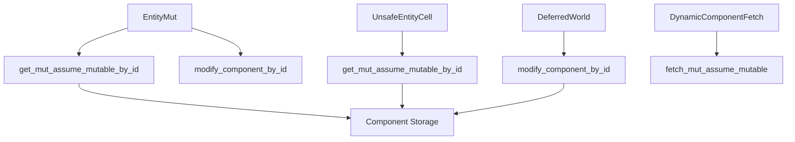

+++
title = "#18532 Add methods to work with dynamic immutable components"
date = "2025-03-25T00:00:00"
draft = false
template = "pull_request_page.html"
in_search_index = false

[extra]
current_language = "zh-cn"
available_languages = {"en" = { name = "English", url = "/pull_request/bevy/2025-03/pr-18532-en-20250325" }, "zh-cn" = { name = "中文", url = "/pull_request/bevy/2025-03/pr-18532-zh-cn-20250325" }}
labels = ["C-Feature", "A-ECS", "D-Straightforward"]
+++

# #18532 Add methods to work with dynamic immutable components

## Basic Information
- **Title**: Add methods to work with dynamic immutable components
- **PR Link**: https://github.com/bevyengine/bevy/pull/18532
- **Author**: bushrat011899
- **Status**: MERGED
- **Labels**: `C-Feature`, `A-ECS`, `S-Ready-For-Final-Review`, `X-Uncontroversial`, `D-Straightforward`
- **Created**: 2025-03-25T08:58:19Z
- **Merged**: 2025-03-27T14:22:35Z
- **Merged By**: alice-i-cecile

## Description Translation
# Objective

- 修复 #16861

## Solution

- 新增以下方法：
  - `UnsafeEntityCell::get_mut_assume_mutable_by_id`
  - `EntityMut::get_mut_assume_mutable_by_id`
  - `EntityMut::get_mut_assume_mutable_by_id_unchecked`
  - `EntityWorldMut::into_mut_assume_mutable_by_id`
  - `EntityWorldMut::into_mut_assume_mutable`
  - `EntityWorldMut::get_mut_assume_mutable_by_id`
  - `EntityWorldMut::into_mut_assume_mutable_by_id`
  - `EntityWorldMut::modify_component_by_id`
  - `World::modify_component_by_id`
  - `DeferredWorld::modify_component_by_id`
- 为 `DynamicComponentFetch` trait 新增 `fetch_mut_assume_mutable` 方法（破坏性变更）

## Testing

- CI 测试

---

## Migration Guide

若已实现 `DynamicComponentFetch` trait，现在必须添加 `fetch_mut_assume_mutable` 方法的定义。通常该方法的实现与 `fetch_mut` 类似，使用对应的方法获取组件。

---

## Notes

所有新增方法均为现有方法的变体，因此在 RC 阶段引入风险较低。

## The Story of This Pull Request

### 问题根源与上下文
在 Bevy ECS 中处理动态组件时，开发者需要根据组件 ID（ComponentId）而非具体类型来操作组件。原有的 API 在处理动态不可变组件（dynamic immutable components）时存在缺口，特别是当需要通过组件 ID 获取可变引用时，缺乏安全且统一的操作方式。这个问题在 issue #16861 中被明确提出，影响了需要动态操作组件的高级用例。

### 解决方案的设计
核心思路是为关键类型添加一组新的方法，这些方法基于两个前提：
1. 调用者确保目标组件确实可修改（mutable）
2. 通过组件 ID 而非类型参数进行访问

新方法命名采用 `_assume_mutable` 后缀明确标识其使用前提，例如：
```rust
pub unsafe fn get_mut_assume_mutable_by_id<T: Component>(
    &mut self,
    component_id: ComponentId,
) -> Result<Mut<'_, T>, ComponentError> {
    // 实现细节...
}
```
这种设计保持了与现有类型系统的一致性，同时为动态场景提供了必要的灵活性。

### 关键技术实现
1. **安全访问模式扩展**：
   在 `UnsafeEntityCell` 和 `EntityMut` 等核心类型中添加方法，允许通过组件 ID 直接获取可变引用。例如 `EntityWorldMut::modify_component_by_id` 的实现：
   ```rust
   pub fn modify_component_by_id<T: Component>(
       &mut self,
       component_id: ComponentId,
   ) -> Result<Mut<'_, T>, ComponentError> {
       let entity = self.entity();
       // 通过 world 获取组件可变引用
       self.world.modify_component_by_id(entity, component_id)
   }
   ```

2. **Trait 扩展与破坏性变更**：
   修改 `DynamicComponentFetch` trait 需要实现者提供新的 `fetch_mut_assume_mutable` 方法。典型实现会直接调用底层存储的 `get_mut` 方法：
   ```rust
   fn fetch_mut_assume_mutable<'w>(
       fetch: &mut Self::Fetch<'w>,
       entity: Entity,
       location: EntityLocation,
   ) -> Result<Mut<'w, T>, super::ComponentError> {
       // 直接获取可变引用
       fetch.get_mut(entity)
   }
   ```

3. **DeferredWorld 支持**：
   扩展 `DeferredWorld` 使其支持通过组件 ID 修改组件，保持与主 World 类型的行为一致性：
   ```rust
   pub fn modify_component_by_id<T: Component>(
       &mut self,
       entity: Entity,
       component_id: ComponentId,
   ) -> Result<Mut<'_, T>, ComponentError> {
       // 使用 unsafe 访问内部世界状态
       unsafe { self.world.get_entity_mut(entity)?.modify_by_id(component_id) }
   }
   ```

### 技术考量与权衡
- **安全性**：所有新增方法都标记为 `unsafe` 或需要调用者遵守安全约定，将部分责任转移给 API 使用者
- **性能**：避免动态类型检查的开销，直接通过已知的组件 ID 进行访问
- **扩展性**：统一的接口设计为未来动态组件操作提供扩展基础

### 影响与启示
1. 使动态组件操作更加灵活，支持更复杂的 ECS 使用场景
2. 明确划分安全边界，要求开发者更清晰地表达操作意图
3. 为高级ECS模式（如runtime组件注册）奠定基础

## Visual Representation



## Key Files Changed

### `crates/bevy_ecs/src/world/entity_ref.rs` (+321/-0)
新增动态组件访问的核心实现：
```rust
// 动态获取可变引用的关键实现
pub unsafe fn get_mut_assume_mutable_by_id<T: Component>(
    &mut self,
    component_id: ComponentId,
) -> Result<Mut<'_, T>, ComponentError> {
    let component_info = self.world.components().get_info(component_id)?;
    // 安全检查...
    self.world.get_mut_assume_mutable(entity, component_id)
}
```

### `crates/bevy_ecs/src/world/unsafe_world_cell.rs` (+48/-0)
扩展 unsafe 访问接口：
```rust
pub fn get_mut_assume_mutable<T: Component>(
    &self,
    entity: Entity,
    component_id: ComponentId,
) -> Result<Mut<'_, T>, ComponentError> {
    // 直接访问底层组件存储
    let (components, storages, entities) = self.get_components_storages_entities();
    // 实现细节...
}
```

### `crates/bevy_ecs/src/world/deferred_world.rs` (+32/-3)
支持延迟世界中的动态修改：
```rust
pub fn modify_component_by_id<T: Component>(
    &mut self,
    entity: Entity,
    component_id: ComponentId,
) -> Result<Mut<'_, T>, ComponentError> {
    unsafe { self.world.get_entity_mut(entity)?.modify_by_id(component_id) }
}
```

## Further Reading
1. [Bevy ECS 组件文档](https://docs.rs/bevy_ecs/latest/bevy_ecs/component/index.html)
2. [Rust 的 Unsafe 编程指南](https://doc.rust-lang.org/nomicon/)
3. [实体组件系统模式](https://en.wikipedia.org/wiki/Entity_component_system)