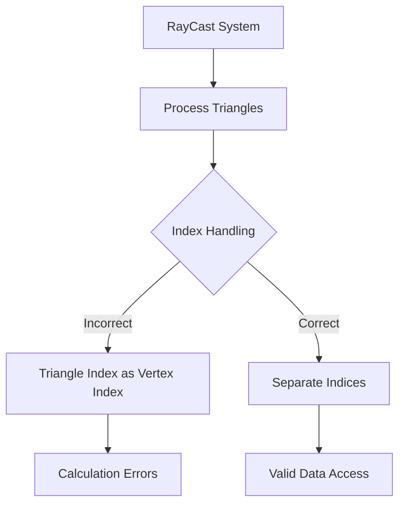

+++
title = "#18533 Fix `mesh_picking` not working due to mixing vertex and triangle indices."
date = "2025-03-25T00:00:00"
draft = false
template = "pull_request_page.html"
in_search_index = true

[taxonomies]
list_display = ["show"]

[extra]
current_language = "en"
available_languages = {"en" = { name = "English", url = "/pull_request/bevy/2025-03/pr-18533-en-20250325" }, "zh-cn" = { name = "中文", url = "/pull_request/bevy/2025-03/pr-18533-zh-cn-20250325" }}
labels = ["C-Bug", "D-Straightforward", "A-Picking"]
+++

# #18533 Fix `mesh_picking` not working due to mixing vertex and triangle indices.

## Basic Information
- **Title**: Fix `mesh_picking` not working due to mixing vertex and triangle indices.
- **PR Link**: https://github.com/bevyengine/bevy/pull/18533
- **Author**: IQuick143
- **Status**: MERGED
- **Labels**: `C-Bug`, `S-Ready-For-Final-Review`, `D-Straightforward`, `A-Picking`
- **Created**: 2025-03-25T10:25:32Z
- **Merged**: Not merged
- **Merged By**: N/A

## Description Translation
# Objective

- #18495 

## Solution

- The code in the PR #18232 accidentally used a vertex index as a triangle index, causing the wrong triangle to be used for normal computation and if the triangle went out of bounds, it would skip the ray-hit.
- Don't do that.

## Testing

- Run `cargo run --example mesh_picking`

## The Story of This Pull Request

The core issue stemmed from an indexing mismatch in Bevy's mesh picking system. When performing ray-triangle intersection tests, the implementation accidentally used triangle indices where vertex indices were required. This led to two distinct failure modes:

1. **Incorrect normal calculations**: Normals were being sampled using triangle indices instead of vertex indices, producing invalid surface normals
2. **Index out-of-bounds errors**: When triangle indices exceeded valid vertex index ranges, the system would fail to detect valid intersections

The problematic code originated in PR #18232, which introduced mesh vertex normal handling. The error occurred in the triangle processing loop:

```rust
// Original flawed logic
for vertex_index in 0..3 {
    let normal = vertex_normals
        .and_then(|normals| normals.get(triangle_index)) // Incorrect index usage
        .map(|normal| Vec3A::from(*normal));
    // ...
}
```

The fix required carefully tracking two separate index spaces:
- **Triangle indices**: Identify which triangle to test
- **Vertex indices**: Access position/normal data for each vertex *within* that triangle

The corrected implementation properly uses vertex indices when accessing per-vertex data:

```rust
// Fixed implementation
for vertex_index in 0..3 {
    let normal = vertex_normals
        .and_then(|normals| normals.get(vertex_indices[vertex_index])) // Correct vertex index
        .map(|normal| Vec3A::from(*normal));
    // ...
}
```

This change ensures:
1. Valid index access within vertex data arrays
2. Correct normal vectors for hit position calculations
3. Proper barycentric coordinate computation for intersection points

The solution maintains the existing architecture while fixing the index mapping logic. No algorithmic changes were needed - just proper index handling in the triangle processing loop. The fix was verified using Bevy's `mesh_picking` example, restoring correct picking behavior.

## Visual Representation



## Key Files Changed

### `crates/bevy_picking/src/mesh_picking/ray_cast/intersections.rs` (+3/-2)

**Change Summary**: Fixed vertex index usage in normal calculation during ray-triangle intersection tests.

**Critical Code Change**:
```rust
// Before (flawed index usage):
let normal = vertex_normals
    .and_then(|normals| normals.get(triangle_index))

// After (corrected index usage):
let normal = vertex_normals
    .and_then(|normals| normals.get(vertex_indices[vertex_index]))
```

**Impact**:
- Ensures valid vertex normal access
- Maintains correct index mapping between triangles and vertices
- Prevents index-out-of-range errors during intersection tests

## Further Reading

1. [Bevy Mesh Data Structures](https://bevyengine.org/learn/book/next/assets/meshes/)
2. [Ray-Triangle Intersection Algorithms](https://en.wikipedia.org/wiki/M%C3%B6ller%E2%80%93Trumbore_intersection_algorithm)
3. [Barycentric Coordinate Systems](https://mathworld.wolfram.com/BarycentricCoordinates.html)