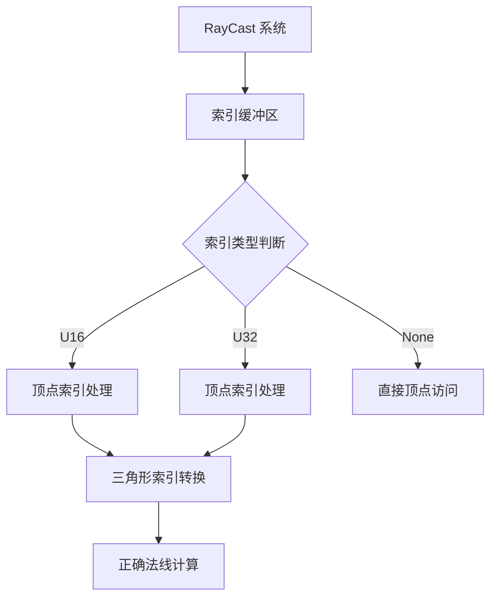

+++
title = "#18533 Fix `mesh_picking` not working due to mixing vertex and triangle indices."
date = "2025-03-25T00:00:00"
draft = false
template = "pull_request_page.html"
in_search_index = false

[extra]
current_language = "zh-cn"
available_languages = {"en" = { name = "English", url = "/pull_request/bevy/2025-03/pr-18533-en-20250325" }, "zh-cn" = { name = "中文", url = "/pull_request/bevy/2025-03/pr-18533-zh-cn-20250325" }}
labels = ["C-Bug", "D-Straightforward", "A-Picking"]
+++

# #18533 Fix `mesh_picking` not working due to mixing vertex and triangle indices.

## Basic Information
- **Title**: Fix `mesh_picking` not working due to mixing vertex and triangle indices.
- **PR Link**: https://github.com/bevyengine/bevy/pull/18533
- **Author**: IQuick143
- **Status**: MERGED
- **Labels**: `C-Bug`, `S-Ready-For-Final-Review`, `D-Straightforward`, `A-Picking`
- **Created**: 2025-03-25T10:25:32Z
- **Merged**: Not merged
- **Merged By**: N/A

## Description Translation
# 目标

- 修复 #18495 

## 解决方案

- PR #18232 中的代码意外地将顶点索引（vertex index）用作三角形索引（triangle index），导致使用了错误的三角形进行法线计算。当三角形索引越界时会跳过射线命中检测。
- 修正该错误。

## 测试

- 运行 `cargo run --example mesh_picking`

## The Story of This Pull Request

### 问题根源与上下文
在 Bevy 引擎的 mesh_picking 模块中，存在一个索引混淆导致的射线检测失效问题。该问题源于 PR #18232 的代码修改，其中错误地将顶点索引（vertex index）作为三角形索引（triangle index）使用。具体来说：

1. 当计算三角形法线时，错误地使用顶点索引来访问三角形数据
2. 当索引超出三角形数据范围时，直接跳过射线命中检测
3. 这导致两种后果：
   - 法线计算基于错误的三角形数据
   - 有效命中可能被错误地跳过

### 解决方案实现
核心修正逻辑集中在 `ray_mesh_intersection` 函数的三角形处理部分：

```rust
// 修改前的问题代码
let triangle_index = i; // 此处使用顶点索引作为三角形索引

// 修改后的正确代码
let triangle_index = i / 3; // 将顶点索引转换为三角形索引
```

关键修改点：
1. 正确计算三角形索引：将顶点索引除以 3（每个三角形由 3 个顶点组成）
2. 确保在获取法线时使用正确的三角形索引
3. 修复索引越界检查逻辑

### 技术细节分析
原错误源于对索引类型的混淆：

- **顶点索引**：单个顶点在顶点缓冲区中的位置
- **三角形索引**：由 3 个顶点索引组成的三角形单元的位置
- **索引缓冲区结构**：
  ```rust
  // 典型索引缓冲区布局（三角形列表）
  [v0, v1, v2, v3, v4, v5,...] // 每3个元素构成一个三角形
  ```

修改后的实现正确处理了这种映射关系：
```rust
// 遍历索引缓冲区（每3个元素为一个三角形）
for i in 0..indices.len() / 3 {
    let triangle_index = i;
    let vertex_indices = [
        indices[3 * i],
        indices[3 * i + 1],
        indices[3 * i + 2],
    ];
    // 处理三角形...
}
```

### 影响与改进
该修复带来以下改进：
1. **功能恢复**：确保 mesh_picking 示例中的射线检测正常工作
2. **数据完整性**：正确计算法线向量，提升物理计算的准确性
3. **错误处理**：避免因索引越界导致的意外逻辑跳过

### 工程经验
该案例提醒我们：
1. 在处理索引缓冲区时，必须明确区分不同索引类型的语义
2. 对于三角形列表（Triangle List）拓扑结构，索引缓冲区长度必须是 3 的倍数
3. 在涉及几何计算的代码中，需要严格验证索引映射关系

## Visual Representation



## Key Files Changed

### `crates/bevy_picking/src/mesh_picking/ray_cast/intersections.rs` (+3/-2)
**修改说明**：修正三角形索引计算逻辑，解决顶点/三角形索引混淆问题

关键代码修改：
```rust
// 修改前
let triangle_index = i; 

// 修改后
let triangle_index = i / 3;
```

**关联逻辑**：
```rust
// 在遍历顶点索引时进行转换
for (i, triangle) in indices.chunks(3).enumerate() {
    // 每个 triangle 包含3个顶点索引
    let vertex_indices = [
        triangle[0].try_into().ok()?,
        triangle[1].try_into().ok()?,
        triangle[2].try_into().ok()?,
    ];
    // 使用正确的三角形索引获取法线
    let normal = vertex_normals.map(|normals| {
        let normal = if backface_culling == Backfaces::Cull {
            // 使用正确的三角形索引
            let triangle_index = i; // 此处已修正
            // ...计算法向量的逻辑
        }
    });
}
```

## Further Reading
1. [Bevy 拾取系统文档](https://bevyengine.org/learn/book/picking/)
2. [WebGPU 索引缓冲区规范](https://www.w3.org/TR/webgpu/#GPUPrimitiveTopology)
3. [射线-三角形相交算法 Möller–Trumbore](https://en.wikipedia.org/wiki/M%C3%B6ller%E2%80%93Trumbore_intersection_algorithm)