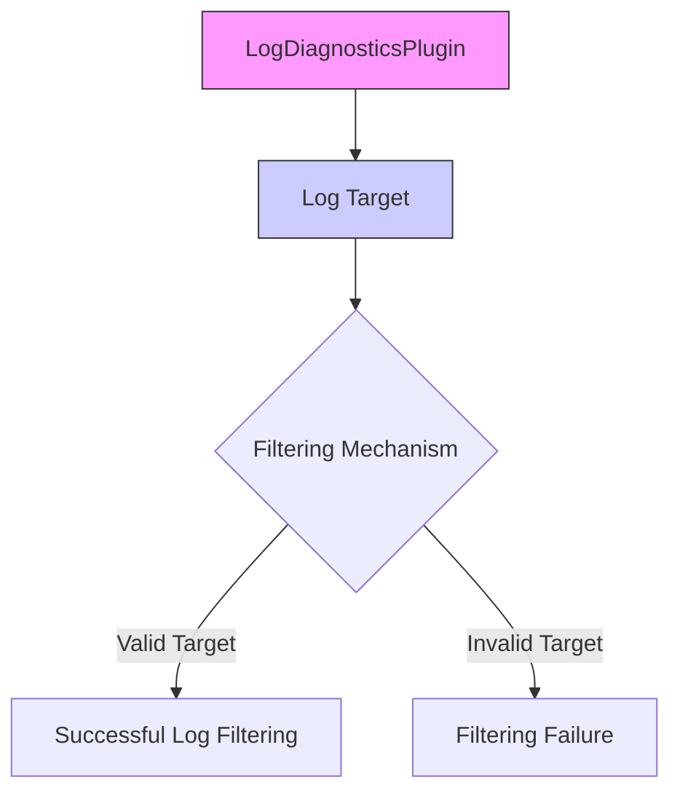

+++
title = "#18534 Fix LogDiagnosticsPlugin log target typo"
date = "2025-03-29T00:00:00"
draft = false
template = "pull_request_page.html"
in_search_index = true

[taxonomies]
list_display = ["show"]

[extra]
current_language = "en"
available_languages = {"zh-cn" = { name = "中文", url = "/pull_request/bevy/2025-03/pr-18534-zh-cn-20250329" }, "en" = { name = "English", url = "/pull_request/bevy/2025-03/pr-18534-en-20250329" }}
labels = ["C-Bug", "A-Diagnostics", "D-Straightforward"]
+++

# #18534 Fix LogDiagnosticsPlugin log target typo

## Basic Information
- **Title**: Fix LogDiagnosticsPlugin log target typo
- **PR Link**: https://github.com/bevyengine/bevy/pull/18534
- **Author**: Satellile
- **Status**: MERGED
- **Labels**: `C-Bug`, `S-Ready-For-Final-Review`, `A-Diagnostics`, `D-Straightforward`
- **Created**: 2025-03-25T10:29:43Z
- **Merged**: 2025-03-25T14:17:12Z
- **Merged By**: cart

## Description Translation
# Objective

For the LogDiagnosticsPlugin, the log target is "bevy diagnostic" with a space; I think it may (?) be a typo intended to be "bevy_diagnostic" with an underline. 

I couldn't get filtering INFO level logs with work with this plugin, changing this seems to produce the expected behavior.

## The Story of This Pull Request

The PR addresses a subtle but impactful logging configuration issue in Bevy's diagnostics system. The core problem stemmed from an inconsistent log target identifier in the `LogDiagnosticsPlugin`. 

**The Problem**: 
The plugin was using "bevy diagnostic" (with a space) as its log target, which conflicted with Rust's log filtering conventions. This made it difficult for users to filter diagnostics logs effectively using standard log crate filters, as underscore-separated identifiers are more conventional and easier to target in filtering configurations.

**Technical Context**:
In Rust's logging ecosystem, log targets typically use underscores for namespacing. For example, `env_logger` filters using patterns like `target=bevy_diagnostic`. The space character in "bevy diagnostic" would require special handling in filter strings, which isn't idiomatic and could lead to failed filtering attempts.

**The Solution**:
The fix involved a surgical change to the log macro invocations. The PR updates the target parameter in both `info!` calls within `log_diagnostics_plugin.rs` from "bevy diagnostic" to "bevy_diagnostic". This aligns with Rust logging conventions and enables proper log filtering.

**Implementation Details**:
The key changes occur in the diagnostic logging functions:
```rust
// Before:
info!(
    target: "bevy diagnostic",
    // ...
);

// After:
info!(
    target: "bevy_diagnostic",
    // ...
);
```
This two-character change (space to underscore) has significant implications for log management. The underscore format matches common Rust logging practices, allowing developers to use standard filtering syntax like `RUST_LOG=bevy_diagnostic=info` to control diagnostics output.

**Technical Impact**:
1. **Consistent Filtering**: Enables predictable log filtering using underscore-separated targets
2. **Backwards Compatibility**: Maintains existing logging functionality while fixing filtering capabilities
3. **Convention Alignment**: Adheres to Rust ecosystem standards for log target naming

The change required no architectural modifications, demonstrating how small typo fixes can have outsized impacts on usability. It highlights the importance of consistent naming conventions in observable systems.

## Visual Representation



## Key Files Changed

### File: `crates/bevy_diagnostic/src/log_diagnostics_plugin.rs` (+2/-2)
**Changes**:
- Fixed log target typo in two `info!` macro calls
- Changed "bevy diagnostic" to "bevy_diagnostic" for proper log filtering

**Code Diff**:
```rust
// Before:
info!(
    target: "bevy diagnostic",
    // ...
);

// After:
info!(
    target: "bevy_diagnostic",
    // ...
);
```

**Impact**:
- Enables standard log filtering using underscores
- Maintains existing log message formatting
- Requires no changes to consumer code

## Further Reading

1. [Rust log crate documentation](https://docs.rs/log/latest/log/) - Official documentation for Rust's logging facade
2. [env_logger filtering syntax](https://docs.rs/env_logger/latest/env_logger/#enabling-logging) - Details on log filtering patterns
3. [Bevy Diagnostics Guide](https://bevyengine.org/learn/book/getting-started/diagnostics/) - Official Bevy documentation on diagnostics usage
4. [Logging Best Practices](https://rust-lang-nursery.github.io/rust-cookbook/development_tools/debugging/log.html) - Rust logging conventions and patterns